## Index

### Main sections

- [1. Introduction](#arch-01-intro)
- [2. Context diagram](#arch-02-context)
- [3. Architectural drivers](#arch-03-drivers)
- [4. Domain model](#arch-04-domain)
- [5. Container diagram](#arch-05-container)
- [6. Component diagrams](#arch-06-components)
- [7. Sequence diagrams](#arch-07-seq)
- [8. Interfaces](#arch-08-interfaces)
- [9. Design decisions](#arch-09-decisions)

### Section 3 — Architectural drivers (detail)

- [Primary User Stories](#arch-drivers-uh)
- [Quality Attribute Scenarios — High/High Priority](#arch-drivers-qa)
- [Technical Constraints](#arch-drivers-con)
- [High-Priority Architectural Concerns](#arch-drivers-concerns)

### Section 4 — Domain model (detail)

- [Domain Model Element Descriptions](#arch-04-elements)
- [Clinical Care Domain Model — Iteration 2 Refinement](#arch-04-clinical-care)

### Section 5 — Container diagram (detail)

- [Container Responsibilities](#arch-05-resp)

### Section 6 — Component diagrams (detail)

- [6.1 — SICEB API Server Components](#arch-06-api)
- [6.2 — SICEB PWA Client Components](#arch-06-pwa)

### Section 7 — Sequence diagrams (detail)

- [SD-01: Authenticated API Request Flow](#arch-sd-01)
- [SD-02: Branch Context Selection and Tenant Isolation](#arch-sd-02)
- [SD-03: Create Patient and Medical Record](#arch-sd-03)
- [SD-04: Add Consultation with Prescriptions and Lab Orders](#arch-sd-04)
- [SD-05: Enter Lab Results and Project into Medical Record](#arch-sd-05)
- [SD-06: Search Patient and Load Clinical Timeline](#arch-sd-06)
- [SD-07: Controlled Medication Prescription Blocked by Residency Policy](#arch-sd-07)
- [SD-08: Admin Creates New Role](#arch-sd-08)
- [SD-09: Patient Record Access with LFPDPPP Audit Logging](#arch-sd-09)
- [SD-10: Register New Branch with Onboarding Workflow](#arch-sd-10)
- [SD-11: Inventory Delta Command with Real-Time WebSocket Propagation](#arch-sd-11)
- [SD-12: Branch Context Switch Without Logout](#arch-sd-12)
- [SD-13: Admin Views Cross-Branch Inventory](#arch-sd-13)

### Section 8 — Interfaces (detail)

- [8.1 — Clinical Care Command Interfaces](#arch-08-1)
- [8.2 — Clinical Care Query Interfaces](#arch-08-2)
- [8.3 — Identity & Access Command Interfaces](#arch-08-3)
- [8.4 — Identity & Access Query Interfaces](#arch-08-4)
- [8.5 — Audit & Compliance Query Interfaces](#arch-08-5)
- [8.6 — Interface-to-Driver Traceability](#arch-08-6)
- [8.7 — Branch Management Command Interfaces](#arch-08-7)
- [8.8 — Branch Management Query Interfaces](#arch-08-8)
- [8.9 — Inventory Command Interfaces](#arch-08-9)
- [8.10 — Inventory Query Interfaces](#arch-08-10)
- [8.11 — Tariff Management Interfaces](#arch-08-11)

### Section 9 — Design decisions (detail)

- [Iteration 1 — Establish Overall System Structure](#arch-iter-1)
- [Iteration 2 — Core Clinical Workflow and Medical Records](#arch-iter-2)
- [Iteration 3 — Security, Access Control, and Audit Infrastructure](#arch-iter-3)
- [Iteration 4 — Multi-Branch Operations and Inventory Management](#arch-iter-4)

---

### 1.- Introduction

This document describes the software architecture of SICEB (Sistema Integral de Control y Expedientes de Bienestar), designed using the Attribute-Driven Design (ADD) method across seven iterations. It captures the architectural decisions, structural views, behavioral diagrams, and design rationale that evolve incrementally — from the foundational system structure through clinical workflows, security, multi-branch operations, pharmacy and payments, offline synchronization, and operational resilience.

The document follows the C4 model for structural views (Context, Container, Component) and uses sequence diagrams to illustrate key behavioral scenarios. Each iteration refines the architecture by addressing a specific set of architectural drivers — user stories, quality attribute scenarios, architectural concerns, and technical constraints — as defined in the iteration plan.

### 2.- Context diagram

The following context diagram shows SICEB as a single system interacting with its external actors. Medical and administrative teams at each branch access the system through a Progressive Web App over HTTPS and Secure WebSocket. External systems — academic institutions and future insurance integrations — communicate via a REST API. A future patient portal is planned but out of scope for the current design.

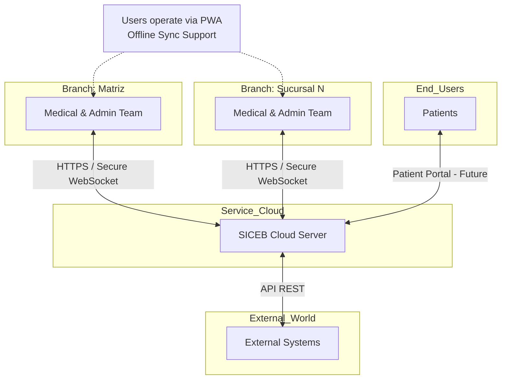
```mermaid
graph TD

    subgraph External_World
        EXT[External Systems]
    end

    subgraph Service_Cloud
        SICEB[SICEB Cloud Server]
    end

    subgraph Branch_1 [Branch: Matriz]
        USR1[Medical & Admin Team]
    end

    subgraph Branch_N [Branch: Sucursal N]
        USRN[Medical & Admin Team]
    end

    subgraph End_Users
        PAC[Patients]
    end

    %% Connections
    USR1 <-->|HTTPS / Secure WebSocket| SICEB
    USRN <-->|HTTPS / Secure WebSocket| SICEB
    
    SICEB <-->|API REST| EXT
    PAC <-->|"Patient Portal - Future"| SICEB

    %% Internal Descriptions
    note1[Users operate via PWA<br/>Offline Sync Support]
    note1 -.-> USR1
    note1 -.-> USRN
```

### 3.- Architectural drivers

This section summarizes the architectural drivers that guide the design of SICEB. For full details, refer to the Architectural Drivers document.

#### Primary User Stories

| Rank | ID         | Short Name                            | Supported High/High Scenarios |
| ---- | ---------- | ------------------------------------- | ----------------------------- |
| 1    | **US-076** | Offline operation and synchronization | REL-01, REL-02, USA-01        |
| 2    | **US-074** | Active branch selection               | SEC-02, ESC-02                |
| 3    | **US-071** | Branch registration                   | SEC-02, ESC-02                |
| 4    | **US-003** | Role-based permissions                | SEC-02                        |
| 5    | **US-026** | Record immutability                   | REL-02                        |
| 6    | **US-025** | Add consultation to record            | REL-01, USA-01                |
| 7    | **US-004** | Complete inventory view — Admin       | PER-01                        |
| 8    | **US-024** | Create clinical record                | USA-01                        |
| 9    | **US-031** | Prescribe medications                 | USA-01                        |
| 10   | **US-044** | Register payments                     | REL-01                        |

#### Quality Attribute Scenarios — High/High Priority

| ID     | Quality Attribute | Description                                        |
| ------ | ----------------- | -------------------------------------------------- |
| PER-01 | Performance       | Real-time inventory update across branches         |
| SEC-02 | Security          | Branch-level data segmentation via multi-tenancy   |
| REL-01 | Reliability       | Offline-to-online sync with zero data loss         |
| REL-02 | Reliability       | Partial sync failure recovery from exact cutoff    |
| USA-01 | Usability         | Transparent offline operation during consultations |
| ESC-02 | Scalability       | Branch growth without performance degradation      |

#### Technical Constraints

| ID         | Constraint                                                             |
| ---------- | ---------------------------------------------------------------------- |
| **CON-01** | PWA with Hybrid Cloud / SaaS; no native mobile apps                    |
| **CON-02** | HTTPS / Secure WebSocket for all client-server communication           |
| **CON-03** | Last 2 versions of Chrome, Edge, Safari, Firefox on desktop and tablet |
| **CON-04** | REST API for all external integrations                                 |
| **CON-05** | No DICOM/PACS; text-only laboratory results                            |

#### High-Priority Architectural Concerns

| Category               | Count | IDs                                                    |
| ---------------------- | ----- | ------------------------------------------------------ |
| Security               | 7     | CRN-13, CRN-14, CRN-15, CRN-16, CRN-17, CRN-18, CRN-45 |
| Synchronization        | 6     | CRN-34, CRN-35, CRN-36, CRN-37, CRN-38, CRN-44         |
| Data Management        | 5     | CRN-01, CRN-02, CRN-04, CRN-05, CRN-06                 |
| Development            | 4     | CRN-25, CRN-26, CRN-27, CRN-43                         |
| Integration            | 3     | CRN-08, CRN-09, CRN-11                                 |
| Operational            | 3     | CRN-19, CRN-21, CRN-24                                 |
| Legal Compliance       | 3     | CRN-31, CRN-32, CRN-33                                 |
| Technical Requirements | 2     | CRN-41, CRN-42                                         |
| Business               | 1     | CRN-29                                                 |
| UX                     | 1     | CRN-39                                                 |

### 4.- Domain model

The following domain model captures the core business entities and their relationships derived from SICEB's architectural drivers — including 76 user stories, 6 prioritized quality attribute scenarios, 5 technical constraints, and 35 high-priority architectural concerns. The model reflects the clinical, pharmacy, inventory, financial, scheduling, and administrative domains of a multi-branch medical clinic network operating with offline-first capabilities.

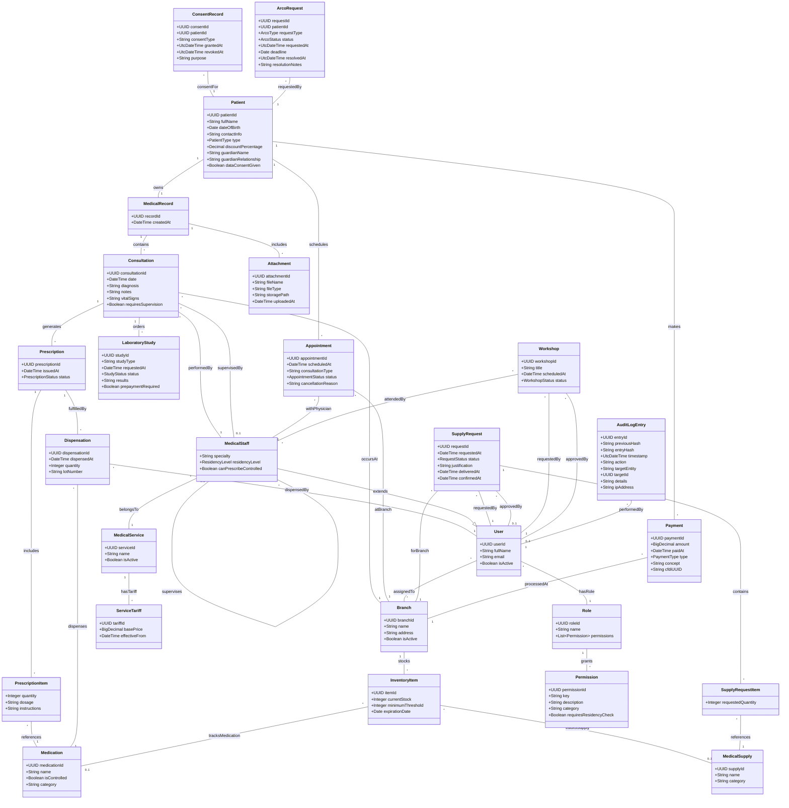
```mermaid
classDiagram

    class Patient {
        +UUID patientId
        +String fullName
        +Date dateOfBirth
        +String contactInfo
        +PatientType type
        +Decimal discountPercentage
        +String guardianName
        +String guardianRelationship
        +Boolean dataConsentGiven
    }

    class MedicalRecord {
        +UUID recordId
        +DateTime createdAt
    }

    class Consultation {
        +UUID consultationId
        +DateTime date
        +String diagnosis
        +String notes
        +String vitalSigns
        +Boolean requiresSupervision
    }

    class Prescription {
        +UUID prescriptionId
        +DateTime issuedAt
        +PrescriptionStatus status
    }

    class PrescriptionItem {
        +Integer quantity
        +String dosage
        +String instructions
    }

    class Medication {
        +UUID medicationId
        +String name
        +Boolean isControlled
        +String category
    }

    class Dispensation {
        +UUID dispensationId
        +DateTime dispensedAt
        +Integer quantity
        +String lotNumber
    }

    class LaboratoryStudy {
        +UUID studyId
        +String studyType
        +DateTime requestedAt
        +StudyStatus status
        +String results
        +Boolean prepaymentRequired
    }

    class Appointment {
        +UUID appointmentId
        +DateTime scheduledAt
        +String consultationType
        +AppointmentStatus status
        +String cancellationReason
    }

    class Attachment {
        +UUID attachmentId
        +String fileName
        +String fileType
        +String storagePath
        +DateTime uploadedAt
    }

    class Branch {
        +UUID branchId
        +String name
        +String address
        +Boolean isActive
    }

    class User {
        +UUID userId
        +String fullName
        +String email
        +Boolean isActive
    }

    class Role {
        +UUID roleId
        +String name
        +List~Permission~ permissions
    }

    class MedicalStaff {
        +String specialty
        +ResidencyLevel residencyLevel
        +Boolean canPrescribeControlled
    }

    class MedicalService {
        +UUID serviceId
        +String name
        +Boolean isActive
    }

    class ServiceTariff {
        +UUID tariffId
        +BigDecimal basePrice
        +DateTime effectiveFrom
    }

    class MedicalSupply {
        +UUID supplyId
        +String name
        +String category
    }

    class InventoryItem {
        +UUID itemId
        +Integer currentStock
        +Integer minimumThreshold
        +Date expirationDate
    }

    class SupplyRequest {
        +UUID requestId
        +DateTime requestedAt
        +RequestStatus status
        +String justification
        +DateTime deliveredAt
        +DateTime confirmedAt
    }

    class SupplyRequestItem {
        +Integer requestedQuantity
    }

    class Payment {
        +UUID paymentId
        +BigDecimal amount
        +DateTime paidAt
        +PaymentType type
        +String concept
        +String cfdiUUID
    }

    class Workshop {
        +UUID workshopId
        +String title
        +DateTime scheduledAt
        +WorkshopStatus status
    }

    class Permission {
        +UUID permissionId
        +String key
        +String description
        +String category
        +Boolean requiresResidencyCheck
    }

    class ConsentRecord {
        +UUID consentId
        +UUID patientId
        +String consentType
        +UtcDateTime grantedAt
        +UtcDateTime revokedAt
        +String purpose
    }

    class ArcoRequest {
        +UUID requestId
        +UUID patientId
        +ArcoType requestType
        +ArcoStatus status
        +UtcDateTime requestedAt
        +Date deadline
        +UtcDateTime resolvedAt
        +String resolutionNotes
    }

    class AuditLogEntry {
        +UUID entryId
        +String previousHash
        +String entryHash
        +UtcDateTime timestamp
        +String action
        +String targetEntity
        +UUID targetId
        +String details
        +String ipAddress
    }

    Patient "1" -- "1" MedicalRecord : owns
    Patient "1" -- "*" Appointment : schedules
    Patient "1" -- "*" Payment : makes

    MedicalRecord "1" -- "*" Consultation : contains
    MedicalRecord "1" -- "*" Attachment : includes

    Consultation "*" -- "1" MedicalStaff : performedBy
    Consultation "*" -- "0..1" MedicalStaff : supervisedBy
    Consultation "1" -- "*" Prescription : generates
    Consultation "1" -- "*" LaboratoryStudy : orders
    Consultation "*" -- "1" Branch : occursAt

    Prescription "1" -- "*" PrescriptionItem : includes
    PrescriptionItem "*" -- "1" Medication : references
    Prescription "1" -- "*" Dispensation : fulfilledBy
    Dispensation "*" -- "1" User : dispensedBy
    Dispensation "*" -- "1" Medication : dispenses

    Appointment "*" -- "1" MedicalStaff : withPhysician
    Appointment "*" -- "1" Branch : atBranch

    MedicalStaff --|> User : extends
    User "*" -- "1" Role : hasRole
    User "*" -- "*" Branch : assignedTo
    MedicalStaff "*" -- "1" MedicalService : belongsTo
    MedicalStaff "0..1" -- "*" MedicalStaff : supervises

    MedicalService "1" -- "*" ServiceTariff : hasTariff

    Branch "1" -- "*" InventoryItem : stocks
    InventoryItem "*" -- "0..1" Medication : tracksMedication
    InventoryItem "*" -- "0..1" MedicalSupply : tracksSupply

    SupplyRequest "*" -- "1" User : requestedBy
    SupplyRequest "*" -- "0..1" User : approvedBy
    SupplyRequest "1" -- "*" SupplyRequestItem : contains
    SupplyRequestItem "*" -- "1" MedicalSupply : references
    SupplyRequest "*" -- "1" Branch : forBranch

    Payment "*" -- "1" Branch : processedAt

    Workshop "*" -- "1" User : requestedBy
    Workshop "*" -- "0..1" User : approvedBy
    Workshop "*" -- "*" MedicalStaff : attendedBy

    Role "1" -- "*" Permission : grants
    ConsentRecord "*" -- "1" Patient : consentFor
    ArcoRequest "*" -- "1" Patient : requestedBy

    AuditLogEntry "*" -- "1" User : performedBy
```

#### Domain Model Element Descriptions

| Element               | Type         | Description                                                                                                                                                                                                                                                                                                                                                                                                                                                                                                                                                                                        | Key Drivers                                                            |
| --------------------- | ------------ | -------------------------------------------------------------------------------------------------------------------------------------------------------------------------------------------------------------------------------------------------------------------------------------------------------------------------------------------------------------------------------------------------------------------------------------------------------------------------------------------------------------------------------------------------------------------------------------------------- | ---------------------------------------------------------------------- |
| **Patient**           | Entity       | A person receiving medical care at any branch. Classified by type — Student, Worker, or External — with automatic discount calculation per type. For minors under 17, guardian information is mandatory. Holds a system-wide unique identifier ensuring one record per patient across all branches. Consent status tracks LFPDPPP compliance.                                                                                                                                                                                                                                                      | US-019, US-020, US-022, US-023, US-062, CRN-37, CRN-32, PER-03         |
| **MedicalRecord**     | Entity       | The append-only, immutable clinical record for a patient. Designed as insert-only at the database level — consultations can be added but never edited or deleted. Supports file attachments for external documents and informed consent. Retention is permanent per NOM-004-SSA3-2012.                                                                                                                                                                                                                                                                                                             | US-024, US-026, US-027, CRN-02, CRN-01, CRN-31, AUD-03                 |
| **Consultation**      | Entity       | A single clinical encounter between a patient and a medical staff member at a specific branch. Records diagnosis, notes, and vital signs. May require supervisor validation when performed by R1/R2 residents. Serves as the origin point for prescriptions, laboratory orders, and supply usage tracking. Must be registerable while offline.                                                                                                                                                                                                                                                     | US-025, US-026, US-030, US-052, US-076, USA-01, USA-02, CRN-16         |
| **Prescription**      | Entity       | A medication order generated during a consultation. Subject to prescriber permission validation — R1, R2, and R3 residents cannot prescribe controlled substances. Validated by pharmacy before dispensation.                                                                                                                                                                                                                                                                                                                                                                                      | US-031, US-033, US-050, US-051, SEC-01, PER-04                         |
| **PrescriptionItem**  | Value Object | A line item within a prescription specifying a medication, quantity, dosage, and instructions.                                                                                                                                                                                                                                                                                                                                                                                                                                                                                                     | US-031, PER-04                                                         |
| **Medication**        | Entity       | A drug in the system's medication catalog. The `isControlled` flag triggers additional traceability requirements for COFEPRIS compliance and restricts which residency levels can prescribe it. Inventory is verified before dispensation.                                                                                                                                                                                                                                                                                                                                                         | US-034, US-035, US-051, SEC-03, CRN-33, CRN-14                         |
| **Dispensation**      | Entity       | The pharmacy fulfillment event of a prescription. Records 8 mandatory traceability fields for controlled substances: prescriber, dispenser, patient, medication, lot, quantity, date, and time. Medications may be charged separately from the consultation.                                                                                                                                                                                                                                                                                                                                       | US-035, US-036, US-037, SEC-03, AUD-02, CRN-33                         |
| **LaboratoryStudy**   | Entity       | A laboratory test ordered during a consultation. Tracks the full lifecycle from physician order through payment verification, test processing, result entry in text format, and availability in the patient's medical record. DICOM/PACS images are not supported per CON-05.                                                                                                                                                                                                                                                                                                                      | US-038, US-039, US-040, US-041, US-042, CRN-27                         |
| **Appointment**       | Entity       | A scheduled medical visit specifying date, time, physician, and consultation type. Supports cancellation and rescheduling with documented reasons. Enables physicians to view their daily agenda with patient information.                                                                                                                                                                                                                                                                                                                                                                         | US-053, US-054, US-055                                                 |
| **Attachment**        | Entity       | A file — PDF, image, or scanned document — attached to a patient's medical record. Used for external documents and signed informed consent records required by NOM-024-SSA3-2012.                                                                                                                                                                                                                                                                                                                                                                                                                  | US-029, US-056, US-057                                                 |
| **Branch**            | Entity       | A physical clinic location within the network. Serves as the tenant boundary for data segmentation — users only see data for their active branch. Each branch can operate independently offline and synchronize when connectivity returns. Supports registration, deactivation, and consolidated dashboards.                                                                                                                                                                                                                                                                                       | US-071, US-072, US-074, US-075, US-076, SEC-02, ESC-02, CRN-29, REL-01 |
| **User**              | Entity       | Any authenticated person in the system. Assigned to one or more branches and granted permissions through a configurable role. Selects an active branch upon login to scope all system views.                                                                                                                                                                                                                                                                                                                                                                                                       | US-001, US-002, US-073, US-074, CRN-15                                 |
| **Role**              | Entity       | A configurable set of permissions governing what actions a user can perform. New roles can be created by administrators without code changes. Enforces branch-scoped and residency-level restrictions across all modules.                                                                                                                                                                                                                                                                                                                                                                          | US-003, US-050, SEC-01, MNT-03, CRN-15                                 |
| **MedicalStaff**      | Entity       | A specialization of User representing clinical personnel — attending physicians, specialists, and residents R1–R4. Carries residency level and controlled substance prescribing authorization. R1/R2 residents require a mandatory assigned supervisor.                                                                                                                                                                                                                                                                                                                                            | US-049, US-050, US-051, US-065, SEC-01, CRN-16, ESC-03                 |
| **MedicalService**    | Entity       | A clinical specialty or department such as Pediatrics, Dermatology, or General Medicine. Configured through a system catalog without code changes, enabling addition of new services in production. Each service scopes inventory visibility for its manager.                                                                                                                                                                                                                                                                                                                                      | US-005, MNT-01                                                         |
| **ServiceTariff**     | Entity       | A price configuration for a medical service specifying the base price and effective date. Used by the system to calculate patient charges automatically, applying the patient-type discount.                                                                                                                                                                                                                                                                                                                                                                                                       | US-064, CRN-42                                                         |
| **MedicalSupply**     | Entity       | A non-medication item in the supply catalog such as gauze, syringes, or surgical gloves. Referenced by supply requests and tracked in branch inventory with low-stock alerts.                                                                                                                                                                                                                                                                                                                                                                                                                      | US-006, US-009, US-052, USA-04                                         |
| **InventoryItem**     | Entity       | A stock record tracking the current quantity of a medication or medical supply at a specific branch. Includes minimum threshold for automated low-stock alerts and expiration date for waste prevention. Updates must propagate across views within 2 seconds.                                                                                                                                                                                                                                                                                                                                     | US-004, US-005, US-006, US-007, US-034, PER-01, CRN-35                 |
| **SupplyRequest**     | Entity       | A formal request for medical supplies submitted by a Service Manager. Follows a complete lifecycle: request with justification, approval or rejection by administrator, delivery recording, and receipt confirmation by the manager — each step updating branch inventory.                                                                                                                                                                                                                                                                                                                         | US-009, US-011, US-013, USA-04, AUD-01                                 |
| **SupplyRequestItem** | Value Object | A line item within a supply request specifying a medical supply and requested quantity. Supports auto-complete from the catalog and suggested quantities based on consumption history.                                                                                                                                                                                                                                                                                                                                                                                                             | US-009, USA-04                                                         |
| **Payment**           | Entity       | A financial transaction for services rendered — consultations, pharmacy dispensations, or laboratory studies. Uses fixed-precision arithmetic for monetary values. Supports simple receipt and CFDI electronic invoice generation. Serves as the basis for income, expense, and profitability reports.                                                                                                                                                                                                                                                                                             | US-044, US-045, US-046, US-047, US-048, PER-02, CRN-42, CRN-08         |
| **Workshop**          | Entity       | A training or academic activity for medical residents. Follows a request-approval workflow and tracks attendance upon completion. Exposed to external academic systems via the interoperability API.                                                                                                                                                                                                                                                                                                                                                                                               | US-015, US-016, US-017, US-018, IOP-01                                 |
| **AuditLogEntry**     | Entity       | An immutable, hash-chained record in the centralized audit trail. Each entry includes a SHA-256 hash of the previous entry's hash concatenated with its own payload, creating a tamper-evident chain. Cannot be altered by application users or database administrators — the application DB role has INSERT-only privileges on the audit table, with UPDATE, DELETE, and TRUNCATE revoked. Logs who accessed which record and when, including IP address. Supports COFEPRIS traceability and LFPDPPP compliance. Every security-relevant action and every patient data access generates an entry. | US-066, CRN-17, CRN-18, SEC-03, AUD-01, AUD-02, AUD-03                 |
| **Permission**        | Entity       | A granular authorization unit identified by a stable string key (e.g., `prescription:create`, `controlled_med:prescribe`). Categorized by functional area. The `requiresResidencyCheck` flag triggers delegation to the `ResidencyLevelPolicy` during authorization. Permissions are assigned to roles through a many-to-many relationship, enabling data-driven RBAC configuration without code changes.                                                                                                                                                                                          | US-003, US-050, SEC-01, MNT-03, CRN-15                                 |
| **ConsentRecord**     | Entity       | Tracks the lifecycle of a patient's data processing consent under LFPDPPP. Records when consent was granted, for what purpose, and when revoked. Consent status is embedded in the JWT for offline-compatible verification. A patient's consent must be explicitly set before PII is accessed.                                                                                                                                                                                                                                                                                                     | CRN-32, US-066                                                         |
| **ArcoRequest**       | Entity       | A formal request exercising ARCO rights (Access, Rectification, Cancellation, Opposition) under LFPDPPP. Carries a legal deadline (20 business days), status tracking, and resolution notes. Rectification on immutable clinical records is handled by appending a corrective addendum event rather than modifying the original record, preserving CRN-02 compliance.                                                                                                                                                                                                                              | CRN-32, US-062, US-063                                                 |

#### Clinical Care Domain Model — Iteration 2 Refinement

The following diagram zooms into the clinical care bounded context, making explicit the **append-only event stream** that enforces medical record immutability (US-026, CRN-02, AUD-03). Every clinical action — consultation, prescription, laboratory order, result entry, attachment — is persisted as an immutable `ClinicalEvent` linked to the patient's `MedicalRecord`. The write model stores the event stream; the read models (`PatientSearchReadModel`, `ClinicalTimelineReadModel`, `Nom004RecordView`) are projections built from these events to serve queries efficiently (PER-03, CRN-31).

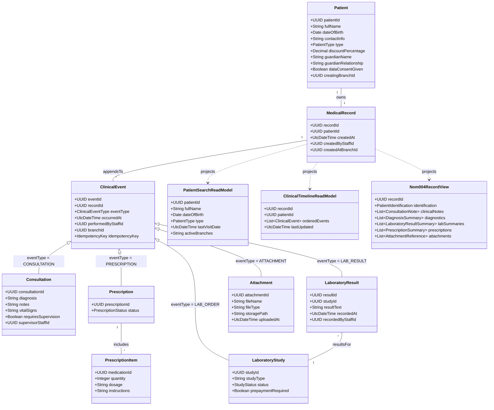
```mermaid
classDiagram
    class Patient {
        +UUID patientId
        +String fullName
        +Date dateOfBirth
        +String contactInfo
        +PatientType type
        +Decimal discountPercentage
        +String guardianName
        +String guardianRelationship
        +Boolean dataConsentGiven
        +UUID creatingBranchId
    }

    class MedicalRecord {
        +UUID recordId
        +UUID patientId
        +UtcDateTime createdAt
        +UUID createdByStaffId
        +UUID createdAtBranchId
    }

    class ClinicalEvent {
        +UUID eventId
        +UUID recordId
        +ClinicalEventType eventType
        +UtcDateTime occurredAt
        +UUID performedByStaffId
        +UUID branchId
        +IdempotencyKey idempotencyKey
    }

    class Consultation {
        +UUID consultationId
        +String diagnosis
        +String notes
        +String vitalSigns
        +Boolean requiresSupervision
        +UUID supervisorStaffId
    }

    class Prescription {
        +UUID prescriptionId
        +PrescriptionStatus status
    }

    class PrescriptionItem {
        +UUID medicationId
        +Integer quantity
        +String dosage
        +String instructions
    }

    class LaboratoryStudy {
        +UUID studyId
        +String studyType
        +StudyStatus status
        +Boolean prepaymentRequired
    }

    class LaboratoryResult {
        +UUID resultId
        +UUID studyId
        +String resultText
        +UtcDateTime recordedAt
        +UUID recordedByStaffId
    }

    class Attachment {
        +UUID attachmentId
        +String fileName
        +String fileType
        +String storagePath
        +UtcDateTime uploadedAt
    }

    class PatientSearchReadModel {
        +UUID patientId
        +String fullName
        +Date dateOfBirth
        +PatientType type
        +UtcDateTime lastVisitDate
        +String activeBranches
    }

    class ClinicalTimelineReadModel {
        +UUID recordId
        +UUID patientId
        +List~ClinicalEvent~ orderedEvents
        +UtcDateTime lastUpdated
    }

    class Nom004RecordView {
        +UUID recordId
        +PatientIdentification identification
        +List~ConsultationNote~ clinicalNotes
        +List~DiagnosisSummary~ diagnostics
        +List~LaboratoryResultSummary~ labSummaries
        +List~PrescriptionSummary~ prescriptions
        +List~AttachmentReference~ attachments
    }

    Patient "1" -- "1" MedicalRecord : owns
    MedicalRecord "1" -- "*" ClinicalEvent : appendsTo

    ClinicalEvent <|-- Consultation : eventType = CONSULTATION
    ClinicalEvent <|-- Prescription : eventType = PRESCRIPTION
    ClinicalEvent <|-- LaboratoryStudy : eventType = LAB_ORDER
    ClinicalEvent <|-- LaboratoryResult : eventType = LAB_RESULT
    ClinicalEvent <|-- Attachment : eventType = ATTACHMENT

    Prescription "1" -- "*" PrescriptionItem : includes
    LaboratoryResult "*" -- "1" LaboratoryStudy : resultsFor

    MedicalRecord ..> PatientSearchReadModel : projects
    MedicalRecord ..> ClinicalTimelineReadModel : projects
    MedicalRecord ..> Nom004RecordView : projects
```

##### Clinical Care Domain — Element Descriptions

| Element                       | Type                    | Description                                                                                                                                                                                                                                                                                                                                                                                     | Key Drivers                            |
| ----------------------------- | ----------------------- | ----------------------------------------------------------------------------------------------------------------------------------------------------------------------------------------------------------------------------------------------------------------------------------------------------------------------------------------------------------------------------------------------- | -------------------------------------- |
| **Patient**                   | Aggregate Root          | The identity anchor for all clinical data. Carries a globally unique `patientId` generated as UUID, ensuring exactly one patient record across all branches. Guardian fields are mandatory when `dateOfBirth` indicates a minor under 17. `creatingBranchId` records provenance for audit and sync.                                                                                             | CRN-37, US-019, US-020, US-023, PER-03 |
| **MedicalRecord**             | Aggregate Root          | The append-only container for all clinical events belonging to a patient. Once created, no event can be updated or deleted — only new events can be appended. Retention is permanent per NOM-004-SSA3-2012. Serves as the consistency boundary for the clinical event stream.                                                                                                                   | US-026, CRN-02, CRN-01, CRN-31, AUD-03 |
| **ClinicalEvent**             | Entity / Event          | The base type for every immutable clinical entry. Each event carries an `idempotencyKey` for safe offline replay and a `branchId` for tenant context. Specialized into Consultation, Prescription, LaboratoryStudy, LaboratoryResult, and Attachment. Events are ordered by `occurredAt` to reconstruct the patient timeline.                                                                   | US-025, US-026, CRN-02, CRN-43         |
| **Consultation**              | Event Specialization    | A clinical encounter appended as an event. Contains diagnosis, notes, vital signs, and optional supervisor reference for R1/R2 residents. Serves as the origin context for prescriptions and lab orders created within the same encounter.                                                                                                                                                      | US-025, US-025, USA-02, CRN-16         |
| **Prescription**              | Event Specialization    | A medication order generated within a consultation context. Includes one or more `PrescriptionItem` entries. Lifecycle states track issuance through dispensation. Prescriber permission validation is fully enforced by the `AuthorizationMiddleware` and `ResidencyLevelPolicy` — R1/R2/R3 residents are blocked from prescribing controlled medications before the command handler executes. | US-031, US-031, US-033                 |
| **PrescriptionItem**          | Value Object            | A single medication line within a prescription: medication reference, quantity, dosage, and instructions. Immutable once the prescription event is appended.                                                                                                                                                                                                                                    | US-031                                 |
| **LaboratoryStudy**           | Event Specialization    | A lab test order created within a consultation. Tracks lifecycle from request through pending, in-progress, to completed. Results are stored as a separate `LaboratoryResult` event, never as an update to the original order. Text-only results per CON-05.                                                                                                                                    | US-038, US-040, CON-05                 |
| **LaboratoryResult**          | Event Specialization    | The text-based result entry for a previously ordered laboratory study. Appended as a new clinical event — the original `LaboratoryStudy` event is never modified. Links back to the study via `studyId`.                                                                                                                                                                                        | US-041, US-042, CRN-02                 |
| **Attachment**                | Event Specialization    | A file reference appended to the medical record as a clinical event. Supports PDFs, images, and scanned documents for external records and informed consent. The file itself is stored externally; the event holds the storage path.                                                                                                                                                            | US-029, US-056, CRN-31                 |
| **PatientSearchReadModel**    | Read Model / Projection | A denormalized, indexed projection optimized for fast patient lookup by name, date of birth, patient type, and last visit date. Updated asynchronously from clinical events. Indexed for sub-1-second search over 50,000+ records.                                                                                                                                                              | PER-03, US-027                         |
| **ClinicalTimelineReadModel** | Read Model / Projection | A chronologically ordered projection of all clinical events for a patient, enabling quick rendering of the complete medical history. Pre-computed to avoid expensive joins at query time.                                                                                                                                                                                                       | US-027, US-025                         |
| **Nom004RecordView**          | Read Model / Projection | A structured projection that organizes clinical events into the mandatory sections defined by NOM-004-SSA3-2012: patient identification, clinical notes, diagnostics, laboratory summaries, prescriptions, and attachments. Enables automated completeness validation and regulatory reporting.                                                                                                 | CRN-31, AUD-03                         |

### 5.- Container diagram

The following C4 container diagram decomposes SICEB into its four deployable containers and shows how they interact with external actors. The PWA Client communicates with the API Server over HTTPS/REST and Secure WebSocket. The API Server persists data in the Cloud Database over TLS-encrypted SQL connections. The PWA Client also writes to its own Local Storage via IndexedDB for offline operation.

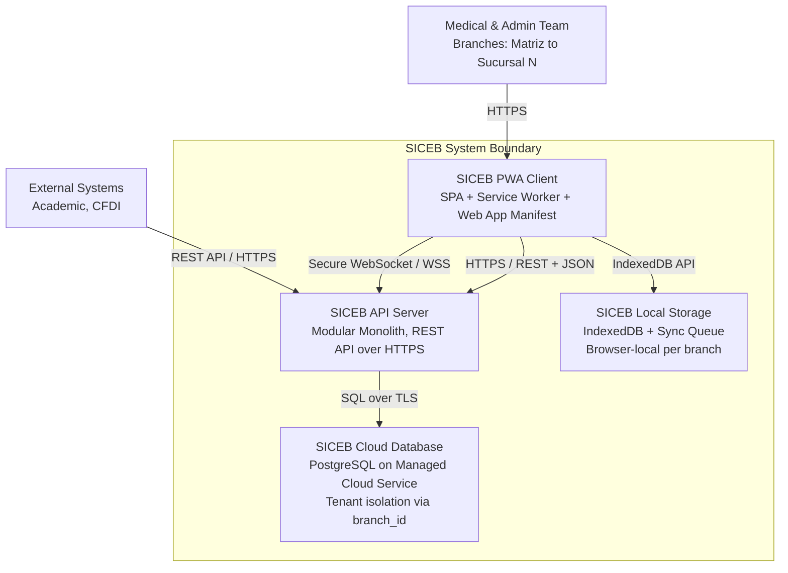
```mermaid
graph TB
    USR[Medical & Admin Team<br/>Branches: Matriz to Sucursal N]
    EXT[External Systems<br/>Academic, CFDI]

    subgraph boundary [SICEB System Boundary]
        PWA[SICEB PWA Client<br/>SPA + Service Worker + Web App Manifest]
        API[SICEB API Server<br/>Modular Monolith, REST API over HTTPS]
        DB[SICEB Cloud Database<br/>PostgreSQL on Managed Cloud Service<br/>Tenant isolation via branch_id]
        LS[SICEB Local Storage<br/>IndexedDB + Sync Queue<br/>Browser-local per branch]
    end

    USR -- "HTTPS" --> PWA
    PWA -- "HTTPS / REST + JSON" --> API
    PWA -- "Secure WebSocket / WSS" --> API
    PWA -- "IndexedDB API" --> LS
    API -- "SQL over TLS" --> DB
    EXT -- "REST API / HTTPS" --> API
```

#### Container Responsibilities

| Container                | Technology                           | Responsibilities                                                                                                                                                                                                                                                                                                                                      |
| ------------------------ | ------------------------------------ | ----------------------------------------------------------------------------------------------------------------------------------------------------------------------------------------------------------------------------------------------------------------------------------------------------------------------------------------------------- |
| **SICEB PWA Client**     | SPA Framework + PWA APIs + IndexedDB | Renders the user interface for all 11 roles; manages application state; intercepts network requests via Service Worker for caching; stores offline data in IndexedDB; provides installable experience on desktop and tablet; targets last 2 versions of Chrome, Edge, Safari, Firefox                                                                 |
| **SICEB API Server**     | Cloud PaaS, Modular Monolith         | Exposes REST API over HTTPS for all client and external operations; hosts domain and platform modules; enforces authentication, authorization, and tenant context; orchestrates business logic; publishes real-time events via Secure WebSocket; documented via OpenAPI specification                                                                 |
| **SICEB Cloud Database** | PostgreSQL, Managed Cloud Service    | Stores all persistent data with tenant isolation via `branch_id` discriminator column; enforces referential integrity and data types at the schema level; uses `DECIMAL(19,4)` for monetary values and `TIMESTAMPTZ` in UTC for all timestamps; supports row-level security for multi-tenant queries                                                  |
| **SICEB Local Storage**  | IndexedDB, Browser Storage           | Caches a subset of cloud data relevant to the user's active branch for offline operation; maintains a sync queue for operations performed while offline; supports cache validation and corruption detection; enforces branch-scoped cache isolation upon branch context switch (PROC-12-FUT); managed by the Service Worker and Local Storage Manager |

### 6.- Component diagrams

#### 6.1 — SICEB API Server Components

The API Server is internally organized as a modular monolith following domain-driven decomposition. Modules are grouped into three layers: **Domain Modules** encapsulate business logic for specific bounded contexts, **Platform Modules** provide cross-cutting infrastructure services consumed by all domain modules, and the **Shared Kernel** defines common value types used across the entire codebase. All inter-module dependencies follow a strict acyclic directed graph — solid arrows represent primary domain dependencies, dashed arrows represent read-only or event-based dependencies.

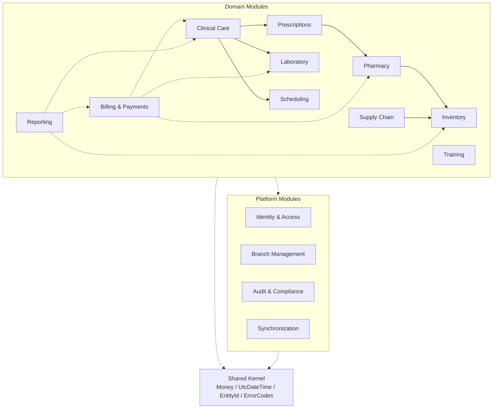
```mermaid
graph TB
    subgraph platform [Platform Modules]
        IAM[Identity & Access]
        BM[Branch Management]
        AUD[Audit & Compliance]
        SYNC[Synchronization]
    end

    subgraph domain [Domain Modules]
        CC[Clinical Care]
        RX[Prescriptions]
        PH[Pharmacy]
        LAB[Laboratory]
        INV[Inventory]
        SC[Supply Chain]
        SCH[Scheduling]
        BP[Billing & Payments]
        RPT[Reporting]
        TRN[Training]
    end

    SK[Shared Kernel<br/>Money / UtcDateTime / EntityId / ErrorCodes]

    %% Primary domain dependency chain
    CC --> RX
    RX --> PH
    PH --> INV
    SC --> INV
    CC --> LAB
    CC --> SCH

    %% Read-only and event-based dependencies
    BP -.-> CC
    BP -.-> PH
    BP -.-> LAB
    RPT -.-> BP
    RPT -.-> INV
    RPT -.-> CC

    %% All domain modules depend on platform and shared kernel
    domain -.-> platform
    domain -.-> SK
    platform -.-> SK
```

##### API Server Module Responsibilities

| Module                 | Type     | Responsibilities                                                                                                                                                                                                                                                                                                                                                                                                                                                                                                                                                                                                                                                                                                                                                                                                                                                                                 |
| ---------------------- | -------- | ------------------------------------------------------------------------------------------------------------------------------------------------------------------------------------------------------------------------------------------------------------------------------------------------------------------------------------------------------------------------------------------------------------------------------------------------------------------------------------------------------------------------------------------------------------------------------------------------------------------------------------------------------------------------------------------------------------------------------------------------------------------------------------------------------------------------------------------------------------------------------------------------ |
| **Clinical Care**      | Domain   | Patient registration and demographics; medical record creation and append-only enforcement via `ClinicalEventStore`; consultation recording with vital signs and diagnosis; file attachment management; system-wide unique patient identifier; CQRS read models for patient search, clinical timeline, and NOM-004 structured views                                                                                                                                                                                                                                                                                                                                                                                                                                                                                                                                                              |
| **Prescriptions**      | Domain   | Prescription creation within consultation context via `PrescriptionCommandHandler` appending to the clinical event stream; prescription item management; prescriber permission validation based on residency level — fully enforced by the `AuthorizationMiddleware` and `ResidencyLevelPolicy` in the security middleware pipeline (Iteration 3): R1, R2, R3 residents are blocked from prescribing controlled medications, and all residency levels are validated against their permitted actions before the handler executes; prescription status lifecycle                                                                                                                                                                                                                                                                                                                                   |
| **Pharmacy**           | Domain   | Medication catalog management; dispensation event recording with 8-field traceability for controlled substances; inventory deduction upon dispensation; prescription validation before dispensing                                                                                                                                                                                                                                                                                                                                                                                                                                                                                                                                                                                                                                                                                                |
| **Laboratory**         | Domain   | Laboratory study request lifecycle via `LabStudyCommandHandler` appending to the clinical event stream; prepayment verification; text-only result entry as separate `LaboratoryResult` events per CON-05; result availability in patient medical record via `ClinicalTimelineReadModel`; `PendingLabStudiesReadModel` for lab technician work queues                                                                                                                                                                                                                                                                                                                                                                                                                                                                                                                                             |
| **Inventory**          | Domain   | Branch-scoped stock tracking for medications and medical supplies via CQRS: command side processes five delta command types (IncrementStock, DecrementStock, AdjustStock, SetMinimumThreshold, UpdateExpiration) through `InventoryCommandHandler` and persists them to the append-only `InventoryDeltaStore`; current stock atomically materialized via PostgreSQL `AFTER INSERT` trigger on delta table; read side maintains `BranchInventoryReadModel` (cross-branch admin and service-scoped views), `LowStockAlertProjection`, and `ExpirationAlertProjection`; real-time propagation via `pg_notify` to WebSocket infrastructure for PER-01; optimistic concurrency with `SELECT ... FOR UPDATE` per item within a branch (CRN-35); tables partitioned by `branch_id` for ESC-02 scalability; no outgoing domain dependencies — designed as a dependency leaf                                                                                                                                                                                                                                                                                                                                                                                                                                                                                              |
| **Supply Chain**       | Domain   | Supply request creation with justification; multi-step approval workflow; delivery recording; receipt confirmation; branch inventory update upon delivery                                                                                                                                                                                                                                                                                                                                                                                                                                                                                                                                                                                                                                                                                                                                        |
| **Scheduling**         | Domain   | Appointment creation and management; physician agenda views; cancellation and rescheduling with documented reasons                                                                                                                                                                                                                                                                                                                                                                                                                                                                                                                                                                                                                                                                                                                                                                               |
| **Billing & Payments** | Domain   | Payment registration for consultations, pharmacy, and laboratory; service tariff configuration via `TariffManagementService` using temporal effective-date pattern — each `ServiceTariff` carries `effectiveFrom` timestamp, active tariff resolved as `MAX(effectiveFrom) WHERE effectiveFrom <= NOW()`, historical tariffs immutable so past charges are unaffected by price changes; tariff CRUD restricted to Director General and General Administrator via `tariff:manage` permission; all monetary values stored as `DECIMAL(19,4)` with banker's rounding; receipt generation; future CFDI integration point                                                                                                                                                                                                                                                                                                                                                                                                                                                                                                                                                                                                                                                                                                                                                                 |
| **Reporting**          | Domain   | Consolidated financial reports across branches; operational dashboards; read-only access to Billing, Inventory, and Clinical Care data via dedicated read models                                                                                                                                                                                                                                                                                                                                                                                                                                                                                                                                                                                                                                                                                                                                 |
| **Training**           | Domain   | Workshop request and approval workflow; attendance tracking; future exposure to external academic systems via REST API                                                                                                                                                                                                                                                                                                                                                                                                                                                                                                                                                                                                                                                                                                                                                                           |
| **Identity & Access**  | Platform | Authentication via `AuthenticationService` (credential validation, JWT issuance with embedded claims for role, permissions, residency level, branch assignments, and consent scopes; refresh token management; `TokenDenyList` for immediate revocation of deactivated users). Authorization via `AuthorizationMiddleware` evaluating three dimensions on every request: role permissions, branch assignment, and residency-level restrictions. `ResidencyLevelPolicy` encodes R1–R4 hierarchical action rules (R1/R2/R3 blocked from controlled substance prescribing; R1/R2 mandatory supervision). Data-driven `RolePermissionModel` storing roles, permissions, and mappings in database — admin-configurable without code changes (MNT-03). `UserManagementService` for user CRUD with branch assignment and medical staff registration including residency level and supervisor assignment |
| **Branch Management**  | Platform | Branch lifecycle via `BranchRegistrationService` — registration with unique name/address validation, activation, deactivation (preserves history, blocks new operations); `BranchOnboardingOrchestrator` executes a 5-step idempotent workflow after registration (database partition creation, service catalog seeding, tariff copying, inventory initialization, completion marking) with progress tracking in `branch_onboarding_status` table for ESC-01; `BranchContextService` handles mid-session active branch switching — validates user assignment, issues new JWT with updated `activeBranchId`, resets PostgreSQL RLS session variable, without requiring re-authentication (ESC-03); `branch_id` injection into request context for tenant-scoped queries                                                                                                                                                                                                                                                                                                                                                                                                                                                                                                                                                                                              |
| **Audit & Compliance** | Platform | `AuditEventReceiver` ingests audit events from two sources: the security middleware pipeline (access events for every request) and domain modules (clinical writes, future pharmacy/inventory events). `ImmutableAuditStore` persists events as SHA-256 hash-chained entries in an INSERT-only PostgreSQL table (UPDATE, DELETE, TRUNCATE revoked from application DB role) — tamper-evident even against DBA modification (CRN-18). Supports synchronous ingestion for security-critical events and asynchronous for high-volume access logs. `AuditQueryService` exposes query interfaces for entity audit trails, user activity logs, patient access logs (LFPDPPP), and on-demand chain integrity verification. `LfpdpppComplianceTracker` manages patient consent lifecycle and ARCO request workflows (Access, Rectification, Cancellation, Opposition) with legal deadline tracking       |
| **Synchronization**    | Platform | Offline sync queue management; conflict detection and resolution via delta-based commands; data reconciliation between Local Storage and Cloud Database; asynchronous business compensation for offline regulatory violations (CRN-45); Service Worker background sync orchestration                                                                                                                                                                                                                                                                                                                                                                                                                                                                                                                                                                                                             |
| **Shared Kernel**      | Shared   | `Money` value type with `DECIMAL(19,4)` and banker's rounding; `UtcDateTime` value type enforcing UTC storage; `EntityId` based on UUID (no auto-increment sequences permitted); `IdempotencyKey` for safe command retry during sync; standardized error codes and base entity types                                                                                                                                                                                                                                                                                                                                                                                                                                                                                                                                                                                                             |

##### 6.1.1 — Clinical Care Module Internals (Iteration 2)

This component diagram zooms into the **Clinical Care**, **Prescriptions**, and **Laboratory** modules, showing the CQRS structure introduced in Iteration 2. The **command side** receives clinical commands and appends immutable `ClinicalEvent`s to the event store. The **read side** maintains projections optimized for patient search, clinical timeline rendering, NOM-004 structured views, and pending lab study lists. The Prescriptions and Laboratory modules contribute event types to the shared clinical event stream but maintain their own command handlers.

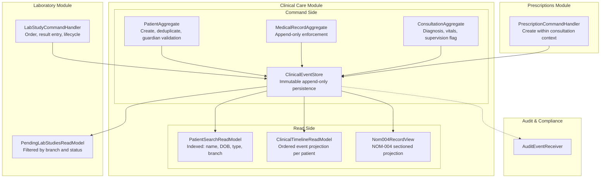
```mermaid
graph TB
    subgraph cc_module [Clinical Care Module]
        direction TB
        subgraph cc_write [Command Side]
            PAG[PatientAggregate<br/>Create, deduplicate, guardian validation]
            MRA[MedicalRecordAggregate<br/>Append-only enforcement]
            CA[ConsultationAggregate<br/>Diagnosis, vitals, supervision flag]
            CES[ClinicalEventStore<br/>Immutable append-only persistence]
        end
        subgraph cc_read [Read Side]
            PSR[PatientSearchReadModel<br/>Indexed: name, DOB, type, branch]
            CTR[ClinicalTimelineReadModel<br/>Ordered event projection per patient]
            N04[Nom004RecordView<br/>NOM-004 sectioned projection]
        end
    end

    subgraph rx_module [Prescriptions Module]
        RXH[PrescriptionCommandHandler<br/>Create within consultation context]
    end

    subgraph lab_module [Laboratory Module]
        LABH[LabStudyCommandHandler<br/>Order, result entry, lifecycle]
        PLR[PendingLabStudiesReadModel<br/>Filtered by branch and status]
    end

    subgraph audit_sink [Audit & Compliance]
        AE[AuditEventReceiver]
    end

    PAG --> CES
    MRA --> CES
    CA --> CES
    RXH --> CES
    LABH --> CES

    CES --> PSR
    CES --> CTR
    CES --> N04
    CES --> PLR

    CES -.-> AE
```

##### Clinical Care Module — Internal Component Responsibilities

| Component                      | Side    | Responsibilities                                                                                                                                                                                                                                                                                                                                                                                                                                                              | Key Drivers                            |
| ------------------------------ | ------- | ----------------------------------------------------------------------------------------------------------------------------------------------------------------------------------------------------------------------------------------------------------------------------------------------------------------------------------------------------------------------------------------------------------------------------------------------------------------------------- | -------------------------------------- |
| **PatientAggregate**           | Command | Handles `CreatePatient` commands; enforces global uniqueness of `patientId` across branches; validates guardian presence for minors; applies patient type classification and discount rules                                                                                                                                                                                                                                                                                   | CRN-37, US-019, US-020, US-023         |
| **MedicalRecordAggregate**     | Command | Handles `CreateMedicalRecord` commands; enforces the invariant that exactly one record exists per patient; rejects any update or delete operation on existing events — append-only                                                                                                                                                                                                                                                                                            | US-026, CRN-02, AUD-03                 |
| **ConsultationAggregate**      | Command | Handles `AddConsultation` commands; captures diagnosis, notes, vital signs; flags `requiresSupervision` for R1/R2 residents; serves as the transactional context for creating prescriptions and lab orders within the same encounter                                                                                                                                                                                                                                          | US-025, USA-02, CRN-16                 |
| **ClinicalEventStore**         | Command | The immutable, append-only persistence layer for all clinical events; assigns sequential ordering per `MedicalRecord`; validates `IdempotencyKey` to prevent duplicate writes during offline sync replay; publishes event notifications to read-side projections and Audit & Compliance                                                                                                                                                                                       | CRN-02, CRN-43, AUD-03                 |
| **PrescriptionCommandHandler** | Command | Handles `CreatePrescriptionFromConsultation` commands; creates `Prescription` and `PrescriptionItem` events within a consultation context; validates that the consultation exists and is open. Prescriber-level restrictions are enforced upstream by the `AuthorizationMiddleware` and `ResidencyLevelPolicy` (Iteration 3) — R1/R2/R3 residents are blocked from prescribing controlled medications before the handler executes; the handler focuses purely on domain logic | US-031, US-031, US-050, US-051, SEC-01 |
| **LabStudyCommandHandler**     | Command | Handles `CreateLabStudiesFromConsultation` and `RecordLabResult` commands; manages the laboratory study lifecycle from order to result; appends `LaboratoryStudy` and `LaboratoryResult` as separate clinical events; results are text-only per CON-05                                                                                                                                                                                                                        | US-038, US-040, US-041, US-042, CON-05 |
| **PatientSearchReadModel**     | Read    | Denormalized, indexed projection for fast patient lookup; updated from `ClinicalEvent` stream; indexes on `fullName`, `dateOfBirth`, `patientType`, `branch_id`, and `lastVisitDate`; targets sub-1-second response over 50,000+ records                                                                                                                                                                                                                                      | PER-03, US-027                         |
| **ClinicalTimelineReadModel**  | Read    | Chronologically ordered projection of all clinical events per patient; enables rendering of the complete medical history without expensive runtime joins; updated incrementally as new events arrive                                                                                                                                                                                                                                                                          | US-027, US-025                         |
| **Nom004RecordView**           | Read    | Structured projection organizing events into NOM-004-SSA3-2012 mandatory sections: identification, clinical notes, diagnostics, lab summaries, prescriptions, attachments; supports automated completeness checks and regulatory reporting                                                                                                                                                                                                                                    | CRN-31, AUD-03                         |
| **PendingLabStudiesReadModel** | Read    | Branch-scoped list of laboratory studies in pending or in-progress status; enables lab technicians to view their work queue filtered by branch and date; updated when `LaboratoryStudy` or `LaboratoryResult` events are appended                                                                                                                                                                                                                                             | US-040                                 |

##### 6.1.2 — Identity & Access Module Internals (Iteration 3)

This component diagram decomposes the **Identity & Access** platform module into its internal components. The `AuthenticationService` handles credential validation and JWT lifecycle. The `AuthorizationMiddleware` evaluates three-dimensional permission checks (role, branch, residency level) on every request. The `ResidencyLevelPolicy` encodes hierarchical R1–R4 action restrictions. The `RolePermissionModel` stores the data-driven role/permission configuration. The `UserManagementService` handles user CRUD with branch and medical staff associations. The `TokenDenyList` enables immediate revocation of compromised or deactivated-user tokens.

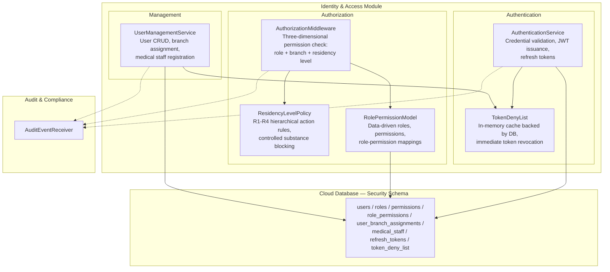
```mermaid
graph TB
    subgraph iam_module [Identity & Access Module]
        direction TB
        subgraph iam_auth [Authentication]
            AS[AuthenticationService<br/>Credential validation, JWT issuance,<br/>refresh tokens]
            TDL[TokenDenyList<br/>In-memory cache backed by DB,<br/>immediate token revocation]
        end
        subgraph iam_authz [Authorization]
            AM[AuthorizationMiddleware<br/>Three-dimensional permission check:<br/>role + branch + residency level]
            RLP[ResidencyLevelPolicy<br/>R1-R4 hierarchical action rules,<br/>controlled substance blocking]
            RPM[RolePermissionModel<br/>Data-driven roles, permissions,<br/>role-permission mappings]
        end
        subgraph iam_mgmt [Management]
            UMS[UserManagementService<br/>User CRUD, branch assignment,<br/>medical staff registration]
        end
    end

    subgraph db_security [Cloud Database — Security Schema]
        DBU[users / roles / permissions /<br/>role_permissions / user_branch_assignments /<br/>medical_staff / refresh_tokens / token_deny_list]
    end

    subgraph audit_sink [Audit & Compliance]
        AER[AuditEventReceiver]
    end

    AS --> TDL
    AS --> DBU
    AM --> RPM
    AM --> RLP
    RPM --> DBU
    UMS --> DBU
    UMS --> TDL

    AS -.-> AER
    AM -.-> AER
    UMS -.-> AER
```

##### Identity & Access Module — Internal Component Responsibilities

| Component                   | Responsibilities                                                                                                                                                                                                                                                                                                                                                                                                                                                                                                                         | Key Drivers                    |
| --------------------------- | ---------------------------------------------------------------------------------------------------------------------------------------------------------------------------------------------------------------------------------------------------------------------------------------------------------------------------------------------------------------------------------------------------------------------------------------------------------------------------------------------------------------------------------------- | ------------------------------ |
| **AuthenticationService**   | Validates user credentials against bcrypt-hashed passwords in the `users` table. On success, issues a short-lived JWT access token (15-minute TTL) carrying embedded claims: `userId`, `role`, `residencyLevel`, `branchAssignments[]`, `activeBranchId`, `permissions[]`, and `consentVerifiedScopes[]`. Issues a long-lived refresh token (7-day TTL, stored server-side, revocable). Checks `TokenDenyList` during token validation to reject revoked tokens. Emits audit events for login success, login failure, and token refresh. | US-002, SEC-04, CRN-43         |
| **TokenDenyList**           | In-memory cache backed by a database table (`token_deny_list`). Stores JTI (JWT ID) of revoked tokens with their original expiry time. Populated when a user is deactivated (all active tokens revoked immediately), when a refresh token is explicitly revoked, or when suspicious activity is detected. Entries are auto-purged after the token's original TTL expires.                                                                                                                                                                | US-001, SEC-04                 |
| **AuthorizationMiddleware** | Intercepts every API request after authentication. Extracts the permission requirement from route metadata. Evaluates three dimensions: (1) Does the user's role include the required permission? (2) Is the request scoped to a branch the user is assigned to? (3) If `requiresResidencyCheck` is set on the permission, delegates to `ResidencyLevelPolicy`. Rejects with HTTP 403 on any dimension failure. Emits an audit event for every authorization denial.                                                                     | SEC-01, SEC-02, CRN-15, US-003 |
| **ResidencyLevelPolicy**    | Encodes hierarchical action rules for residency levels R1–R4 and attending physicians, loaded from the `residency_level_rules` database table and cached in memory. Key rules: R1/R2/R3 blocked from `controlled_med:prescribe`; R1/R2 require `supervision:mandatory` on consultations; R4 may prescribe controlled medications with optional review flagging. Evaluated by `AuthorizationMiddleware` for any permission with `requiresResidencyCheck = true`.                                                                          | US-050, US-051, SEC-01         |
| **RolePermissionModel**     | Data-driven storage of roles, permissions, and role-permission mappings in three database tables. The 11 initial system roles are seeded via migration and protected by `is_system_role` flag. Administrators can create new roles and assign permissions through the admin UI. A validation layer prevents creation of roles that combine `controlled_med:prescribe` with residency levels R1–R3. Permission keys are stable strings categorized by functional area.                                                                    | MNT-03, US-003, CRN-15         |
| **UserManagementService**   | Handles user lifecycle: create user with role assignment and branch assignments; activate/deactivate users (deactivation adds all active tokens to `TokenDenyList` for immediate revocation); update role and branch assignments. For medical staff, additionally stores `residencyLevel`, `specialty`, and `supervisorStaffId` (mandatory for R1/R2). Emits audit events for every user lifecycle action.                                                                                                                               | US-001, CRN-15                 |

##### 6.1.3 — Audit & Compliance Module Internals (Iteration 3)

This component diagram decomposes the **Audit & Compliance** platform module. The `AuditEventReceiver` ingests events from two sources: the security middleware pipeline (access events) and domain modules (business events). The `ImmutableAuditStore` persists events as hash-chained entries in an INSERT-only table. The `AuditQueryService` provides read interfaces for compliance reporting. The `LfpdpppComplianceTracker` manages consent and ARCO workflows.

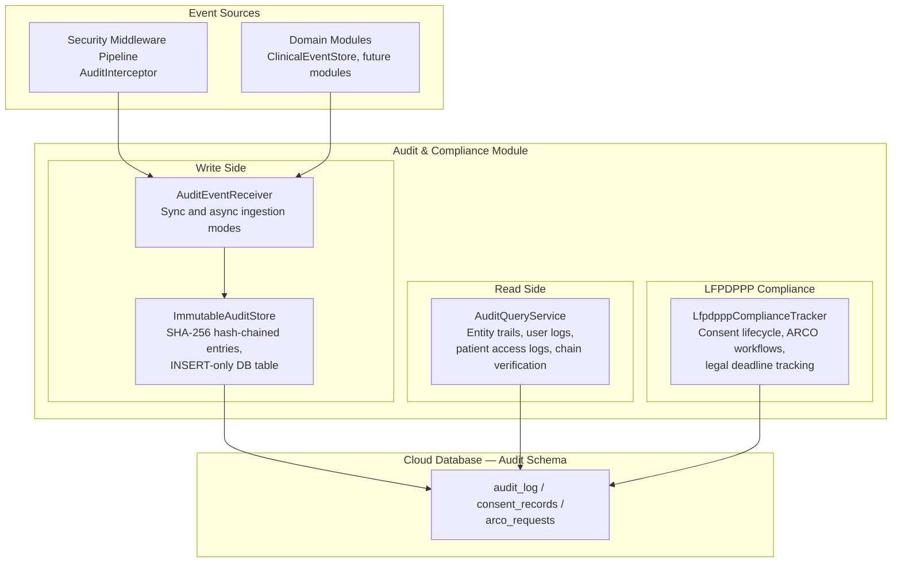
```mermaid
graph TB
    subgraph audit_module [Audit & Compliance Module]
        direction TB
        subgraph audit_write [Write Side]
            AER[AuditEventReceiver<br/>Sync and async ingestion modes]
            IAS[ImmutableAuditStore<br/>SHA-256 hash-chained entries,<br/>INSERT-only DB table]
        end
        subgraph audit_read [Read Side]
            AQS[AuditQueryService<br/>Entity trails, user logs,<br/>patient access logs, chain verification]
        end
        subgraph audit_lfpdppp [LFPDPPP Compliance]
            LCT[LfpdpppComplianceTracker<br/>Consent lifecycle, ARCO workflows,<br/>legal deadline tracking]
        end
    end

    subgraph event_sources [Event Sources]
        MW[Security Middleware Pipeline<br/>AuditInterceptor]
        DM[Domain Modules<br/>ClinicalEventStore, future modules]
    end

    subgraph db_audit [Cloud Database — Audit Schema]
        DBA[audit_log / consent_records /<br/>arco_requests]
    end

    MW --> AER
    DM --> AER
    AER --> IAS
    IAS --> DBA
    AQS --> DBA
    LCT --> DBA
```

##### Audit & Compliance Module — Internal Component Responsibilities

| Component                    | Side       | Responsibilities                                                                                                                                                                                                                                                                                                                                                                                                                                                                                                                                                                                                                                               | Key Drivers                    |
| ---------------------------- | ---------- | -------------------------------------------------------------------------------------------------------------------------------------------------------------------------------------------------------------------------------------------------------------------------------------------------------------------------------------------------------------------------------------------------------------------------------------------------------------------------------------------------------------------------------------------------------------------------------------------------------------------------------------------------------------- | ------------------------------ |
| **AuditEventReceiver**       | Write      | Ingestion interface receiving audit events from two sources: (1) the `AuditInterceptor` middleware (access events for every API request — who accessed what, when, from which IP), and (2) domain modules via direct emission (clinical writes from Iteration 2, future pharmacy and inventory events from Iterations 4–5). Each event is enriched with `previous_hash`, serialized, hashed (SHA-256), and forwarded to `ImmutableAuditStore`. Supports synchronous mode for security-critical events (login failures, permission denials, controlled substance actions) and asynchronous mode for high-volume access logging to avoid request latency impact. | CRN-17, US-066                 |
| **ImmutableAuditStore**      | Write      | The append-only persistence layer for the audit trail. Each entry in the `audit_log` PostgreSQL table includes: `entry_id`, `previous_hash`, `entry_hash` (SHA-256 of `previous_hash` + serialized payload), `timestamp`, `user_id`, `action`, `target_entity`, `target_id`, `branch_id`, `details` (JSONB), and `ip_address`. The application database role has INSERT-only privileges on this table — UPDATE, DELETE, and TRUNCATE are revoked. A periodic integrity verification job walks the hash chain and alerts on any discontinuity, making tampering (even by a DBA with direct database access) detectable.                                         | CRN-17, CRN-18, AUD-03         |
| **AuditQueryService**        | Read       | Read-only query interface exposing four operations: `GetAuditTrailForEntity(entityType, entityId, dateRange)` — all audit events for a specific record; `GetAuditTrailForUser(userId, dateRange)` — all actions by a specific user; `GetAccessLogForPatient(patientId, dateRange)` — all access events for a patient's data (LFPDPPP compliance); `VerifyChainIntegrity(fromEntryId, toEntryId)` — on-demand tamper check across a range of entries. Results are paginated and branch-scoped (except for Director General role which can query cross-branch).                                                                                                  | CRN-17, US-066, CRN-32         |
| **LfpdpppComplianceTracker** | Compliance | Manages patient data consent lifecycle via the `consent_records` table: tracks consent grant, revocation, purpose, and timestamps per patient. Consent status is embedded in the JWT claims for offline-compatible verification. Supports ARCO request workflows via the `arco_requests` table: request creation with type (Access, Rectification, Cancellation, Opposition), legal deadline calculation (20 business days), status tracking, and resolution recording. For Rectification on immutable clinical records (CRN-02), generates a corrective addendum event appended to the clinical event stream rather than modifying the original record.       | CRN-32, US-062, US-063, US-066 |

##### 6.1.4 — Security Middleware Pipeline (Iteration 3)

This diagram shows the ordered filter chain applied to every API request entering the SICEB API Server. Each filter has a single responsibility and can short-circuit the chain by returning an error response. The ordering guarantees that unauthenticated requests are rejected before authorization logic, unauthorized requests never reach domain modules, tenant context is always set before any database query, and all access is audited.

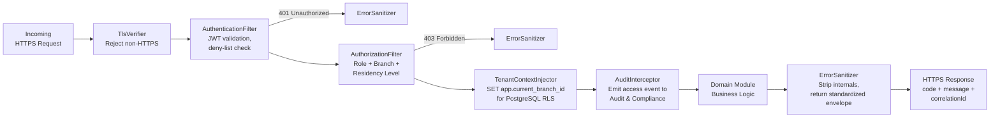
```mermaid
graph LR
    REQ[Incoming<br/>HTTPS Request] --> TLS[TlsVerifier<br/>Reject non-HTTPS]
    TLS --> AF[AuthenticationFilter<br/>JWT validation,<br/>deny-list check]
    AF -->|401 Unauthorized| ES1[ErrorSanitizer]
    AF --> AZF[AuthorizationFilter<br/>Role + Branch +<br/>Residency Level]
    AZF -->|403 Forbidden| ES2[ErrorSanitizer]
    AZF --> TCI[TenantContextInjector<br/>SET app.current_branch_id<br/>for PostgreSQL RLS]
    TCI --> AI[AuditInterceptor<br/>Emit access event to<br/>Audit & Compliance]
    AI --> DOM[Domain Module<br/>Business Logic]
    DOM --> ESF[ErrorSanitizer<br/>Strip internals,<br/>return standardized envelope]
    ESF --> RES[HTTPS Response<br/>code + message +<br/>correlationId]
```

##### Security Middleware Pipeline — Filter Responsibilities

| Filter                    | Order | Responsibilities                                                                                                                                                                                                                                                                                                                                                                                                                                               | Short-Circuit                                                                               | Key Drivers                            |
| ------------------------- | ----- | -------------------------------------------------------------------------------------------------------------------------------------------------------------------------------------------------------------------------------------------------------------------------------------------------------------------------------------------------------------------------------------------------------------------------------------------------------------- | ------------------------------------------------------------------------------------------- | -------------------------------------- |
| **TlsVerifier**           | 1     | Defense-in-depth verification that the request arrived over HTTPS. Rejects any non-TLS request at the application level as a safeguard behind the cloud load balancer's TLS termination.                                                                                                                                                                                                                                                                       | Rejects with 421 Misdirected Request                                                        | CON-02, CRN-13                         |
| **AuthenticationFilter**  | 2     | Validates the JWT signature, expiry, and issuer. Checks the token's JTI against the `TokenDenyList` to reject revoked tokens. Extracts the full user context from JWT claims: `userId`, `role`, `residencyLevel`, `branchAssignments`, `activeBranchId`, `permissions`, `consentVerifiedScopes`. Attaches the user context to the request for downstream filters.                                                                                              | Rejects with 401 Unauthorized (generic message, no internal details)                        | SEC-04, US-002                         |
| **AuthorizationFilter**   | 3     | Reads the required permission from the route metadata. Evaluates three dimensions using the user context: (1) role-based permission inclusion, (2) branch assignment match for the active branch, (3) residency-level check via `ResidencyLevelPolicy` if the permission has `requiresResidencyCheck`. Emits an audit event for every denial.                                                                                                                  | Rejects with 403 Forbidden (states which dimension failed without leaking internal details) | SEC-01, SEC-02, CRN-15, US-050, US-051 |
| **TenantContextInjector** | 4     | Sets the PostgreSQL session variable `app.current_branch_id` to the user's active branch from the JWT claims. This activates Row-Level Security (RLS) policies on all tenant-scoped tables, providing defense-in-depth below the application-level `branch_id` filtering. For cross-branch reporting endpoints (Director General only), sets a bypass flag using the `admin_reporting` role.                                                                   | None — always passes through                                                                | SEC-02                                 |
| **AuditInterceptor**      | 5     | Captures an access audit event for every request that reaches this point (authenticated, authorized, tenant-scoped). Records: `userId`, `action` (HTTP method + route), `targetEntity` (derived from route), `targetId` (from path parameters), `branchId`, `timestamp`, and `ipAddress`. Routes the event to `AuditEventReceiver` — synchronous for security-sensitive actions, asynchronous for standard access logging.                                     | None — always passes through                                                                | US-066, CRN-17                         |
| **ErrorSanitizer**        | 6     | Terminal filter that intercepts all error responses — including unhandled exceptions from domain modules. Strips stack traces, internal entity names, database details, and SQL fragments. Returns a standardized error envelope: `{ code, message, correlationId }`. The `correlationId` links to the full internal error in server-side logs for debugging. Validation errors from domain modules are passed through with their user-facing messages intact. | N/A — wraps the response                                                                    | CRN-13, SEC-04                         |

##### 6.1.5 — Branch Management Module Internals (Iteration 4)

This component diagram decomposes the **Branch Management** platform module into its internal components. The `BranchRegistrationService` handles branch lifecycle operations. The `BranchOnboardingOrchestrator` executes the multi-step branch setup workflow. The `BranchContextService` manages active branch selection and mid-session context switching with JWT re-issuance. The `BranchConfigurationStore` persists branch-specific settings and onboarding progress.

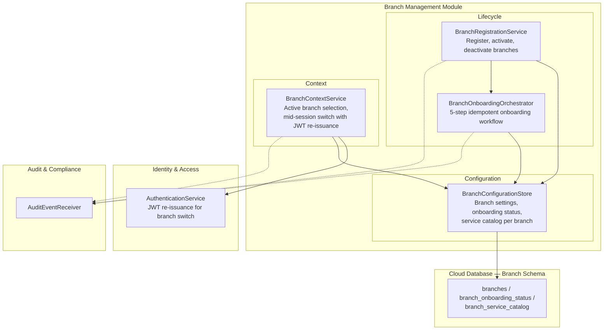
```mermaid
graph TB
    subgraph bm_module [Branch Management Module]
        direction TB
        subgraph bm_lifecycle [Lifecycle]
            BRS[BranchRegistrationService<br/>Register, activate, deactivate branches]
            BOO[BranchOnboardingOrchestrator<br/>5-step idempotent onboarding workflow]
        end
        subgraph bm_context [Context]
            BCS[BranchContextService<br/>Active branch selection,<br/>mid-session switch with JWT re-issuance]
        end
        subgraph bm_config [Configuration]
            BCFS[BranchConfigurationStore<br/>Branch settings, onboarding status,<br/>service catalog per branch]
        end
    end

    subgraph iam [Identity & Access]
        AS[AuthenticationService<br/>JWT re-issuance for branch switch]
    end

    subgraph db_branch [Cloud Database — Branch Schema]
        DBB[branches / branch_onboarding_status /<br/>branch_service_catalog]
    end

    subgraph audit_sink [Audit & Compliance]
        AER[AuditEventReceiver]
    end

    BRS --> BCFS
    BRS --> BOO
    BOO --> BCFS
    BCS --> AS
    BCS --> BCFS
    BCFS --> DBB

    BRS -.-> AER
    BCS -.-> AER
    BOO -.-> AER
```

##### Branch Management Module — Internal Component Responsibilities

| Component | Responsibilities | Key Drivers |
|---|---|---|
| **BranchRegistrationService** | Handles `RegisterBranch` command: validates unique branch name and address, persists branch record with `isActive = true`, triggers `BranchOnboardingOrchestrator`. Handles `DeactivateBranch` command: sets `isActive = false`, preserves all historical data, prevents new operations. Emits audit events for both lifecycle actions. | US-071, ESC-01 |
| **BranchOnboardingOrchestrator** | Executes a deterministic 5-step idempotent sequence after branch registration: (1) create database partitions for `inventory_items` and `inventory_deltas` tables, (2) seed default service catalog entries from the organization template, (3) copy active tariff catalog to the new branch, (4) initialize empty inventory items per service, (5) mark branch as `onboarding_complete`. Each step records progress in `branch_onboarding_status` table for resumability. Designed to complete within ESC-01 target (<1 hour). | US-071, ESC-01 |
| **BranchContextService** | Handles `SwitchBranch` command for mid-session branch context switching: validates user is assigned to the target branch (from JWT `branchAssignments`), delegates to `AuthenticationService` for JWT re-issuance with updated `activeBranchId` claim, sets PostgreSQL RLS session variable `app.current_branch_id` to the new branch. Does not require re-authentication — satisfies ESC-03 (<3 seconds without logout). Also handles initial post-login branch selection. | US-074, ESC-03, SEC-02 |
| **BranchConfigurationStore** | Persistence layer for branch records, onboarding progress tracking, and branch-scoped service catalog configuration. Stores branch settings including name, address, `isActive` status, `onboardingComplete` flag. Provides queries for `ListBranches`, `GetBranch`, and `GetOnboardingStatus`. | US-071, ESC-01 |

##### 6.1.6 — Inventory Module Internals (Iteration 4)

This component diagram decomposes the **Inventory** domain module into its CQRS structure. The **command side** receives inventory delta commands and persists them to the append-only `InventoryDeltaStore`. A PostgreSQL trigger atomically materializes the current stock on every delta insertion, eliminating any eventual consistency gap. The **read side** maintains projections for branch-scoped inventory views, low-stock alerts, and expiration alerts. The delta store publishes change notifications via `pg_notify` to bridge to the WebSocket real-time infrastructure (§6.1.7).

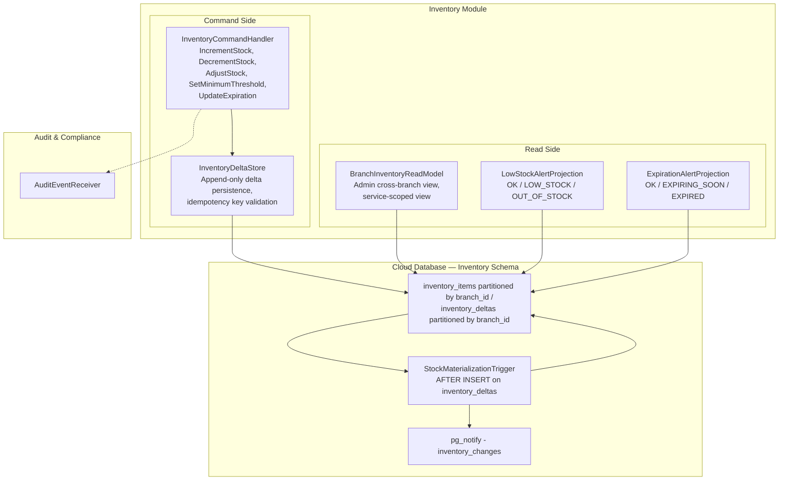
```mermaid
graph TB
    subgraph inv_module [Inventory Module]
        direction TB
        subgraph inv_write [Command Side]
            ICH[InventoryCommandHandler<br/>IncrementStock, DecrementStock,<br/>AdjustStock, SetMinimumThreshold,<br/>UpdateExpiration]
            IDS[InventoryDeltaStore<br/>Append-only delta persistence,<br/>idempotency key validation]
        end
        subgraph inv_read [Read Side]
            BIR[BranchInventoryReadModel<br/>Admin cross-branch view,<br/>service-scoped view]
            LSA[LowStockAlertProjection<br/>OK / LOW_STOCK / OUT_OF_STOCK]
            EAP[ExpirationAlertProjection<br/>OK / EXPIRING_SOON / EXPIRED]
        end
    end

    subgraph db_inv [Cloud Database — Inventory Schema]
        DBI[inventory_items partitioned by branch_id /<br/>inventory_deltas partitioned by branch_id]
        TRG[StockMaterializationTrigger<br/>AFTER INSERT on inventory_deltas]
        PGN[pg_notify - inventory_changes]
    end

    subgraph audit_sink [Audit & Compliance]
        AER[AuditEventReceiver]
    end

    ICH --> IDS
    IDS --> DBI
    DBI --> TRG
    TRG --> DBI
    TRG --> PGN
    BIR --> DBI
    LSA --> DBI
    EAP --> DBI

    ICH -.-> AER
```

##### Inventory Module — Internal Component Responsibilities

| Component | Side | Responsibilities | Key Drivers |
|---|---|---|---|
| **InventoryCommandHandler** | Command | Processes five delta command types: `IncrementStock(itemId, quantity, reason, sourceRef)`, `DecrementStock(itemId, quantity, reason, sourceRef)`, `AdjustStock(itemId, absoluteQuantity, reason)`, `SetMinimumThreshold(itemId, threshold)`, `UpdateExpiration(itemId, expirationDate)`. Validates item exists and belongs to the active branch. Uses `SELECT ... FOR UPDATE` on the `inventory_items` row for concurrency serialization within a branch. Validates `DecrementStock` will not produce negative stock. Delegates persistence to `InventoryDeltaStore`. Emits audit events for all mutations. | CRN-44, CRN-35, CRN-43 |
| **InventoryDeltaStore** | Command | Append-only persistence layer for inventory deltas. Each delta carries: `delta_id (UUID)`, `item_id`, `branch_id`, `delta_type`, `quantity_change`, `absolute_quantity`, `reason`, `source_ref`, `staff_id`, `timestamp (TIMESTAMPTZ)`, `idempotency_key (UNIQUE)`, `sequence_number`. Validates idempotency key uniqueness to prevent duplicate writes during offline sync replay. Insertion triggers `StockMaterializationTrigger`. | CRN-44, CRN-43 |
| **StockMaterializationTrigger** | Database | PostgreSQL `AFTER INSERT` trigger function on `inventory_deltas`. Applies the delta to `inventory_items.current_stock` atomically within the same transaction: INCREMENT adds, DECREMENT subtracts (raises error if result < 0), ADJUST sets absolute value. After materialization, executes `pg_notify('inventory_changes', json_payload)` to trigger real-time WebSocket propagation. | CRN-44, CRN-35, PER-01 |
| **BranchInventoryReadModel** | Read | Denormalized projection combining `inventory_items`, `medical_supplies`, `medications`, and `medical_services` into a query-optimized view. Two access patterns: (1) Admin cross-branch — aggregates all branches, grouped by service, with filters by category, status, and service; uses `admin_reporting` RLS bypass (US-004). (2) Service-scoped — filtered by `branch_id` (RLS) and `service_id` for Service Managers and physicians (US-005). Supports sorting, pagination (50 items/page), and search by name/SKU. | US-004, US-005, PER-01 |
| **LowStockAlertProjection** | Read | Flags inventory items based on stock level relative to minimum threshold: `OK` (stock >= threshold), `LOW_STOCK` (stock < threshold and stock > 0), `OUT_OF_STOCK` (stock = 0). Updated by the stock materialization trigger. Alert status included in both REST query responses and WebSocket inventory change events. | US-004, US-005 |
| **ExpirationAlertProjection** | Read | Categorizes inventory items by expiration status: `OK` (>30 days from expiry), `EXPIRING_SOON` (<=30 days), `EXPIRED` (past date). Computed daily via a scheduled job and on-demand during inventory queries. Expiration status included in inventory views as color-coded indicators. | US-004 |

##### 6.1.7 — WebSocket Real-Time Event Infrastructure (Iteration 4)

This component diagram shows the real-time event infrastructure that enables PER-01 (<2-second inventory update propagation). The `RealtimeEventPublisher` listens to PostgreSQL `pg_notify` notifications and publishes structured STOMP messages to tenant-scoped WebSocket channels. The `WebSocketSecurityInterceptor` authenticates connections via JWT and authorizes subscriptions to prevent cross-branch data leakage.

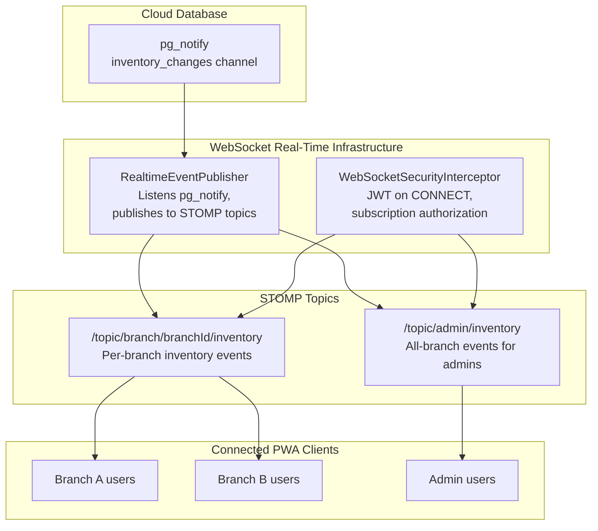
```mermaid
graph TB
    subgraph ws_infra [WebSocket Real-Time Infrastructure]
        direction TB
        REP[RealtimeEventPublisher<br/>Listens pg_notify,<br/>publishes to STOMP topics]
        WSI[WebSocketSecurityInterceptor<br/>JWT on CONNECT,<br/>subscription authorization]
    end

    subgraph stomp_topics [STOMP Topics]
        BT["/topic/branch/branchId/inventory"<br/>Per-branch inventory events]
        AT["/topic/admin/inventory"<br/>All-branch events for admins]
    end

    subgraph db [Cloud Database]
        PGN[pg_notify<br/>inventory_changes channel]
    end

    subgraph pwa_clients [Connected PWA Clients]
        C1[Branch A users]
        C2[Branch B users]
        CA[Admin users]
    end

    PGN --> REP
    REP --> BT
    REP --> AT
    WSI --> BT
    WSI --> AT
    BT --> C1
    BT --> C2
    AT --> CA
```

##### WebSocket Real-Time Infrastructure — Component Responsibilities

| Component | Responsibilities | Key Drivers |
|---|---|---|
| **RealtimeEventPublisher** | Listens to PostgreSQL `pg_notify('inventory_changes')` notifications via a persistent JDBC listener connection. Deserializes the JSON payload containing `branchId`, `itemId`, `deltaType`, `newStock`, `stockStatus`, and `timestamp`. Publishes a structured STOMP message to `/topic/branch/{branchId}/inventory` for the specific branch. Simultaneously publishes to `/topic/admin/inventory` for admin subscribers. Designed for sub-second processing latency to satisfy PER-01 (<2-second end-to-end). | PER-01, ESC-02 |
| **WebSocketSecurityInterceptor** | Validates JWT on STOMP CONNECT frame — extracts `activeBranchId` and `permissions` from claims. Authorizes SUBSCRIBE requests: users may only subscribe to `/topic/branch/{branchId}/inventory` if `branchId` matches their `activeBranchId` or they hold `inventory:read_all` permission. Admin wildcard subscription to `/topic/admin/inventory` requires `inventory:read_all`. Rejects unauthorized subscriptions with STOMP ERROR frame. Periodically validates token expiry; disconnects clients with expired tokens. Handles reconnection with re-authentication. | SEC-02, PER-01, ESC-02 |

#### 6.2 — SICEB PWA Client Components

The PWA Client is organized into five internal components that separate UI rendering, state management, network communication, offline caching, and local persistence.

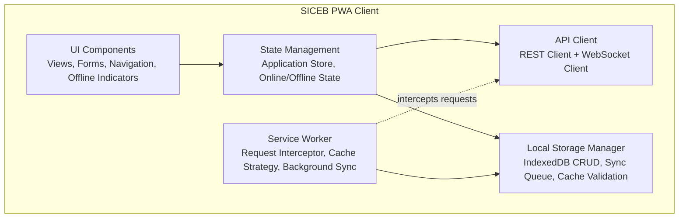
```mermaid
graph TB
    subgraph pwa [SICEB PWA Client]
        UI[UI Components<br/>Views, Forms, Navigation, Offline Indicators]
        SM[State Management<br/>Application Store, Online/Offline State]
        AC[API Client<br/>REST Client + WebSocket Client]
        SW[Service Worker<br/>Request Interceptor, Cache Strategy, Background Sync]
        LSM[Local Storage Manager<br/>IndexedDB CRUD, Sync Queue, Cache Validation]
    end

    UI --> SM
    SM --> AC
    SM --> LSM
    SW -.->|intercepts requests| AC
    SW --> LSM
```

##### PWA Client Component Responsibilities

| Component                 | Responsibilities                                                                                                                                                                                                                                                                                                                                                                |
| ------------------------- | ------------------------------------------------------------------------------------------------------------------------------------------------------------------------------------------------------------------------------------------------------------------------------------------------------------------------------------------------------------------------------- |
| **UI Components**         | Renders views, forms, and navigation for all user roles; displays offline/online status indicators and sync progress; responsive layout for desktop and 10-inch tablets; follows progressive enhancement for browser compatibility                                                                                                                                              |
| **State Management**      | Maintains application state including user session, active branch context, and online/offline mode; coordinates between API Client and Local Storage Manager; triggers UI updates on state changes                                                                                                                                                                              |
| **API Client**            | Sends REST requests to the API Server over HTTPS; manages WebSocket connection for real-time events; handles authentication token lifecycle; serializes requests and deserializes responses                                                                                                                                                                                     |
| **Service Worker**        | Intercepts outgoing network requests; applies caching strategies for static assets and API responses; triggers background sync when connectivity is restored; manages PWA installation and update lifecycle                                                                                                                                                                     |
| **Local Storage Manager** | Performs CRUD operations on IndexedDB; manages the offline sync queue; validates cache integrity via checksums; stores branch-scoped data subset for offline operation; enforces cache isolation per `branch_id` — when the user switches active branch context, the local cache is partitioned or purged to prevent cross-branch data leakage in offline mode (SEC-02, CRN-36) |

##### 6.2.1 — PWA Clinical Workflow Components (Iteration 2)

This diagram refines the PWA client's `UI Components` and `State Management` for the clinical workflow introduced in Iteration 2. The **ConsultationWizard** orchestrates the multi-step guided flow — patient search, consultation capture, prescription creation, and laboratory order entry — mirroring the back-end aggregates and NOM-004 sections. The **ClinicalStateManager** coordinates command dispatch and read-model queries through the API Client.

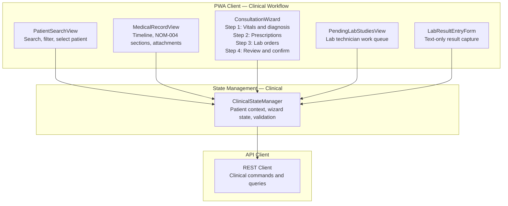
```mermaid
graph TB
    subgraph pwa_clinical [PWA Client — Clinical Workflow]
        PS[PatientSearchView<br/>Search, filter, select patient]
        MRV[MedicalRecordView<br/>Timeline, NOM-004 sections, attachments]
        CW[ConsultationWizard<br/>Step 1: Vitals and diagnosis<br/>Step 2: Prescriptions<br/>Step 3: Lab orders<br/>Step 4: Review and confirm]
        PLV[PendingLabStudiesView<br/>Lab technician work queue]
        LRF[LabResultEntryForm<br/>Text-only result capture]
    end

    subgraph pwa_state [State Management — Clinical]
        CSM[ClinicalStateManager<br/>Patient context, wizard state, validation]
    end

    subgraph pwa_api [API Client]
        AC[REST Client<br/>Clinical commands and queries]
    end

    PS --> CSM
    MRV --> CSM
    CW --> CSM
    PLV --> CSM
    LRF --> CSM
    CSM --> AC
```

##### PWA Clinical Workflow — Component Responsibilities

| Component                 | Responsibilities                                                                                                                                                                                                                                                                                                                                                                                                          | Key Drivers                            |
| ------------------------- | ------------------------------------------------------------------------------------------------------------------------------------------------------------------------------------------------------------------------------------------------------------------------------------------------------------------------------------------------------------------------------------------------------------------------- | -------------------------------------- |
| **PatientSearchView**     | Renders the patient search interface with filters for name, date of birth, and patient type; displays results from `PatientSearchReadModel`; allows selecting a patient to navigate to their medical record                                                                                                                                                                                                               | PER-03, US-019                         |
| **MedicalRecordView**     | Displays the patient's complete clinical timeline and NOM-004 structured sections; renders consultations, prescriptions, lab results, and attachments in chronological order; provides entry point to start a new consultation                                                                                                                                                                                            | US-027, CRN-31                         |
| **ConsultationWizard**    | Guides the clinician through a structured multi-step flow: (1) vital signs and diagnosis, (2) prescriptions with medication search, (3) laboratory orders, (4) review and confirmation. Each step validates completeness before advancing. Designed to reduce errors for new residents and enforce NOM-004 data capture. Dispatches commands to `Clinical Care`, `Prescriptions`, and `Laboratory` APIs upon confirmation | US-024, US-025, US-031, US-038, USA-02 |
| **PendingLabStudiesView** | Shows the branch-scoped list of pending laboratory studies for lab technicians; allows selection of a study to enter results                                                                                                                                                                                                                                                                                              | US-040                                 |
| **LabResultEntryForm**    | Captures text-only laboratory results for a selected pending study; validates required fields before submission; dispatches `RecordLabResult` command                                                                                                                                                                                                                                                                     | US-041, US-042, CON-05                 |
| **ClinicalStateManager**  | Maintains the active patient context, consultation wizard state, and validation rules; coordinates command dispatch to the API Client and refreshes read-model data after successful writes; manages optimistic UI updates during the consultation flow                                                                                                                                                                   | USA-02, US-025                         |

##### 6.2.2 — PWA Security and Admin Components (Iteration 3)

This diagram refines the PWA client's `UI Components` and `State Management` for authentication, session management, role-aware rendering, and administrative user/role configuration introduced in Iteration 3. The `SessionManager` handles the JWT lifecycle, while the `RoleAwareRenderer` conditionally shows or hides UI elements based on the user's permissions from the JWT claims.

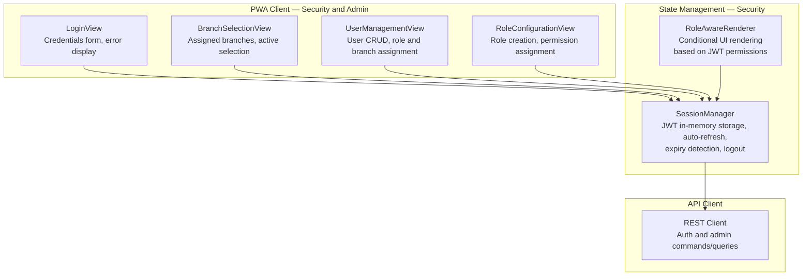
```mermaid
graph TB
    subgraph pwa_security [PWA Client — Security and Admin]
        LV[LoginView<br/>Credentials form, error display]
        BSV[BranchSelectionView<br/>Assigned branches, active selection]
        UMV[UserManagementView<br/>User CRUD, role and branch assignment]
        RCV[RoleConfigurationView<br/>Role creation, permission assignment]
    end

    subgraph pwa_session [State Management — Security]
        SM[SessionManager<br/>JWT in-memory storage, auto-refresh,<br/>expiry detection, logout]
        RAR[RoleAwareRenderer<br/>Conditional UI rendering<br/>based on JWT permissions]
    end

    subgraph pwa_api [API Client]
        AC[REST Client<br/>Auth and admin commands/queries]
    end

    LV --> SM
    BSV --> SM
    UMV --> SM
    RCV --> SM
    SM --> AC
    RAR --> SM
```

##### PWA Security and Admin — Component Responsibilities

| Component                 | Responsibilities                                                                                                                                                                                                                                                                                                                                                                                                                                        | Key Drivers            |
| ------------------------- | ------------------------------------------------------------------------------------------------------------------------------------------------------------------------------------------------------------------------------------------------------------------------------------------------------------------------------------------------------------------------------------------------------------------------------------------------------- | ---------------------- |
| **LoginView**             | Renders the login form for credential entry. Displays authentication errors (invalid credentials, account deactivated) without revealing which field is incorrect. On successful authentication, stores the JWT via `SessionManager` and navigates to `BranchSelectionView`.                                                                                                                                                                            | US-002, SEC-04         |
| **BranchSelectionView**   | Displays the list of branches the user is assigned to (from JWT `branchAssignments` claim). Allows the user to select their active branch, which triggers `POST /session/branch` and scopes all subsequent views. For users assigned to a single branch, auto-selects and skips this screen.                                                                                                                                                            | US-003, SEC-02         |
| **SessionManager**        | Stores the JWT access token in memory (not localStorage) to mitigate XSS-based token theft. Monitors token TTL and triggers automatic refresh via the refresh token before expiry. Detects expired or revoked tokens and redirects to `LoginView`. Exposes the current user context (role, permissions, residency level, active branch) to all other components. Handles logout by clearing in-memory token and revoking the refresh token server-side. | US-002, SEC-04, CRN-43 |
| **RoleAwareRenderer**     | A higher-order component that wraps UI elements and conditionally renders them based on the user's `permissions[]` from the JWT claims. Elements for which the user lacks permission are not rendered (not merely hidden). This reduces UI clutter and prevents social-engineering attempts. All permission checks are mirrored server-side — `RoleAwareRenderer` is a UX optimization, not a security boundary.                                        | US-003, SEC-01, CRN-15 |
| **UserManagementView**    | Admin interface for creating, editing, activating, and deactivating user accounts. Supports role assignment (from data-driven role list), branch assignment (multi-select), and for medical staff: specialty, residency level, and supervisor selection. Only rendered for users with `user:manage` permission.                                                                                                                                         | US-001, CRN-15         |
| **RoleConfigurationView** | Admin interface for creating new roles and assigning permissions from the system permission catalog. Displays the permission matrix with categories and checkboxes. Validates against regulatory constraints (prevents combining `controlled_med:prescribe` with R1–R3 residency levels). Only rendered for users with `role:manage` permission. Enables MNT-03: new roles operational in under 30 minutes with zero code changes.                      | MNT-03, US-003, CRN-15 |

##### 6.2.3 — PWA Branch and Inventory Components (Iteration 4)

This diagram refines the PWA client's `UI Components` and `State Management` for branch management, inventory visualization, tariff configuration, and real-time inventory updates introduced in Iteration 4. The `InventoryRealtimeManager` manages WebSocket subscriptions for live inventory updates. The `BranchSelectionView` is extended to support mid-session context switching without logout.

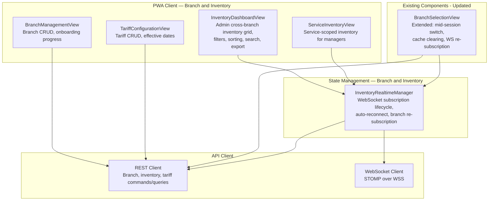
```mermaid
graph TB
    subgraph pwa_branch_inv [PWA Client — Branch and Inventory]
        BMV[BranchManagementView<br/>Branch CRUD, onboarding progress]
        IDV[InventoryDashboardView<br/>Admin cross-branch inventory grid,<br/>filters, sorting, search, export]
        SIV[ServiceInventoryView<br/>Service-scoped inventory for managers]
        TCV[TariffConfigurationView<br/>Tariff CRUD, effective dates]
    end

    subgraph pwa_state_inv [State Management — Branch and Inventory]
        IRM[InventoryRealtimeManager<br/>WebSocket subscription lifecycle,<br/>auto-reconnect, branch re-subscription]
    end

    subgraph pwa_existing [Existing Components - Updated]
        BSV[BranchSelectionView<br/>Extended: mid-session switch,<br/>cache clearing, WS re-subscription]
    end

    subgraph pwa_api [API Client]
        RC[REST Client<br/>Branch, inventory, tariff commands/queries]
        WSC[WebSocket Client<br/>STOMP over WSS]
    end

    BMV --> RC
    IDV --> IRM
    SIV --> IRM
    TCV --> RC
    BSV --> RC
    BSV --> IRM
    IRM --> WSC
    IRM --> RC
```

##### PWA Branch and Inventory — Component Responsibilities

| Component | Responsibilities | Key Drivers |
|---|---|---|
| **BranchManagementView** | Admin interface for registering new branches (name, address), viewing branch list with status (active/inactive/onboarding), and deactivating branches. Displays onboarding progress during registration with step-by-step completion indicators. Only rendered for users with `branch:manage` permission via `RoleAwareRenderer`. | US-071, ESC-01 |
| **InventoryDashboardView** | Renders the full inventory grid for General Administrator: grouped by service, filterable by category/status/service/branch, sortable by any column, searchable by name/SKU, paginated (50 items/page). Items display color-coded status indicators: OK = white, LOW_STOCK = yellow, EXPIRING_SOON = orange, EXPIRED = red. Detail panel on item selection showing all fields per US-004. Export to Excel. Receives real-time updates from `InventoryRealtimeManager`. | US-004, PER-01 |
| **ServiceInventoryView** | Renders the service-scoped inventory for Service Managers and physicians. Same layout as `InventoryDashboardView` but pre-filtered to the user's assigned service — items from other services are never rendered (not merely hidden). Export includes only the user's service items. Unauthorized direct URL access returns 403 and is logged. Only rendered for users with `inventory:read_service` permission. | US-005, SEC-02 |
| **TariffConfigurationView** | Admin interface for creating and updating service tariffs. Displays tariff catalog with service name, code, current price, and effective date. Supports creating new tariffs with effective-from date, updating prices for future dates. Price field validates non-negative `DECIMAL` input. Search across tariff catalog. Only rendered for users with `tariff:manage` permission. | US-064 |
| **InventoryRealtimeManager** | State management component that manages WebSocket subscription lifecycle for real-time inventory updates. Subscribes to `/topic/branch/{activeBranchId}/inventory` on inventory view load (or `/topic/admin/inventory` for admins). Processes incoming STOMP messages with inventory change events and triggers UI re-renders on `InventoryDashboardView` and `ServiceInventoryView`. Handles WebSocket disconnection with auto-reconnect and exponential backoff. On branch context switch: unsubscribes from old branch channel, subscribes to new. | PER-01, ESC-03 |
| **BranchSelectionView** (updated) | Extended to support mid-session branch context switching (ESC-03) in addition to the initial post-login selection. When user selects a different branch mid-session: (1) confirms if there is unsaved work, (2) calls `POST /session/branch` via API Client, (3) stores new JWT via `SessionManager`, (4) clears branch-scoped IndexedDB cache via `LocalStorageManager`, (5) triggers `InventoryRealtimeManager` to re-subscribe to new branch WebSocket channel, (6) reloads dashboard with new branch data. Single-branch users continue to auto-select and skip. | US-074, ESC-03, SEC-02 |

### 7.- Sequence diagrams

#### SD-01: Authenticated API Request Flow (Updated — Iteration 3)

This sequence diagram illustrates the standard lifecycle of any authenticated request in SICEB, now showing the concrete security middleware pipeline introduced in Iteration 3. Every request passes through six ordered filters — TLS verification, JWT authentication with deny-list check, three-dimensional authorization (role + branch + residency level), PostgreSQL RLS tenant context injection, audit interception, and error sanitization — before reaching any domain module.

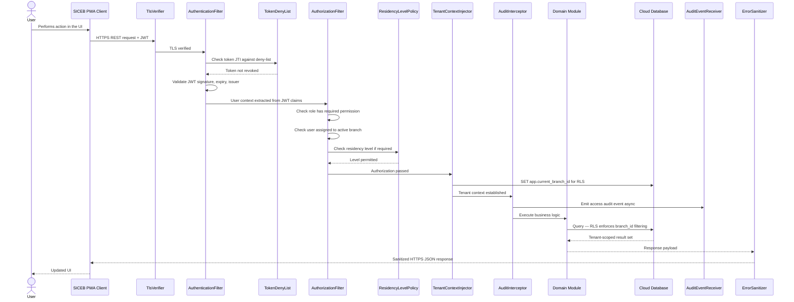
```mermaid
sequenceDiagram
    actor User
    participant PWA as SICEB PWA Client
    participant TLS as TlsVerifier
    participant AF as AuthenticationFilter
    participant TDL as TokenDenyList
    participant AZF as AuthorizationFilter
    participant RLP as ResidencyLevelPolicy
    participant TCI as TenantContextInjector
    participant AI as AuditInterceptor
    participant MOD as Domain Module
    participant DB as Cloud Database
    participant AER as AuditEventReceiver
    participant ES as ErrorSanitizer

    User->>PWA: Performs action in the UI
    PWA->>TLS: HTTPS REST request + JWT
    TLS->>AF: TLS verified
    AF->>TDL: Check token JTI against deny-list
    TDL-->>AF: Token not revoked
    AF->>AF: Validate JWT signature, expiry, issuer
    AF->>AZF: User context extracted from JWT claims
    AZF->>AZF: Check role has required permission
    AZF->>AZF: Check user assigned to active branch
    AZF->>RLP: Check residency level if required
    RLP-->>AZF: Level permitted
    AZF->>TCI: Authorization passed
    TCI->>DB: SET app.current_branch_id for RLS
    TCI->>AI: Tenant context established
    AI->>AER: Emit access audit event async
    AI->>MOD: Execute business logic
    MOD->>DB: Query — RLS enforces branch_id filtering
    DB-->>MOD: Tenant-scoped result set
    MOD-->>ES: Response payload
    ES-->>PWA: Sanitized HTTPS JSON response
    PWA-->>User: Updated UI
```

This flow enforces five cross-cutting concerns on every request: (1) **Transport security** — TLS verification at the application level as defense-in-depth; (2) **Authentication** — JWT validation with deny-list check for immediate token revocation; (3) **Authorization** — three-dimensional evaluation of role permissions, branch assignment, and residency-level restrictions; (4) **Tenant isolation** — PostgreSQL RLS activated via session variable, providing defense-in-depth below application-level filtering; (5) **Audit** — every access is logged to the immutable, hash-chained audit trail. Error sanitization ensures no internal details leak in any response.

#### SD-02: Branch Context Selection and Tenant Isolation (Updated — Iteration 3)

This sequence diagram shows how a user authenticates, selects an active branch, and how the tenant context is established for all subsequent operations. Updated in Iteration 3 to show JWT claim embedding (role, permissions, residency level, branch assignments, consent scopes), refresh token issuance, deny-list verification, and PostgreSQL RLS session variable activation.

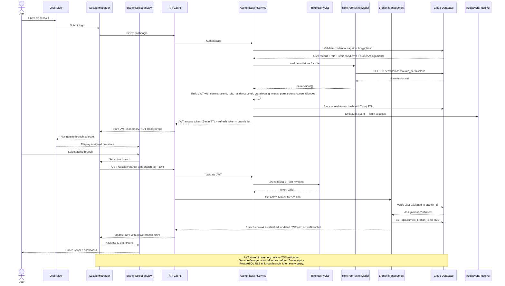
```mermaid
sequenceDiagram
    actor User
    participant LV as LoginView
    participant SM as SessionManager
    participant BSV as BranchSelectionView
    participant AC as API Client
    participant AS as AuthenticationService
    participant TDL as TokenDenyList
    participant RPM as RolePermissionModel
    participant BM as Branch Management
    participant DB as Cloud Database
    participant AER as AuditEventReceiver

    User->>LV: Enter credentials
    LV->>SM: Submit login
    SM->>AC: POST /auth/login
    AC->>AS: Authenticate
    AS->>DB: Validate credentials against bcrypt hash
    DB-->>AS: User record + role + residencyLevel + branchAssignments
    AS->>RPM: Load permissions for role
    RPM->>DB: SELECT permissions via role_permissions
    DB-->>RPM: Permission set
    RPM-->>AS: permissions[]
    AS->>AS: Build JWT with claims: userId, role, residencyLevel, branchAssignments, permissions, consentScopes
    AS->>DB: Store refresh token hash with 7-day TTL
    AS->>AER: Emit audit event — login success
    AS-->>AC: JWT access token 15-min TTL + refresh token + branch list
    AC-->>SM: Store JWT in memory, NOT localStorage
    SM-->>LV: Navigate to branch selection
    LV-->>BSV: Display assigned branches

    User->>BSV: Select active branch
    BSV->>SM: Set active branch
    SM->>AC: POST /session/branch with branch_id + JWT
    AC->>AS: Validate JWT
    AS->>TDL: Check token JTI not revoked
    TDL-->>AS: Token valid
    AC->>BM: Set active branch for session
    BM->>DB: Verify user assigned to branch_id
    DB-->>BM: Assignment confirmed
    BM->>DB: SET app.current_branch_id for RLS
    BM-->>AC: Branch context established, updated JWT with activeBranchId
    AC-->>SM: Update JWT with active branch claim
    SM-->>BSV: Navigate to dashboard
    BSV-->>User: Branch-scoped dashboard

    Note over SM,DB: JWT stored in memory only — XSS mitigation.<br/>SessionManager auto-refreshes before 15-min expiry.<br/>PostgreSQL RLS enforces branch_id on every query.
```

After branch selection, the `activeBranchId` is embedded in the JWT and set as a PostgreSQL session variable via the `TenantContextInjector` middleware. Row-Level Security policies automatically filter all tenant-scoped tables by this value, providing defense-in-depth below the application-level filtering. The `SessionManager` monitors the JWT TTL and triggers automatic refresh before expiry, maintaining a seamless session without re-authentication.

> **Iteration 4 note (ESC-03):** This diagram shows the initial post-login branch selection. For mid-session branch context switching — where a multi-branch user changes their active branch without logging out — see [SD-12: Branch Context Switch Without Logout](#arch-sd-12). The mid-session flow reuses the JWT re-issuance and RLS reset mechanisms shown here, but adds IndexedDB cache clearing and WebSocket channel re-subscription.

#### SD-03: Create Patient and Medical Record (Iteration 2)

This sequence diagram shows the creation of a new patient and their medical record. The flow enforces global patient uniqueness across branches (CRN-37), guardian validation for minors (US-023), and the creation of the append-only medical record as the first clinical event. An audit event is emitted to prepare for the immutable audit trail designed in Iteration 3.

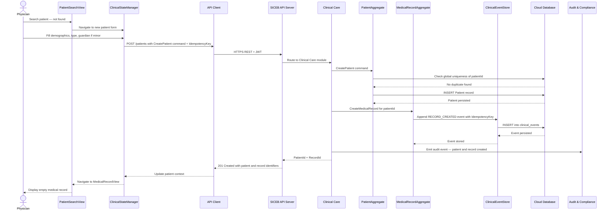
```mermaid
sequenceDiagram
    actor Physician
    participant PWA as PatientSearchView
    participant CSM as ClinicalStateManager
    participant AC as API Client
    participant API as SICEB API Server
    participant CC as Clinical Care
    participant PAG as PatientAggregate
    participant MRA as MedicalRecordAggregate
    participant CES as ClinicalEventStore
    participant DB as Cloud Database
    participant AUD as Audit & Compliance

    Physician->>PWA: Search patient — not found
    PWA->>CSM: Navigate to new patient form
    Physician->>CSM: Fill demographics, type, guardian if minor
    CSM->>AC: POST /patients with CreatePatient command + IdempotencyKey
    AC->>API: HTTPS REST + JWT
    API->>CC: Route to Clinical Care module
    CC->>PAG: CreatePatient command
    PAG->>DB: Check global uniqueness of patientId
    DB-->>PAG: No duplicate found
    PAG->>DB: INSERT Patient record
    DB-->>PAG: Patient persisted

    CC->>MRA: CreateMedicalRecord for patientId
    MRA->>CES: Append RECORD_CREATED event with IdempotencyKey
    CES->>DB: INSERT into clinical_events
    DB-->>CES: Event persisted
    CES-->>MRA: Event stored

    CC->>AUD: Emit audit event — patient and record created
    CC-->>API: PatientId + RecordId
    API-->>AC: 201 Created with patient and record identifiers
    AC-->>CSM: Update patient context
    CSM-->>PWA: Navigate to MedicalRecordView
    PWA-->>Physician: Display empty medical record
```

This flow guarantees that every patient starts with exactly one `MedicalRecord` and that the record is created as an immutable event from the outset. The `IdempotencyKey` ensures safe replay if this command is later executed during offline synchronization.

#### SD-04: Add Consultation with Prescriptions and Lab Orders (Iteration 2)

This sequence diagram illustrates the core daily clinical workflow: a physician adds a consultation to an existing patient's medical record, and within the same encounter context, creates prescriptions and laboratory orders. All artifacts are appended as immutable clinical events. The ConsultationWizard guides the physician through the multi-step flow (USA-02).

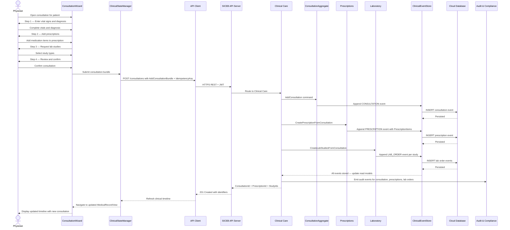
```mermaid
sequenceDiagram
    actor Physician
    participant CW as ConsultationWizard
    participant CSM as ClinicalStateManager
    participant AC as API Client
    participant API as SICEB API Server
    participant CC as Clinical Care
    participant CA as ConsultationAggregate
    participant RX as Prescriptions
    participant LAB as Laboratory
    participant CES as ClinicalEventStore
    participant DB as Cloud Database
    participant AUD as Audit & Compliance

    Physician->>CW: Open consultation for patient
    CW->>Physician: Step 1 — Enter vital signs and diagnosis
    Physician->>CW: Complete vitals and diagnosis
    CW->>Physician: Step 2 — Add prescriptions
    Physician->>CW: Add medication items to prescription
    CW->>Physician: Step 3 — Request lab studies
    Physician->>CW: Select study types
    CW->>Physician: Step 4 — Review and confirm
    Physician->>CW: Confirm consultation

    CW->>CSM: Submit consultation bundle
    CSM->>AC: POST /consultations with AddConsultationBundle + IdempotencyKey

    AC->>API: HTTPS REST + JWT
    API->>CC: Route to Clinical Care

    CC->>CA: AddConsultation command
    CA->>CES: Append CONSULTATION event
    CES->>DB: INSERT consultation event
    DB-->>CES: Persisted

    CC->>RX: CreatePrescriptionFromConsultation
    RX->>CES: Append PRESCRIPTION event with PrescriptionItems
    CES->>DB: INSERT prescription event
    DB-->>CES: Persisted

    CC->>LAB: CreateLabStudiesFromConsultation
    LAB->>CES: Append LAB_ORDER event per study
    CES->>DB: INSERT lab order events
    DB-->>CES: Persisted

    CES-->>CC: All events stored — update read models
    CC->>AUD: Emit audit events for consultation, prescriptions, lab orders

    CC-->>API: ConsultationId + PrescriptionId + StudyIds
    API-->>AC: 201 Created with identifiers
    AC-->>CSM: Refresh clinical timeline
    CSM-->>CW: Navigate to updated MedicalRecordView
    CW-->>Physician: Display updated timeline with new consultation
```

The entire consultation bundle — diagnosis, prescriptions, and lab orders — is committed as a set of immutable clinical events within a single transactional context. If any step fails, no partial events are persisted. The `IdempotencyKey` on the bundle ensures that offline replay produces the same result without duplicates.

#### SD-05: Enter Lab Results and Project into Medical Record (Iteration 2)

This sequence diagram shows how laboratory staff enter text-based results for a pending study and how those results become part of the patient's immutable medical record through a separate `LaboratoryResult` clinical event — the original `LaboratoryStudy` event is never modified.

```mermaid
sequenceDiagram
    actor LabTech as Lab Technician
    participant PLV as PendingLabStudiesView
    participant LRF as LabResultEntryForm
    participant CSM as ClinicalStateManager
    participant AC as API Client
    participant API as SICEB API Server
    participant LAB as Laboratory
    participant LABH as LabStudyCommandHandler
    participant CES as ClinicalEventStore
    participant DB as Cloud Database
    participant AUD as Audit & Compliance

    LabTech->>PLV: View pending lab studies for branch
    PLV->>CSM: Request pending studies
    CSM->>AC: GET /lab-studies/pending?branch_id=X
    AC->>API: HTTPS REST + JWT
    API->>LAB: Query PendingLabStudiesReadModel
    LAB->>DB: SELECT pending studies WHERE branch_id = X
    DB-->>LAB: Pending study list
    LAB-->>API: Study list
    API-->>AC: 200 OK with studies
    AC-->>CSM: Update state
    CSM-->>PLV: Display pending studies

    LabTech->>PLV: Select study to enter results
    PLV->>LRF: Open result entry form for studyId
    LabTech->>LRF: Enter text-based results
    LRF->>CSM: Submit RecordLabResult command + IdempotencyKey
    CSM->>AC: POST /lab-studies/:studyId/results

    AC->>API: HTTPS REST + JWT
    API->>LAB: Route to Laboratory module
    LAB->>LABH: RecordLabResult command
    LABH->>CES: Append LAB_RESULT event
    CES->>DB: INSERT lab result event
    DB-->>CES: Persisted
    CES-->>LABH: Event stored — update read models

    LABH->>AUD: Emit audit event — lab result recorded
    LABH-->>API: ResultId
    API-->>AC: 201 Created
    AC-->>CSM: Refresh pending studies list
    CSM-->>LRF: Confirm result saved
    LRF-->>LabTech: Result recorded — study marked as completed

    Note over CES,DB: The original LAB_ORDER event remains unchanged.<br/>The LAB_RESULT is a new immutable event linked via studyId.
```

This flow ensures that laboratory results are always additive — the original order event is never modified, and results are appended as a new `LaboratoryResult` event in the clinical event stream. The result is immediately visible in the patient's `ClinicalTimelineReadModel` and `Nom004RecordView`.

#### SD-06: Search Patient and Load Clinical Timeline (Iteration 2)

This sequence diagram shows the read-side flow for searching patients and loading their complete clinical history. Both queries hit dedicated read models optimized for performance (PER-03), not the event store directly.

```mermaid
sequenceDiagram
    actor Physician
    participant PS as PatientSearchView
    participant MRV as MedicalRecordView
    participant CSM as ClinicalStateManager
    participant AC as API Client
    participant API as SICEB API Server
    participant CC as Clinical Care
    participant PSR as PatientSearchReadModel
    participant CTR as ClinicalTimelineReadModel
    participant N04 as Nom004RecordView
    participant DB as Cloud Database

    Physician->>PS: Enter search criteria — name, DOB, type
    PS->>CSM: Dispatch search query
    CSM->>AC: GET /patients/search?q=criteria&branch_id=X
    AC->>API: HTTPS REST + JWT
    API->>CC: Route to Clinical Care read side
    CC->>PSR: Query PatientSearchReadModel
    PSR->>DB: SELECT from patient_search_view with indexes
    DB-->>PSR: Matching patients — sub-1s response
    PSR-->>CC: Patient list
    CC-->>API: Patient results
    API-->>AC: 200 OK
    AC-->>CSM: Update search results
    CSM-->>PS: Display patient list
    PS-->>Physician: Show matching patients

    Physician->>PS: Select patient
    PS->>CSM: Set active patient context
    CSM->>AC: GET /patients/:patientId/timeline
    AC->>API: HTTPS REST + JWT
    API->>CC: Route to Clinical Care read side
    CC->>CTR: Query ClinicalTimelineReadModel for patientId
    CTR->>DB: SELECT ordered events from clinical_timeline_view
    DB-->>CTR: Complete event timeline
    CTR-->>CC: Timeline data
    CC-->>API: Timeline payload
    API-->>AC: 200 OK
    AC-->>CSM: Update patient timeline state

    CSM->>AC: GET /patients/:patientId/nom004
    AC->>API: HTTPS REST + JWT
    API->>CC: Route to Clinical Care read side
    CC->>N04: Query Nom004RecordView for patientId
    N04->>DB: SELECT structured sections
    DB-->>N04: NOM-004 structured data
    N04-->>CC: Sectioned record
    CC-->>API: NOM-004 record payload
    API-->>AC: 200 OK
    AC-->>CSM: Update NOM-004 view state

    CSM-->>MRV: Render medical record with timeline and NOM-004 tabs
    MRV-->>Physician: Display complete clinical history
```

Both the patient search and timeline queries use pre-computed read models backed by indexed database views, ensuring that even with 50,000+ patient records, the search responds in under 1 second (PER-03). The `Nom004RecordView` is loaded in parallel to provide the regulatory-compliant structured view alongside the chronological timeline.

#### SD-07: Controlled Medication Prescription Blocked by Residency Policy (Iteration 3)

This sequence diagram shows the security enforcement path when an R2 resident attempts to prescribe a controlled medication during a consultation. The `AuthorizationFilter` detects the `controlled_med:prescribe` permission requirement, delegates to the `ResidencyLevelPolicy`, and blocks the action. An audit event is emitted to the immutable audit trail, and a sanitized error is returned to the PWA.

```mermaid
sequenceDiagram
    actor R2 as R2 Resident
    participant CW as ConsultationWizard
    participant SM as SessionManager
    participant AC as API Client
    participant AF as AuthenticationFilter
    participant AZF as AuthorizationFilter
    participant RLP as ResidencyLevelPolicy
    participant AER as AuditEventReceiver
    participant IAS as ImmutableAuditStore
    participant ES as ErrorSanitizer

    R2->>CW: Step 2 — Add controlled medication to prescription
    CW->>SM: Validate local permissions
    SM-->>CW: RoleAwareRenderer shows warning — controlled med
    R2->>CW: Confirm prescription submission
    CW->>AC: POST /consultations/:id/prescriptions with controlled item
    AC->>AF: HTTPS + JWT
    AF->>AF: JWT valid, user context extracted
    AF->>AZF: Route requires prescription:create + controlled_med:prescribe
    AZF->>AZF: Check role permissions — prescription:create OK
    AZF->>RLP: Check controlled_med:prescribe for residencyLevel=R2
    RLP-->>AZF: DENIED — R2 blocked from controlled substance prescribing
    AZF->>AER: Emit security audit event — permission denied sync
    AER->>IAS: Append hash-chained entry with denial details
    AZF-->>ES: 403 Forbidden
    ES-->>AC: Sanitized error — residency level does not permit this action
    AC-->>CW: Display error message
    CW-->>R2: Controlled medication blocked — contact attending physician
```

This flow demonstrates SEC-01 (100% of restricted actions blocked and logged) and US-051 (R1/R2/R3 blocked from prescribing controlled medications). The `RoleAwareRenderer` in the PWA provides a client-side warning, but the authoritative enforcement happens server-side in the middleware. The audit entry is written synchronously because controlled substance actions are security-critical.

#### SD-08: Admin Creates New Role (Iteration 3)

This sequence diagram shows an Administrator creating a new role with specific permissions through the `RoleConfigurationView`, demonstrating MNT-03 — new roles operational in under 30 minutes with zero code changes. The `RolePermissionModel` validates the permission set against regulatory constraints before persisting.

```mermaid
sequenceDiagram
    actor Admin as Administrator
    participant RCV as RoleConfigurationView
    participant SM as SessionManager
    participant AC as API Client
    participant AF as AuthenticationFilter
    participant AZF as AuthorizationFilter
    participant IAM as Identity & Access
    participant RPM as RolePermissionModel
    participant DB as Cloud Database
    participant AER as AuditEventReceiver

    Admin->>RCV: Open role configuration
    RCV->>SM: Check permission role:manage
    SM-->>RCV: Permission confirmed — render UI

    Admin->>RCV: Enter role name: Nutritionist
    Admin->>RCV: Select permissions from catalog
    Admin->>RCV: Submit new role

    RCV->>AC: POST /roles with name + permission IDs
    AC->>AF: HTTPS + JWT
    AF->>AZF: Validate role:manage permission
    AZF-->>IAM: Authorized
    IAM->>RPM: CreateRole command
    RPM->>RPM: Validate no regulatory conflicts
    Note over RPM: Check: no controlled_med:prescribe<br/>combined with R1-R3 residency constraint
    RPM->>DB: INSERT into roles + role_permissions
    DB-->>RPM: Role persisted
    RPM->>AER: Emit audit event — role created with permissions
    RPM-->>IAM: RoleId
    IAM-->>AC: 201 Created with roleId
    AC-->>RCV: Display success
    RCV-->>Admin: Nutritionist role available for assignment

    Note over Admin,DB: Total time: under 5 minutes.<br/>Zero code changes. Zero deployment.
```

This flow satisfies MNT-03: the administrator creates a fully functional role through the UI, assigns permissions from the system catalog, and the role is immediately available for user assignment. The validation layer prevents creation of roles that violate regulatory constraints.

#### SD-09: Patient Record Access with LFPDPPP Audit Logging (Iteration 3)

This sequence diagram shows a physician accessing a patient's clinical timeline, with the `AuditInterceptor` capturing the access event and routing it through the hash-chained `ImmutableAuditStore`. This ensures LFPDPPP compliance by recording who accessed which patient data and when.

```mermaid
sequenceDiagram
    actor Physician
    participant MRV as MedicalRecordView
    participant CSM as ClinicalStateManager
    participant AC as API Client
    participant AF as AuthenticationFilter
    participant AZF as AuthorizationFilter
    participant TCI as TenantContextInjector
    participant AI as AuditInterceptor
    participant CC as Clinical Care
    participant CTR as ClinicalTimelineReadModel
    participant DB as Cloud Database
    participant AER as AuditEventReceiver
    participant IAS as ImmutableAuditStore

    Physician->>MRV: View patient record
    MRV->>CSM: Load clinical timeline
    CSM->>AC: GET /patients/:patientId/timeline
    AC->>AF: HTTPS + JWT
    AF->>AZF: User context with permissions
    AZF->>AZF: Check patient:read permission — OK
    AZF->>TCI: Authorized
    TCI->>DB: SET app.current_branch_id
    TCI->>AI: Tenant context set
    AI->>AER: Emit access audit event async
    Note over AI,AER: userId, action=GET /patients/:id/timeline,<br/>targetEntity=Patient, targetId=patientId,<br/>branchId, timestamp, ipAddress
    AER->>IAS: Compute SHA-256 hash chain
    IAS->>DB: INSERT hash-chained audit entry
    AI->>CC: Execute query
    CC->>CTR: Query ClinicalTimelineReadModel
    CTR->>DB: SELECT ordered events with RLS filter
    DB-->>CTR: Timeline data
    CTR-->>CC: Timeline
    CC-->>AC: 200 OK with timeline payload
    AC-->>CSM: Update state
    CSM-->>MRV: Render timeline
    MRV-->>Physician: Display clinical history

    Note over AER,IAS: Access logged in tamper-evident audit trail.<br/>LFPDPPP: who accessed which patient data and when.
```

This flow demonstrates US-066 (audit log for record access) and CRN-32 (LFPDPPP compliance). The `AuditInterceptor` captures the access event asynchronously to avoid adding latency to the clinical query, while the `ImmutableAuditStore` ensures the entry is hash-chained and tamper-evident. The `GetAccessLogForPatient` query in `AuditQueryService` can later retrieve all access events for a specific patient to support ARCO requests or regulatory audits.

#### SD-10: Register New Branch with Onboarding Workflow (Iteration 4)

This sequence diagram shows an Administrator registering a new branch and the `BranchOnboardingOrchestrator` executing the 5-step idempotent onboarding sequence. Each step records progress for resumability. The complete workflow targets ESC-01 (<1 hour for full branch operability).

```mermaid
sequenceDiagram
    actor Admin as Administrator
    participant BMV as BranchManagementView
    participant AC as API Client
    participant AF as AuthenticationFilter
    participant AZF as AuthorizationFilter
    participant BRS as BranchRegistrationService
    participant BOO as BranchOnboardingOrchestrator
    participant BCFS as BranchConfigurationStore
    participant DB as Cloud Database
    participant AER as AuditEventReceiver

    Admin->>BMV: Enter branch name and address
    BMV->>AC: POST /branches with RegisterBranch command
    AC->>AF: HTTPS + JWT
    AF->>AZF: Validate branch:manage permission
    AZF->>BRS: Authorized

    BRS->>BCFS: Validate unique name and address
    BCFS->>DB: SELECT existing branches
    DB-->>BCFS: No duplicates
    BRS->>BCFS: Persist branch record isActive=true
    BCFS->>DB: INSERT INTO branches
    DB-->>BCFS: Branch persisted
    BRS->>AER: Emit audit event — branch registered

    BRS->>BOO: Trigger onboarding for branchId

    BOO->>DB: Step 1 — CREATE PARTITION for inventory_items and inventory_deltas
    BOO->>BCFS: Record step 1 complete
    BCFS->>DB: UPDATE branch_onboarding_status

    BOO->>DB: Step 2 — Seed service catalog from org template
    BOO->>BCFS: Record step 2 complete

    BOO->>DB: Step 3 — Copy active tariffs to new branch
    BOO->>BCFS: Record step 3 complete

    BOO->>DB: Step 4 — Initialize empty inventory items per service
    BOO->>BCFS: Record step 4 complete

    BOO->>BCFS: Step 5 — Mark onboarding_complete = true
    BCFS->>DB: UPDATE branches SET onboarding_complete = true
    BOO->>AER: Emit audit event — onboarding completed

    BOO-->>BRS: Onboarding complete
    BRS-->>AC: 201 Created with branchId + onboarding status
    AC-->>BMV: Display success with onboarding summary
    BMV-->>Admin: New branch operational — ready for user assignment

    Note over BOO,DB: Each step is idempotent and resumable.<br/>Progress tracked in branch_onboarding_status.<br/>Target: complete in less than 1 hour - ESC-01.
```

This flow satisfies US-071 (branch registration) and ESC-01 (new branch operational in <1 hour). The onboarding orchestrator executes all five steps in sequence, with each step recording its completion status. If the process is interrupted (e.g., network failure), it can be resumed from the last completed step without repeating previous steps.

#### SD-11: Inventory Delta Command with Real-Time WebSocket Propagation (Iteration 4)

This sequence diagram illustrates the end-to-end flow of an inventory mutation: a physician uses supplies during a consultation, triggering a `DecrementStock` delta command. The delta is persisted, stock is atomically materialized via a PostgreSQL trigger, `pg_notify` fires, and the `RealtimeEventPublisher` pushes a STOMP message to all connected clients on the branch channel — all within the PER-01 target of <2 seconds.

```mermaid
sequenceDiagram
    actor Physician
    participant CW as ConsultationWizard
    participant AC as API Client
    participant API as SICEB API Server
    participant ICH as InventoryCommandHandler
    participant IDS as InventoryDeltaStore
    participant DB as Cloud Database
    participant TRG as StockMaterializationTrigger
    participant PGN as pg_notify
    participant REP as RealtimeEventPublisher
    participant WSC as WebSocket Channel
    participant IRM as InventoryRealtimeManager
    participant IDV as InventoryDashboardView
    participant AER as AuditEventReceiver

    Physician->>CW: Record supply usage during consultation
    CW->>AC: POST /inventory/decrements with DecrementStock command + IdempotencyKey
    AC->>API: HTTPS + JWT
    API->>ICH: Route to Inventory module

    ICH->>DB: SELECT ... FOR UPDATE on inventory_items row
    DB-->>ICH: Row locked, current_stock = 50

    ICH->>ICH: Validate: 50 - 3 >= 0
    ICH->>IDS: Persist delta: DECREMENT, qty=3, reason=consultation_usage
    IDS->>DB: INSERT INTO inventory_deltas with idempotency_key

    DB->>TRG: AFTER INSERT trigger fires
    TRG->>DB: UPDATE inventory_items SET current_stock = 47
    TRG->>PGN: pg_notify inventory_changes with JSON payload

    DB-->>IDS: Delta persisted, stock materialized
    IDS-->>ICH: Success
    ICH->>AER: Emit audit event — inventory decremented

    ICH-->>API: Updated stock = 47, status = OK
    API-->>AC: 200 OK
    AC-->>CW: Supply usage recorded

    PGN->>REP: Notification received
    REP->>WSC: Publish STOMP to /topic/branch/branchId/inventory
    WSC->>IRM: STOMP message received
    IRM->>IDV: Update item stock: 47, status: OK
    IDV->>IDV: Re-render inventory row with updated values

    Note over TRG,IDV: End-to-end latency target: less than 2 seconds - PER-01.<br/>Delta is append-only - CRN-44.<br/>Stock materialization is transactional - CRN-35.
```

This flow demonstrates four key architectural decisions working together: (1) delta-based mutations (CRN-44) — the stock change is recorded as an intent command, not an absolute state overwrite; (2) transactional materialization (CRN-35) — the trigger updates `current_stock` atomically within the same transaction as the delta insertion; (3) real-time propagation (PER-01) — `pg_notify` bridges the database event to the WebSocket layer without polling; (4) concurrency control — `SELECT ... FOR UPDATE` prevents lost updates when multiple physicians use the same supply concurrently.

#### SD-12: Branch Context Switch Without Logout (Iteration 4)

This sequence diagram shows a multi-branch user switching their active branch mid-session without logging out. The flow re-issues the JWT with the new `activeBranchId`, resets the PostgreSQL RLS session variable, clears the branch-scoped IndexedDB cache, and re-subscribes to the new branch's WebSocket channel — all within the ESC-03 target of <3 seconds.

```mermaid
sequenceDiagram
    actor User as Multi-Branch User
    participant BSV as BranchSelectionView
    participant SM as SessionManager
    participant LSM as LocalStorageManager
    participant IRM as InventoryRealtimeManager
    participant AC as API Client
    participant WSC as WebSocket Client
    participant BCS as BranchContextService
    participant AS as AuthenticationService
    participant DB as Cloud Database
    participant AER as AuditEventReceiver

    User->>BSV: Select Branch B as active branch
    BSV->>BSV: Check for unsaved work — prompt if needed
    BSV->>SM: Request branch switch to Branch B

    SM->>AC: POST /session/branch with branchId=B + JWT
    AC->>BCS: SwitchBranch command
    BCS->>DB: Verify user assigned to Branch B
    DB-->>BCS: Assignment confirmed

    BCS->>AS: Re-issue JWT with activeBranchId=B
    AS->>AS: Build new JWT preserving all claims, updating activeBranchId
    AS-->>BCS: New JWT

    BCS->>DB: SET app.current_branch_id = B for RLS
    BCS->>AER: Emit audit event — branch context switched
    BCS-->>AC: New JWT + branch context established
    AC-->>SM: Store new JWT in memory

    SM->>LSM: Clear branch-scoped IndexedDB cache for old branch
    LSM->>LSM: Purge cached data for Branch A

    SM->>IRM: Re-subscribe to new branch channel
    IRM->>WSC: UNSUBSCRIBE from /topic/branch/A/inventory
    IRM->>WSC: SUBSCRIBE to /topic/branch/B/inventory
    WSC-->>IRM: Subscription confirmed

    SM-->>BSV: Branch switch complete
    BSV->>AC: Reload dashboard data for Branch B
    AC-->>BSV: Branch B data
    BSV-->>User: Dashboard displays Branch B context

    Note over User,DB: Total time target: less than 3 seconds - ESC-03.<br/>No re-authentication required.<br/>Cache cleared to prevent cross-branch data leakage - SEC-02.
```

This flow satisfies US-074 (active branch selection), ESC-03 (<3 seconds without logout), and SEC-02 (no cross-branch data leakage). The key operations are: (1) JWT re-issuance without password re-entry — only the `activeBranchId` claim changes; (2) RLS session variable reset — PostgreSQL immediately enforces the new branch scope; (3) IndexedDB cache clearing — prevents offline queries from returning stale data from the previous branch; (4) WebSocket re-subscription — ensures real-time events come from the correct branch.

#### SD-13: Admin Views Cross-Branch Inventory (Iteration 4)

This sequence diagram shows a General Administrator accessing the inventory dashboard with cross-branch visibility. The request activates the `admin_reporting` RLS bypass, queries across all branch partitions, and subscribes to the admin WebSocket channel for real-time updates from all branches.

```mermaid
sequenceDiagram
    actor Admin as General Administrator
    participant IDV as InventoryDashboardView
    participant IRM as InventoryRealtimeManager
    participant AC as API Client
    participant WSC as WebSocket Client
    participant AF as AuthenticationFilter
    participant AZF as AuthorizationFilter
    participant TCI as TenantContextInjector
    participant INV as Inventory Module
    participant BIR as BranchInventoryReadModel
    participant DB as Cloud Database
    participant REP as RealtimeEventPublisher

    Admin->>IDV: Open Inventory Management
    IDV->>IRM: Initialize real-time subscription
    IRM->>WSC: SUBSCRIBE to /topic/admin/inventory
    Note over IRM,WSC: Admin subscribes to all-branch channel<br/>via inventory:read_all permission

    IDV->>AC: GET /inventory?groupBy=service
    AC->>AF: HTTPS + JWT with inventory:read_all permission
    AF->>AZF: Validate inventory:read_all
    AZF->>TCI: Authorized

    TCI->>DB: Activate admin_reporting role with BYPASSRLS
    TCI->>INV: Tenant context — cross-branch mode

    INV->>BIR: Query all branches, group by service
    BIR->>DB: SELECT across all inventory_items partitions with parallel scan
    DB-->>BIR: Aggregated inventory from all branches
    BIR-->>INV: Inventory data with stock status and alerts
    INV-->>AC: 200 OK with grouped inventory
    AC-->>IDV: Render cross-branch inventory grid

    IDV-->>Admin: Display inventory grouped by service across all branches

    Note over Admin,DB: Filters available: category, status, service, branch.<br/>Sorting, pagination at 50 items/page, search by name/SKU.<br/>Color-coded: OK=white, LOW_STOCK=yellow, EXPIRING_SOON=orange, EXPIRED=red.

    REP->>WSC: Real-time update from Branch A — stock change
    WSC->>IRM: STOMP message on /topic/admin/inventory
    IRM->>IDV: Update affected item in grid
    IDV-->>Admin: Item row refreshes with new stock value
```

This flow satisfies US-004 (General Administrator sees complete inventory of ALL services), PER-01 (real-time updates via WebSocket), and ESC-02 (parallel partition scans ensure performance with up to 15 branches). The `admin_reporting` RLS bypass allows cross-branch queries while maintaining the SEC-02 security model — only users with `inventory:read_all` permission can activate this bypass, and the authorization is enforced by the middleware pipeline before any database query executes.

### 8.- Interfaces

#### 8.1 — Clinical Care Command Interfaces (Iteration 2)

The following table describes the command-side interfaces exposed by the Clinical Care, Prescriptions, and Laboratory modules. Each command appends one or more immutable `ClinicalEvent`s to the event store. All commands require a valid JWT token, an active `branch_id` in session context, and a client-generated `IdempotencyKey` for safe offline replay.

| Command                                | Module        | HTTP Verb / Endpoint                                | Input Invariants                                                                                                                                                                                                        | Events Produced                                   | Key Drivers                    |
| -------------------------------------- | ------------- | --------------------------------------------------- | ----------------------------------------------------------------------------------------------------------------------------------------------------------------------------------------------------------------------- | ------------------------------------------------- | ------------------------------ |
| **CreatePatient**                      | Clinical Care | `POST /patients`                                    | `patientId` is UUID; `fullName`, `dateOfBirth`, `type` are required; if age < 17, `guardianName` and `guardianRelationship` are mandatory; `dataConsentGiven` must be explicitly set; no duplicate `patientId` globally | `RECORD_CREATED` via linked `CreateMedicalRecord` | CRN-37, US-019, US-020, US-023 |
| **CreateMedicalRecord**                | Clinical Care | Invoked internally after `CreatePatient`            | Exactly one record per `patientId`; `recordId` is UUID                                                                                                                                                                  | `RECORD_CREATED`                                  | US-026, CRN-02, CRN-01         |
| **AddConsultation**                    | Clinical Care | `POST /consultations`                               | Must reference an existing `recordId`; `diagnosis`, `vitalSigns` required; `requiresSupervision` flag set based on staff residency level; `consultationId` is UUID                                                      | `CONSULTATION`                                    | US-025, USA-02                 |
| **CreatePrescriptionFromConsultation** | Prescriptions | `POST /consultations/:consultationId/prescriptions` | Must reference an open consultation; at least one `PrescriptionItem` with valid `medicationId`, `quantity`, `dosage`; `prescriptionId` is UUID                                                                          | `PRESCRIPTION`                                    | US-031, US-031                 |
| **CreateLabStudiesFromConsultation**   | Laboratory    | `POST /consultations/:consultationId/lab-studies`   | Must reference an open consultation; at least one study with valid `studyType`; `studyId` is UUID per study                                                                                                             | `LAB_ORDER` per study                             | US-038                         |
| **RecordLabResult**                    | Laboratory    | `POST /lab-studies/:studyId/results`                | Study must exist and be in `PENDING` or `IN_PROGRESS` status; `resultText` is required and non-empty; `resultId` is UUID                                                                                                | `LAB_RESULT`                                      | US-041, US-042, CON-05         |

#### 8.2 — Clinical Care Query Interfaces (Iteration 2)

The following table describes the read-side interfaces. Each query is served by a dedicated read model optimized for its access pattern. Queries do not modify the event store.

| Query                          | Read Model                   | HTTP Verb / Endpoint                | Parameters                                                              | Performance / Consistency                                                                                                            | Key Drivers    |
| ------------------------------ | ---------------------------- | ----------------------------------- | ----------------------------------------------------------------------- | ------------------------------------------------------------------------------------------------------------------------------------ | -------------- |
| **SearchPatients**             | `PatientSearchReadModel`     | `GET /patients/search`              | `q` (name substring), `dateOfBirth`, `type`, `branch_id` (from session) | Sub-1-second over 50,000+ records; indexed on `fullName`, `dateOfBirth`, `type`, `branch_id`; eventually consistent with write model | PER-03, US-027 |
| **GetPatientClinicalTimeline** | `ClinicalTimelineReadModel`  | `GET /patients/:patientId/timeline` | `patientId`; optional date range filters                                | Pre-computed chronological projection; paginated for large histories; eventually consistent                                          | US-027, US-025 |
| **GetNom004Record**            | `Nom004RecordView`           | `GET /patients/:patientId/nom004`   | `patientId`                                                             | Structured projection with mandatory NOM-004 sections; validates completeness; eventually consistent                                 | CRN-31, AUD-03 |
| **ListPendingLabStudies**      | `PendingLabStudiesReadModel` | `GET /lab-studies/pending`          | `branch_id` (from session); optional `status` filter                    | Branch-scoped; sorted by `requestedAt` ascending; eventually consistent                                                              | US-040         |

#### 8.3 — Identity & Access Command Interfaces (Iteration 3)

The following table describes the command-side interfaces exposed by the Identity & Access module. All commands emit audit events to the `ImmutableAuditStore`. User management commands require `user:manage` permission; role management commands require `role:manage` permission.

| Command                   | HTTP Verb / Endpoint             | Input Invariants                                                                                                                                                                                                          | Key Drivers            |
| ------------------------- | -------------------------------- | ------------------------------------------------------------------------------------------------------------------------------------------------------------------------------------------------------------------------- | ---------------------- |
| **Login**                 | `POST /auth/login`               | `email` and `password` required; returns JWT access token (15-min TTL) with embedded claims + refresh token (7-day TTL) + assigned branch list. Emits audit event for success and failure.                                | US-002, SEC-04         |
| **RefreshToken**          | `POST /auth/refresh`             | Valid refresh token required; checks `TokenDenyList` for revocation; returns new JWT access token with updated claims.                                                                                                    | US-002, SEC-04         |
| **Logout**                | `POST /auth/logout`              | Valid JWT required; revokes the refresh token server-side; adds current access token JTI to `TokenDenyList`.                                                                                                              | US-002                 |
| **CreateUser**            | `POST /users`                    | `fullName`, `email`, `roleId`, `branchAssignments[]` required; `email` must be unique; for medical staff: `specialty`, `residencyLevel`, `supervisorStaffId` (mandatory for R1/R2). Password set via secure initial flow. | US-001, CRN-15         |
| **UpdateUser**            | `PUT /users/:userId`             | Supports role change, branch assignment update, medical staff attribute changes. Role change triggers JWT invalidation via `TokenDenyList`.                                                                               | US-001, CRN-15         |
| **DeactivateUser**        | `POST /users/:userId/deactivate` | Sets `isActive = false`; adds all active tokens to `TokenDenyList` for immediate revocation; emits security audit event.                                                                                                  | US-001, SEC-04         |
| **CreateRole**            | `POST /roles`                    | `name` and `permissionIds[]` required; validates no regulatory conflicts (e.g., `controlled_med:prescribe` cannot be combined with R1–R3 residency-level constraints); `is_system_role = false` for custom roles.         | MNT-03, US-003, CRN-15 |
| **UpdateRolePermissions** | `PUT /roles/:roleId/permissions` | `permissionIds[]` required; system roles cannot be deleted but their permissions can be updated; re-validates regulatory constraints; triggers JWT invalidation for all users with this role.                             | MNT-03, CRN-15         |

#### 8.4 — Identity & Access Query Interfaces (Iteration 3)

| Query               | HTTP Verb / Endpoint | Parameters                                                                                        | Key Drivers    |
| ------------------- | -------------------- | ------------------------------------------------------------------------------------------------- | -------------- |
| **ListUsers**       | `GET /users`         | Optional filters: `roleId`, `branchId`, `isActive`; paginated; branch-scoped for non-admin roles  | US-001, CRN-15 |
| **GetUser**         | `GET /users/:userId` | Returns user profile with role, branch assignments, and medical staff details if applicable       | US-001         |
| **ListRoles**       | `GET /roles`         | Returns all roles with their permission sets; includes `is_system_role` flag                      | MNT-03, US-003 |
| **ListPermissions** | `GET /permissions`   | Returns the system permission catalog grouped by category; includes `requiresResidencyCheck` flag | MNT-03, CRN-15 |

#### 8.5 — Audit & Compliance Query Interfaces (Iteration 3)

The following table describes the read-side interfaces exposed by the Audit & Compliance module. All queries are branch-scoped except for Director General role which can query cross-branch. Results are paginated.

| Query                      | HTTP Verb / Endpoint                      | Parameters                                                                                             | Key Drivers    |
| -------------------------- | ----------------------------------------- | ------------------------------------------------------------------------------------------------------ | -------------- |
| **GetAuditTrailForEntity** | `GET /audit/entity/:entityType/:entityId` | `entityType`, `entityId`, optional `dateRange`; returns all audit events for a specific record         | CRN-17         |
| **GetAuditTrailForUser**   | `GET /audit/user/:userId`                 | `userId`, optional `dateRange`; returns all actions performed by a specific user                       | CRN-17, US-066 |
| **GetAccessLogForPatient** | `GET /audit/patient/:patientId/access`    | `patientId`, optional `dateRange`; returns all access events for a patient's data — LFPDPPP compliance | CRN-32, US-066 |
| **VerifyChainIntegrity**   | `GET /audit/verify`                       | `fromEntryId`, `toEntryId`; walks the SHA-256 hash chain and reports any discontinuities               | CRN-18         |

#### 8.7 — Branch Management Command Interfaces (Iteration 4)

The following table describes the command-side interfaces exposed by the Branch Management module. All commands emit audit events to the `ImmutableAuditStore`. Branch management commands require `branch:manage` permission.

| Command | HTTP Verb / Endpoint | Input Invariants | Key Drivers |
|---|---|---|---|
| **RegisterBranch** | `POST /branches` | `name` (unique, non-empty), `address` (non-empty) required; `branchId` is UUID. Triggers `BranchOnboardingOrchestrator` after persistence. Emits audit event. | US-071, ESC-01 |
| **DeactivateBranch** | `POST /branches/:branchId/deactivate` | Branch must exist and be active. Sets `isActive = false`. Preserves all historical data. Prevents new operations at the branch. Users assigned to only this branch are notified. Emits audit event. | US-071 |
| **SwitchBranch** | `POST /session/branch` | `branchId` required; user must be assigned to the target branch (validated against JWT `branchAssignments`). Re-issues JWT with updated `activeBranchId` claim. Sets PostgreSQL RLS session variable. Does not require re-authentication. | US-074, ESC-03, SEC-02 |

#### 8.8 — Branch Management Query Interfaces (Iteration 4)

| Query | HTTP Verb / Endpoint | Parameters | Key Drivers |
|---|---|---|---|
| **ListBranches** | `GET /branches` | Optional filters: `isActive`, `onboardingComplete`; paginated. Admin users see all branches; non-admin users see only their assigned branches. | US-071, US-074 |
| **GetBranch** | `GET /branches/:branchId` | Returns branch details: name, address, isActive, onboardingComplete, creation date, assigned user count. | US-071 |
| **GetOnboardingStatus** | `GET /branches/:branchId/onboarding` | Returns step-by-step onboarding progress: step name, status (pending/complete/failed), completion timestamp. Requires `branch:manage` permission. | ESC-01 |

#### 8.9 — Inventory Command Interfaces (Iteration 4)

The following table describes the command-side interfaces exposed by the Inventory module. All commands persist an immutable delta to the `InventoryDeltaStore` and require a client-generated `IdempotencyKey` for safe offline replay. Stock materialization occurs atomically via PostgreSQL trigger.

| Command | HTTP Verb / Endpoint | Input Invariants | Events Produced | Key Drivers |
|---|---|---|---|---|
| **IncrementStock** | `POST /inventory/increments` | `itemId` (UUID, must exist in active branch), `quantity` (positive integer), `reason` (non-empty), `sourceRef` (optional — links to supply delivery, purchase order), `idempotencyKey` (UUID, unique). | Delta: INCREMENT | CRN-44, CRN-43 |
| **DecrementStock** | `POST /inventory/decrements` | `itemId` (UUID, must exist in active branch), `quantity` (positive integer), `reason` (non-empty), `sourceRef` (optional — links to consultation, dispensation), `idempotencyKey` (UUID, unique). Validation: resulting stock >= 0. | Delta: DECREMENT | CRN-44, CRN-43, CRN-35 |
| **AdjustStock** | `POST /inventory/adjustments` | `itemId` (UUID, must exist in active branch), `absoluteQuantity` (non-negative integer), `reason` (mandatory — justification for override), `idempotencyKey` (UUID, unique). Requires `inventory:adjust` permission. | Delta: ADJUST | CRN-44 |
| **SetMinimumThreshold** | `PUT /inventory/:itemId/threshold` | `itemId` (UUID, must exist in active branch), `threshold` (non-negative integer). Triggers immediate re-evaluation of `LowStockAlertProjection` for this item. | Delta: THRESHOLD | US-004, US-005 |
| **UpdateExpiration** | `PUT /inventory/:itemId/expiration` | `itemId` (UUID, must exist in active branch), `expirationDate` (DATE, must be future or null). Updates `ExpirationAlertProjection`. | Delta: EXPIRATION | US-004 |

#### 8.10 — Inventory Query Interfaces (Iteration 4)

| Query | Read Model | HTTP Verb / Endpoint | Parameters | Performance / Consistency | Key Drivers |
|---|---|---|---|---|---|
| **GetBranchInventory** | `BranchInventoryReadModel` | `GET /inventory` | `branch_id` (from session or query param for admin), `groupBy` (service/category), `filterStatus`, `filterCategory`, `filterService`, `sortBy`, `page`, `pageSize` (default 50). Admin users with `inventory:read_all` see all branches; others see only active branch. | Partition-pruned queries; <1s per branch; parallel scan for cross-branch admin view | US-004, US-005, PER-01, ESC-02 |
| **GetInventoryItem** | `BranchInventoryReadModel` | `GET /inventory/:itemId` | `itemId`; returns full detail: SKU, name, category, service, current stock, minimum threshold, expiration date, status, last updated timestamp. Branch-scoped via RLS. | Single-row lookup; <100ms | US-004, US-005 |
| **SearchInventory** | `BranchInventoryReadModel` | `GET /inventory/search` | `q` (name or SKU substring), `branch_id` (from session). Supports partial matching. | Indexed search; <500ms | US-004, US-005 |
| **ExportInventory** | `BranchInventoryReadModel` | `GET /inventory/export` | Same filters as `GetBranchInventory`; returns Excel file. Service Managers export only their service. Admins export all or filtered. | Streaming export; file generated server-side | US-004, US-005 |

#### 8.11 — Tariff Management Interfaces (Iteration 4)

The following table describes the command and query interfaces for service tariff configuration. All tariff commands require `tariff:manage` permission (Director General or General Administrator). Tariffs use the temporal effective-date pattern with `DECIMAL(19,4)` precision.

| Interface | Type | HTTP Verb / Endpoint | Input / Parameters | Key Drivers |
|---|---|---|---|---|
| **CreateTariff** | Command | `POST /tariffs` | `serviceId` (UUID, must reference existing service), `branchId` (UUID), `basePrice` (DECIMAL >= 0.00), `effectiveFrom` (TIMESTAMPTZ, must be current or future). Validates no overlapping effective dates for the same service + branch. | US-064, CRN-42 |
| **UpdateTariff** | Command | `PUT /tariffs/:tariffId` | `basePrice` (DECIMAL >= 0.00), `effectiveFrom` (TIMESTAMPTZ, must be future). Creates a new effective-date entry; historical tariff records are immutable. | US-064, CRN-42 |
| **GetActiveTariff** | Query | `GET /tariffs/active?serviceId=X&branchId=Y` | Resolves the current active tariff as `MAX(effectiveFrom) WHERE effectiveFrom <= NOW()` for the given service and branch. Returns `tariffId`, `serviceId`, `branchId`, `basePrice`, `effectiveFrom`. | US-064 |
| **ListTariffs** | Query | `GET /tariffs` | Optional filters: `serviceId`, `branchId`, `includeHistorical` (default false). Paginated. Returns tariff catalog with service name, code, current price, effective date. | US-064 |
| **SearchTariffs** | Query | `GET /tariffs/search` | `q` (service name substring). Returns matching tariffs with current active price. | US-064 |

#### 8.6 — Interface-to-Driver Traceability

| Interface                          | Drivers Addressed                              |
| ---------------------------------- | ---------------------------------------------- |
| CreatePatient                      | CRN-37, US-019, US-020, US-023, CRN-02         |
| CreateMedicalRecord                | US-026, CRN-02, CRN-01, CRN-31, AUD-03         |
| AddConsultation                    | US-025, USA-02, CRN-16, CRN-43                 |
| CreatePrescriptionFromConsultation | US-031, US-031, US-033, US-050, US-051, SEC-01 |
| CreateLabStudiesFromConsultation   | US-038, CON-05                                 |
| RecordLabResult                    | US-041, US-042, CON-05, CRN-02                 |
| SearchPatients                     | PER-03, US-027                                 |
| GetPatientClinicalTimeline         | US-027, US-025, CRN-31, US-066                 |
| GetNom004Record                    | CRN-31, AUD-03, US-066                         |
| ListPendingLabStudies              | US-040                                         |
| Login                              | US-002, SEC-04, CRN-17                         |
| RefreshToken                       | US-002, SEC-04                                 |
| Logout                             | US-002                                         |
| CreateUser                         | US-001, CRN-15                                 |
| UpdateUser                         | US-001, CRN-15                                 |
| DeactivateUser                     | US-001, SEC-04, CRN-17                         |
| CreateRole                         | MNT-03, US-003, CRN-15                         |
| UpdateRolePermissions              | MNT-03, CRN-15                                 |
| GetAuditTrailForEntity             | CRN-17                                         |
| GetAuditTrailForUser               | CRN-17, US-066                                 |
| GetAccessLogForPatient             | CRN-32, US-066                                 |
| VerifyChainIntegrity               | CRN-18                                         |
| RegisterBranch                     | US-071, ESC-01                                 |
| DeactivateBranch                   | US-071                                         |
| SwitchBranch                       | US-074, ESC-03, SEC-02                         |
| ListBranches                       | US-071, US-074                                 |
| GetBranch                          | US-071                                         |
| GetOnboardingStatus                | ESC-01                                         |
| IncrementStock                     | CRN-44, CRN-43                                 |
| DecrementStock                     | CRN-44, CRN-43, CRN-35                         |
| AdjustStock                        | CRN-44                                         |
| SetMinimumThreshold                | US-004, US-005                                 |
| UpdateExpiration                   | US-004                                         |
| GetBranchInventory                 | US-004, US-005, PER-01, ESC-02                 |
| GetInventoryItem                   | US-004, US-005                                 |
| SearchInventory                    | US-004, US-005                                 |
| ExportInventory                    | US-004, US-005                                 |
| CreateTariff                       | US-064, CRN-42                                 |
| UpdateTariff                       | US-064, CRN-42                                 |
| GetActiveTariff                    | US-064                                         |
| ListTariffs                        | US-064                                         |
| SearchTariffs                      | US-064                                         |

### 9.- Design decisions

#### Iteration 1 — Establish Overall System Structure

| Driver     | Decision                                                                                                                                                                                                                                                                                                                                                                                                                                                                                                                                     | Rationale                                                                                                                                                                                                                                                                                                        | Discarded Alternatives                                                                                                                                                                                                                                                                                                 |
| ---------- | -------------------------------------------------------------------------------------------------------------------------------------------------------------------------------------------------------------------------------------------------------------------------------------------------------------------------------------------------------------------------------------------------------------------------------------------------------------------------------------------------------------------------------------------- | ---------------------------------------------------------------------------------------------------------------------------------------------------------------------------------------------------------------------------------------------------------------------------------------------------------------- | ---------------------------------------------------------------------------------------------------------------------------------------------------------------------------------------------------------------------------------------------------------------------------------------------------------------------- |
| **CRN-25** | Decompose SICEB into four containers: PWA Client, API Server, Cloud Database, Local Storage                                                                                                                                                                                                                                                                                                                                                                                                                                                  | Three-tier architecture provides clear separation of concerns; each tier can evolve independently; Local Storage container enables offline operation                                                                                                                                                             | Two-tier with direct DB access — exposes database credentials to client; Serverless-first — vendor lock-in and cold-start latency                                                                                                                                                                                      |
| **CRN-26** | Organize the API Server into 10 domain modules, 4 platform modules, and a Shared Kernel following domain-driven decomposition                                                                                                                                                                                                                                                                                                                                                                                                                | High cohesion within modules aligned with business domains; clear ownership boundaries; modules can be independently tested and maintained                                                                                                                                                                       | Technical-layer decomposition — low cohesion, a single feature change touches every layer; Unstructured monolith — no module boundaries, prevents future decomposition                                                                                                                                                 |
| **CRN-27** | Enforce an acyclic directed dependency graph: domain modules depend on platform modules and Shared Kernel; cross-domain dependencies follow Clinical Care → Prescriptions → Pharmacy → Inventory                                                                                                                                                                                                                                                                                                                                             | Prevents circular dependencies; dependency direction mirrors business process flow; enforceable at build time through module visibility rules                                                                                                                                                                    | Unrestricted module access — leads to spaghetti coupling; Event-only coupling between all modules — premature complexity for the initial architecture                                                                                                                                                                  |
| **CRN-29** | Shared database with `branch_id` tenant discriminator column; single deployment serving all branches; row-level filtering enforced at the repository layer                                                                                                                                                                                                                                                                                                                                                                                   | Low operational cost with a single database to manage; simplified schema migrations; enables cross-branch reporting; aligns with small-team operational capacity                                                                                                                                                 | Database-per-tenant — N databases to patch, migrate, and back up; Schema-per-tenant — complex migrations across N schemas                                                                                                                                                                                              |
| **CRN-41** | Store all timestamps in UTC using `UtcDateTime` value type in Shared Kernel; convert to `America/Mexico_City` only at the UI presentation layer                                                                                                                                                                                                                                                                                                                                                                                              | Eliminates timezone ambiguity during offline synchronization; consistent chronological ordering in audit logs; simplifies cross-branch data correlation                                                                                                                                                          | Local timezone storage — causes sync conflicts during DST transitions; Dual storage of UTC + local — data redundancy and drift risk                                                                                                                                                                                    |
| **CRN-42** | Use `DECIMAL(19,4)` for all monetary database columns and `Money` value type in Shared Kernel with banker's rounding                                                                                                                                                                                                                                                                                                                                                                                                                         | Zero floating-point rounding errors in financial calculations; matches tax authority precision requirements for IVA proration; auditable results                                                                                                                                                                 | IEEE 754 float/double — accumulates rounding errors in sums; Integer cents — insufficient precision for tax proration at 16% IVA                                                                                                                                                                                       |
| **CON-01** | Build the frontend as a Progressive Web App with Service Worker, Web App Manifest, and IndexedDB                                                                                                                                                                                                                                                                                                                                                                                                                                             | Installable on desktop and tablet without app store; offline-capable through Service Worker caching; single codebase for all platforms                                                                                                                                                                           | Native mobile apps — explicitly excluded by the constraint; Server-rendered MPA — poor offline support, full page reloads degrade clinical workflow UX                                                                                                                                                                 |
| **CON-02** | TLS 1.2+ termination at cloud load balancer; all API endpoints require HTTPS; WebSocket channel secured with WSS protocol                                                                                                                                                                                                                                                                                                                                                                                                                    | Industry-standard transport security; centralized certificate management at infrastructure level; meets the constraint for all client-server communication                                                                                                                                                       | Application-level encryption only — incomplete protection, no certificate trust chain; Self-signed certificates — browser trust warnings in clinical setting                                                                                                                                                           |
| **CON-03** | Target last 2 versions of Chrome, Edge, Safari, and Firefox; use standard Web APIs with progressive enhancement                                                                                                                                                                                                                                                                                                                                                                                                                              | Meets the constraint; ensures consistent experience on clinic desktops and tablets; avoids polyfill overhead for obsolete browsers                                                                                                                                                                               | Support all browser versions — excessive testing burden; Single-browser target — limits deployment flexibility across clinic devices                                                                                                                                                                                   |
| **CON-04** | Expose REST API with JSON payloads documented via OpenAPI specification; versioned endpoints for external consumers                                                                                                                                                                                                                                                                                                                                                                                                                          | Standard integration interface; stateless and cacheable; excellent tooling ecosystem; meets the constraint for academic and future insurance integrations                                                                                                                                                        | GraphQL — steeper learning curve, less standard HTTP caching; gRPC — no native browser support, requires proxy                                                                                                                                                                                                         |
| **CON-05** | Laboratory results stored as text fields only; no binary medical imaging pipeline                                                                                                                                                                                                                                                                                                                                                                                                                                                            | Simplifies data model and storage requirements; avoids PACS integration complexity and associated infrastructure costs; meets the constraint scope                                                                                                                                                               | DICOM/PACS support — explicitly excluded by the constraint; File-based image storage — exceeds defined scope and adds storage costs                                                                                                                                                                                    |
| **CRN-43** | Establish four mandatory offline-aware design conventions for all modules: (1) UUID-only identifiers via `EntityId` — no auto-increment sequences; (2) idempotent write operations with client-generated idempotency keys; (3) business validations executable against locally cached data (JWT + IndexedDB); (4) inventory mutations modeled as intent-based delta commands, not absolute state transfers. Enforced via automated architecture tests in the CI pipeline (e.g., ArchUnit) that reject violations without manual intervention | Ensures all modules built in Iterations 2–5 are inherently compatible with offline synchronization; eliminates costly data-layer retrofit in Iteration 6; delta commands enable deterministic conflict resolution for concurrent branch operations; CI enforcement prevents convention erosion over 4 iterations | No conventions (defer all offline concerns to Iteration 6) — high risk of expensive retrofit across all modules; Full offline implementation in Iteration 1 — premature without domain models to validate sync strategies against; Manual code review only — insufficient for sustained discipline across 4 iterations |

#### Iteration 2 — Core Clinical Workflow and Medical Records

| Driver                             | Decision                                                                                                                                                                                                                                                                                                       | Rationale                                                                                                                                                                                                                                                                                                                                       | Discarded Alternatives                                                                                                                                                                                                                                                                                |
| ---------------------------------- | -------------------------------------------------------------------------------------------------------------------------------------------------------------------------------------------------------------------------------------------------------------------------------------------------------------- | ----------------------------------------------------------------------------------------------------------------------------------------------------------------------------------------------------------------------------------------------------------------------------------------------------------------------------------------------- | ----------------------------------------------------------------------------------------------------------------------------------------------------------------------------------------------------------------------------------------------------------------------------------------------------- |
| **US-026, CRN-02, AUD-03**         | Adopt an append-only clinical event stream (`ClinicalEvent`) as the authoritative write model for medical records. Every clinical action — consultation, prescription, lab order, lab result, attachment — is persisted as an immutable event. No updates or deletes are permitted on clinical events          | Enforces immutability at the deepest architectural layer, satisfying NOM-004 permanent retention (CRN-01) and 100% modification-attempt blocking (AUD-03). Aligns with the idempotent, command-based offline conventions established in Iteration 1 (CRN-43). Enables full auditability without a separate audit mechanism for clinical data    | Update-in-place CRUD with application-level immutability checks — weaker guarantee, bypassed by direct DB access; Soft-delete with `is_active` flag — still allows logical mutation, complicates compliance proof                                                                                     |
| **PER-03, US-027**                 | Introduce CQRS in the Clinical Care bounded context: command side appends events to `ClinicalEventStore`; read side maintains dedicated projections — `PatientSearchReadModel`, `ClinicalTimelineReadModel`, `Nom004RecordView`, `PendingLabStudiesReadModel` — backed by indexed database views               | Separates the immutable write model from query-optimized read models, enabling sub-1-second patient search over 50,000+ records without compromising append-only integrity. Read models can evolve independently (e.g., new NOM-004 sections) without touching the event schema                                                                 | Single unified model for reads and writes — forces trade-off between write simplicity and read performance; Full event sourcing with runtime projection — higher infrastructure complexity for the current team size and data volume                                                                  |
| **CRN-31**                         | Represent NOM-004-SSA3-2012 mandatory sections as a structured projection (`Nom004RecordView`) generated from clinical events, with explicit section types: patient identification, clinical notes, diagnostics, laboratory summaries, prescriptions, attachments                                              | Makes regulatory compliance a first-class architectural element rather than an implicit UI convention. Enables automated completeness validation — the system can verify that a record has all mandatory NOM-004 sections before it is considered complete. Projection can be regenerated if regulations change, without altering stored events | Free-form text fields with no structural enforcement — impossible to automate compliance verification; Hard-coded screen layouts representing NOM-004 — brittle, UI-coupled, not auditable at the data layer                                                                                          |
| **CRN-37**                         | Implement a global `PatientId` based on UUID via the Shared Kernel `EntityId` type, enforced by the `PatientAggregate` which validates uniqueness across all branches before persisting                                                                                                                        | Guarantees exactly one medical record per patient across the entire clinic network, regardless of which branch registers the patient. Compatible with offline ID generation (UUIDs can be created client-side without server coordination). Enables future patient search and history consolidation across branches                             | Auto-increment integer IDs per branch — collisions when merging offline data from multiple branches; Composite natural keys based on demographics — brittle, error-prone with name changes or corrections; Centralized sequence server — single point of failure, incompatible with offline operation |
| **CRN-01**                         | Define data retention policy for clinical records: permanent retention (no deletion, no archival) for all clinical events; retention metadata encoded in the `MedicalRecord` aggregate as a non-nullable policy marker                                                                                         | Satisfies NOM-004-SSA3-2012 requirement for permanent medical record retention. Combined with append-only event store, guarantees that no clinical data can be lost through application or database operations. Storage growth is managed through read-model pruning and database partitioning, not event deletion                              | Time-based archival after N years — violates NOM-004 permanent retention mandate; Soft-delete with recovery window — still implies eventual deletion, non-compliant                                                                                                                                   |
| **USA-02**                         | Implement a guided multi-step consultation wizard (`ConsultationWizard`) in the PWA that structures the clinical encounter into four sequential steps: vital signs and diagnosis, prescriptions, laboratory orders, review and confirmation                                                                    | Reduces cognitive load for new residents (R1–R4) by enforcing a structured workflow that mirrors the NOM-004 clinical record sections. Each step validates completeness before allowing progression, reducing data entry errors. The wizard mirrors the back-end aggregate structure, ensuring UI and domain model alignment                    | Unstructured forms per screen — higher error rate, weaker NOM-004 alignment, poor onboarding experience; Single long form — overwhelming for new users, no progressive validation                                                                                                                     |
| **US-024, US-025, US-031, US-038** | Structure the Clinical Care, Prescriptions, and Laboratory modules as DDD aggregates (`PatientAggregate`, `MedicalRecordAggregate`, `ConsultationAggregate`) with clear transactional boundaries; prescriptions and lab orders are created within a consultation context and committed as atomic event bundles | Aggregates enforce clinical invariants at the domain level: one record per patient, append-only record, consultation as the origin for all clinical artifacts. Atomic event bundles prevent partial consultation data. Clear aggregate boundaries enable independent module testing and future independent scaling                              | Anemic domain model with transaction scripts — business rules scattered across services, harder to reason about invariants; Entity-per-table with no aggregate boundaries — foreign-key spaghetti, weak invariant enforcement, unclear transactional scope                                            |
| **AUD-03, CRN-17**                 | Wire all clinical write operations to emit audit events to the `Audit & Compliance` platform module via the `ClinicalEventStore`, even though the full audit infrastructure is designed in Iteration 3                                                                                                         | Ensures that from the first clinical transaction, every modification attempt is logged. When Iteration 3 designs the full immutable audit trail, the clinical event emission hooks are already in place — no retrofit needed. The `ClinicalEventStore` serves as both the source of truth for clinical data and the event publisher for audit   | Defer all audit emission to Iteration 3 — creates a gap where early clinical transactions are unaudited; risks missing audit entries if hooks are not retroactively applied to all command paths                                                                                                      |
| **PER-03**                         | Create dedicated database indexes on `PatientSearchReadModel`: composite B-tree indexes on `fullName`, `dateOfBirth`, `patientType`, `branch_id`, and `lastVisitDate`; partial indexes per branch for high-selectivity queries; PostgreSQL `pg_trgm` extension for trigram-based name similarity search        | Directly addresses the sub-1-second search requirement over 50,000+ records. Trigram indexes support partial name matching without full-text search infrastructure. Partial indexes per branch reduce index size and improve cache hit rates in the multi-tenant model                                                                          | No dedicated indexes — unacceptable scan-based search performance; External search engine like Elasticsearch — operational overhead disproportionate to data volume at this stage; Full-text search via PostgreSQL `tsvector` — overkill for name-based search, higher index maintenance cost         |

#### Iteration 3 — Security, Access Control, and Audit Infrastructure

| Driver | Decision | Rationale | Discarded Alternatives |
|---|---|---|---|
| **CRN-15, US-003** | Implement three-dimensional RBAC: role-based permissions, branch-scoped data access, and residency-level clinical action restrictions. Permission checks evaluate all three dimensions on every request via the `AuthorizationMiddleware`. 11 initial roles seeded; custom roles creatable through admin UI | Captures all access control requirements in a single coherent model. Branch scoping enforces SEC-02 at the authorization layer. Residency-level dimension is explicit and centrally maintained, not scattered across modules. Supports the full range from Director General (cross-branch) to R1 Resident (most restricted) | ABAC (Attribute-Based Access Control) — significantly higher complexity for a team this size; policy language overhead unjustified when roles are well-defined. ACL per resource — impractical at 50,000+ patient records scale |
| **US-002, SEC-04** | Stateless JWT authentication with embedded claims (userId, role, permissions, residencyLevel, branchAssignments, activeBranchId, consentScopes). Short-lived access tokens (15-min TTL) with long-lived refresh tokens (7-day TTL). `TokenDenyList` for immediate revocation of deactivated-user tokens | Embedded claims enable offline authorization per CRN-43 rule (3) — no server round-trip needed. Short TTL limits exposure window. Deny-list closes the revocation gap for deactivated users. Standard format with broad tooling support | Server-side sessions with session ID cookie — requires server-side session store, incompatible with offline authorization. OAuth2 with external IdP — external dependency, no offline token introspection, operational complexity for a private clinic |
| **SEC-01, SEC-04, CRN-13, US-066** | Define a six-filter security middleware pipeline applied to every API request in strict order: TlsVerifier → AuthenticationFilter → AuthorizationFilter → TenantContextInjector → AuditInterceptor → ErrorSanitizer. Each filter has a single responsibility and can short-circuit the chain | Single enforcement point — security cannot be accidentally bypassed by individual endpoints. Ordering guarantees unauthenticated requests are rejected first, unauthorized requests never reach domain modules, all access is audited, and no internal details leak in responses. Each filter is independently testable | Per-endpoint security annotations only — scattered enforcement, a missing annotation silently exposes an endpoint, no centralized audit interception. Dedicated API gateway as a separate process — operational overhead disproportionate for a modular monolith |
| **SEC-02** | Add PostgreSQL Row-Level Security (RLS) policies on all tenant-scoped tables as a defense-in-depth layer below application-level filtering. RLS policies filter by `app.current_branch_id` session variable set by the `TenantContextInjector` middleware. A separate `admin_reporting` role with `BYPASSRLS` is restricted to the Reporting module for cross-branch reports | Even if application code has a bug that omits the `branch_id` WHERE clause, RLS prevents cross-branch data leakage. Two-layer enforcement provides the guarantee required by a High/High quality attribute scenario. The `admin_reporting` bypass enables consolidated reporting without violating the security model | Application-level WHERE clause only (Iteration 1 baseline) — single enforcement layer; a missed filter in one query exposes cross-branch data. Insufficient as the sole mechanism for SEC-02 (High/High scenario) |
| **CRN-17, CRN-18, AUD-03** | Implement a cryptographic SHA-256 hash-chained append-only audit log. Each entry includes a hash of the previous entry's hash + its own payload. Application DB role has INSERT-only privileges on the `audit_log` table (UPDATE, DELETE, TRUNCATE revoked). A periodic integrity verification job walks the chain and alerts on discontinuities | Tamper-evidence detectable by any verifier — altering one entry breaks all subsequent hashes. Defense-in-depth with DB-level INSERT-only restriction satisfies CRN-18 (tamper-proof even against DBAs). No external infrastructure required. Active detection via verification job rather than relying solely on passive integrity | Simple append-only table without hash chaining — DBA could UPDATE a row undetectably without external DB log audit. Blockchain-based audit — extreme overhead, unnecessary consensus mechanism. External SIEM as primary audit store — offline branches cannot ship events in real time |
| **MNT-03** | Store roles, permissions, and role-permission mappings as database records (data-driven). Admin UI (`RoleConfigurationView`) allows creating new roles and assigning permissions without code changes or deployments. Validation layer prevents regulatory conflicts (e.g., `controlled_med:prescribe` + R1–R3) | Satisfies MNT-03 measurably: new roles operational in <30 minutes, zero code changes. Decouples permission definitions from application releases. Audit trail captures who changed which role and when | Hard-coded role checks in source code — any role change requires code deployment, violates MNT-03. Configuration-file-based roles — requires deployment to apply changes; no admin UI; harder to audit |
| **US-050, US-051, SEC-01** | Model residency-level restrictions as a first-class `ResidencyLevelPolicy` component with explicit hierarchical rules: R1/R2/R3 blocked from `controlled_med:prescribe`; R1/R2 require mandatory supervision; R4 can prescribe controlled with optional review. Rules loaded from database and cached. Evaluated by `AuthorizationMiddleware` for any permission flagged `requiresResidencyCheck` | Makes residency restrictions explicit and centrally maintained. Avoids scattering level checks across domain modules. The policy is testable in isolation. Rules travel in JWT claims for offline-compatible enforcement | Generic RBAC with one permission per action per level — explosion of fine-grained permissions (4 levels x N actions), loses hierarchical semantics. Hard-coded level checks in each command handler — scattered, duplicated, inconsistent enforcement |
| **CRN-32** | Implement LFPDPPP compliance as a cross-cutting concern: `LfpdpppComplianceTracker` manages consent lifecycle; consent status embedded in JWT for offline verification; ARCO workflows (Access, Rectification, Cancellation, Opposition) modeled as first-class processes with legal deadline tracking. Rectification on immutable clinical records handled by appending corrective addendum events, preserving CRN-02 | Makes legal compliance architecturally explicit. Consent verification enforceable at middleware level. ARCO workflows have clear ownership and deadline tracking. The corrective-addendum pattern reconciles LFPDPPP Rectification with NOM-004 immutability | Consent as a UI-only checkbox — no enforcement at data layer, impossible to prove compliance. Post-hoc compliance retrofit — expensive and risky after significant unaudited PII access has occurred |
| **CRN-13, SEC-04** | Implement error sanitization as a terminal middleware filter. All error responses pass through the `ErrorSanitizer` which strips stack traces, internal entity names, database details, and SQL fragments, returning a standardized envelope: `{ code, message, correlationId }`. The correlationId links to detailed internal error in server-side logs | Prevents information leakage in all error paths including unexpected exceptions. Standardized error format simplifies client-side handling. Correlation ID enables support debugging without exposing internals to clients | Verbose error messages in production — direct information leakage. Per-handler error formatting — inconsistent; a single missed handler leaks internal details |

#### Iteration 4 — Multi-Branch Operations and Inventory Management

| Driver | Decision | Rationale | Discarded Alternatives |
|---|---|---|---|
| **CRN-44, CRN-35** | Adopt CQRS for the Inventory bounded context with an append-only `InventoryDeltaStore` and PostgreSQL trigger-based stock materialization. Every stock change is recorded as an intent-based delta command (IncrementStock, DecrementStock, AdjustStock). Current stock is atomically derived by a PostgreSQL `AFTER INSERT` trigger on the delta table, eliminating any eventual consistency gap. `pg_notify` bridges the database event to the WebSocket real-time layer | Delta commands enable deterministic offline conflict resolution — deltas can be replayed in any order and produce the same final state when combined with timestamp ordering. Trigger-based materialization guarantees stock consistency within the same transaction as the delta insertion. Consistent with the CQRS pattern adopted for Clinical Care in Iteration 2 and the offline-aware conventions from Iteration 1 (CRN-43) | CRUD with direct stock updates — absolute state overwrites prevent deterministic offline merge and lose mutation history. Application-level materialization job — introduces delay between delta write and stock update, risks stale reads. Full event sourcing with runtime projection — excessive for inventory volumes; runtime replay latency unacceptable for PER-01 |
| **PER-01, ESC-02** | Implement real-time inventory update propagation via WebSocket publish-subscribe using Spring STOMP with tenant-scoped channels. `RealtimeEventPublisher` listens to PostgreSQL `pg_notify('inventory_changes')` and publishes structured STOMP messages to `/topic/branch/{branchId}/inventory`. Admin users subscribe to `/topic/admin/inventory` for cross-branch events | Sub-2-second end-to-end propagation achievable with push model (database trigger → pg_notify → WebSocket → UI). Eliminates polling overhead that would scale poorly with branch count. Tenant-scoped channels enforce data segmentation at the transport layer. Linear connection scaling — 15 branches x ~10 users = ~150 connections, well within STOMP capacity | Short polling — unacceptable latency vs. resource trade-off at 2-second target with 15 branches. Server-Sent Events (SSE) — unidirectional only, no standard reconnection ID across browsers. Raw WebSocket without STOMP — requires custom topic routing and subscription management. External message broker — operational overhead disproportionate for ~150 connections |
| **US-071, ESC-01** | Implement branch registration with a choreographed 5-step idempotent onboarding workflow via `BranchOnboardingOrchestrator`: (1) create database partitions, (2) seed service catalog, (3) copy active tariffs, (4) initialize inventory, (5) mark complete. Each step records progress in `branch_onboarding_status` for resumability | Each step independently testable and idempotent — safe to retry on failure. Measurable progress toward ESC-01 (<1 hour target). Progress tracking enables admin monitoring. No external orchestrator infrastructure needed | Manual step-by-step admin configuration — error-prone, unmeasurable against ESC-01 time target. Event-driven choreography across modules — harder to track overall progress and ensure step ordering; debugging distributed failures is disproportionate for an internal workflow |
| **US-074, ESC-03** | Implement mid-session branch context switching via JWT re-issuance without re-authentication. `BranchContextService` validates user assignment, delegates to `AuthenticationService` for JWT re-issuance with updated `activeBranchId`, resets PostgreSQL RLS session variable. PWA clears IndexedDB cache and re-subscribes WebSocket to new branch channel | <3 seconds achievable without password re-entry. RLS immediately enforces new branch scope on all queries. Cache clearing prevents cross-branch data leakage (SEC-02). WebSocket re-subscription ensures correct real-time event feed for the new branch | Logout and re-login — violates ESC-03 requirement (no logout required). Client-side branch context only — no server-side RLS enforcement, security gap for SEC-02 |
| **ESC-02, CRN-24** | Partition `inventory_items` and `inventory_deltas` tables by `branch_id` using PostgreSQL declarative partitioning (`PARTITION BY LIST`). `BranchOnboardingOrchestrator` creates new partitions during branch registration. Cross-branch admin queries use parallel partition scans | Partition pruning ensures per-branch query performance is independent of total branch count — adding branches from 3 to 15 has near-zero impact on individual branch queries. Smaller per-partition indexes improve cache hit rates. Cross-branch admin queries benefit from PostgreSQL parallel scan capability | No partitioning (single table with branch_id index) — acceptable at 3 branches but index growth degrades performance beyond target with 15 branches. Database sharding across separate instances — excessive operational complexity and cross-shard query difficulty for a single-team deployment |
| **CRN-35** | Enforce optimistic concurrency within a branch via `SELECT ... FOR UPDATE` on the `inventory_items` row before processing delta commands. Cross-branch conflicts on shared supply catalogs resolved by applying deltas in timestamp order (last-writer-wins). UTC timestamps from CRN-41 ensure consistent ordering | Deterministic serialization within a branch prevents lost updates. Timestamp ordering is compatible with future offline delta replay in Iteration 6. No distributed lock manager needed. Database-level locking avoids application-level race conditions | Pessimistic distributed locks — high latency, incompatible with offline operation. CRDT-based counters — excellent for offline merge but adds significant complexity prematurely; can be adopted in Iteration 6 if delta ordering proves insufficient. Application-level optimistic locking with version column — weaker than DB-level serialization |
| **US-064** | Implement temporal effective-date tariff pattern via `TariffManagementService`. Each `ServiceTariff` carries `effectiveFrom` timestamp. Active tariff resolved as `MAX(effectiveFrom) WHERE effectiveFrom <= NOW()`. Historical tariffs immutable — price changes only affect future charges. All prices stored as `DECIMAL(19,4)` per CRN-42 | Historical price integrity preserved — past charges unaffected by price changes and remain auditable. Simple temporal query pattern. No deletion of records aligns with auditability requirements. Supports $0.00 pricing for free services | Overwrite-in-place pricing — loses price history, past charges become unverifiable against the price at time of service. Separate price history table — data duplication, synchronization risk between active and historical tables |
| **SEC-02** | Extend RLS policies to `inventory_items`, `inventory_deltas`, and `service_tariffs` tables, filtering by `app.current_branch_id`. `admin_reporting` role with `BYPASSRLS` enables cross-branch inventory views for authorized admin users (US-004). WebSocket subscriptions also enforce tenant scoping via `WebSocketSecurityInterceptor` | Defense-in-depth consistent with the Iteration 3 SEC-02 model — even application bugs cannot leak cross-branch inventory data. Three enforcement layers: middleware authorization, RLS at database, and WebSocket subscription authorization | Application-level WHERE clause only — single enforcement layer; insufficient for High/High scenario. No RLS on inventory tables — inconsistent with the security model applied to clinical and user data |

