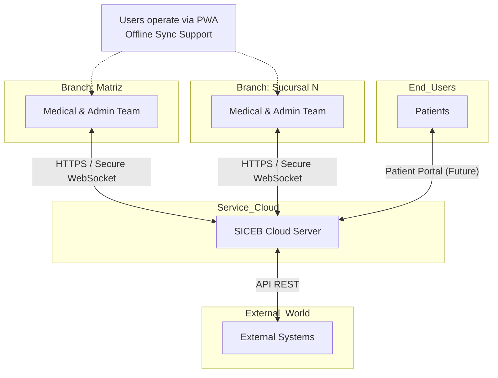
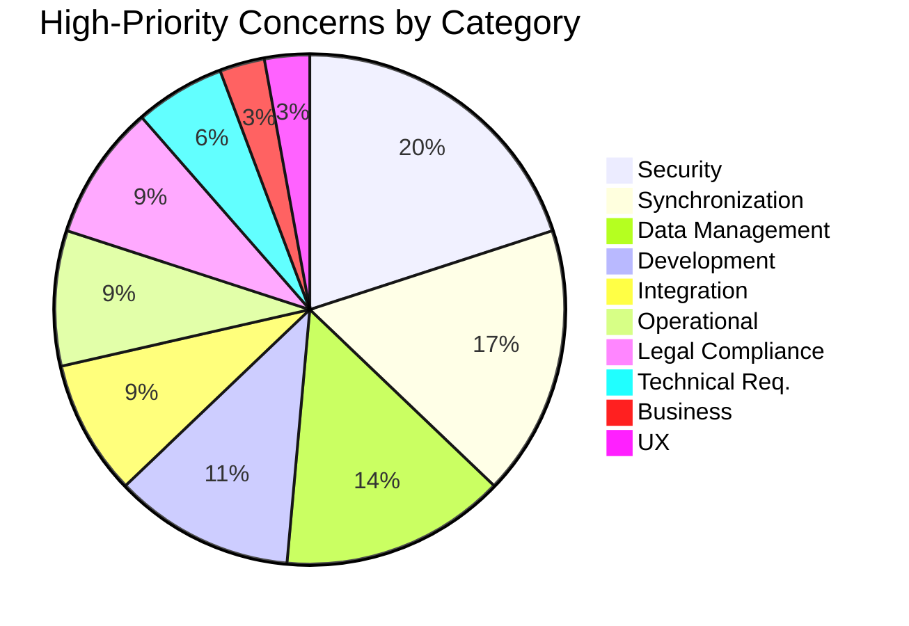

# Business Case

## Index

- [Business case (introduction)](#ad-business-case-intro)
- [Business objectives](#ad-business-objectives)
- [Primary user stories (US)](#ad-primary-user-stories)
- [Quality attributes](#ad-quality-attributes)
- [Review constraints](#ad-review-constraints)
  - [Technical constraints](#ad-technical-constraints)
- [Review architectural concerns](#ad-review-architectural-concerns)
- [High-priority architectural concerns — overview](#ad-high-priority-overview)
- [1. Data management and persistence](#ad-sec-01-data)
- [2. Integration architecture](#ad-sec-02-integration)
- [3. Security architecture](#ad-sec-03-security)
- [4. Operational architecture](#ad-sec-04-operational)
- [5. Development architecture](#ad-sec-05-development)
- [6. Business architecture](#ad-sec-06-business)
- [7. Compliance and legal framework](#ad-sec-07-compliance)
- [8. Synchronization and conflict resolution](#ad-sec-08-sync)
- [9. User experience](#ad-sec-09-ux)
- [10. Internal technical requirements](#ad-sec-10-technical)
- [Distribution by category](#ad-distribution-by-category)
- [ID summary](#ad-id-summary)

SICEB (Sistema Integral de Control y Expedientes de Bienestar — Comprehensive Wellness Control and Records System) is a hybrid cloud Progressive Web Application designed to digitize and centralize the operations of a private multi-branch medical clinic network. It replaces entirely manual, paper-based workflows with an integrated platform that manages electronic medical records, medical supply inventories with automated alerts, supply and workshop request approvals, pharmacy prescription validation, laboratory study tracking, financial reporting, and role-based access control for nine distinct user roles — from general directors to medical residents (R1–R4). With built-in offline capability and automatic data synchronization, SICEB ensures operational continuity even during connectivity outages, delivering improved efficiency, full traceability, and a better experience for staff and patients alike.

---

## Business Objectives
The clinic aims to achieve the following strategic objectives:

- **Financial Management:** Efficiently record income and expenses per service, generate financial profitability reports.
- **Client Management:** Maintain centralized digital records with a complete care history.
- **Inventory Management:** Rigorous control of medical supplies, materials, and medications.
- **Staff Management:** Control over attending physicians and residents, record of training activities.

## Primary User Stories (US)
| Rank | US ID      | Short Name                           | High/High Scenarios Supported   |
| ---- | ---------- | ------------------------------------ | ------------------------------- |
| 1    | **US-076** | Offline operation & synchronization  | REL-01, REL-02, USA-01          |
| 2    | **US-074** | Active branch selection              | SEC-02, ESC-02                  |
| 3    | **US-071** | Branch registration                  | SEC-02, ESC-02                  |
| 4    | **US-003** | Role-based permissions               | SEC-02                          |
| 5    | **US-026** | Record immutability                  | REL-02                          |
| 6    | **US-025** | Add consultation to record           | REL-01, USA-01                  |
| 7    | **US-004** | Full inventory view (Admin)          | PER-01                          |
| 8    | **US-024** | Create clinical record               | USA-01                          |
| 9    | **US-031** | Prescribe medications                | USA-01                          |
| 10   | **US-044** | Register payments                    | REL-01                          |

## Quality Attributes
| Scenario ID      | Quality Attribute   | Description                                                 |
| ---------------- | ------------------- | ----------------------------------------------------------- |
| PER-01           | Performance         | Real-time inventory updates across branches                 |
| SEC-02           | Security            | Branch-level data segmentation (multi-tenancy)              |
| REL-01           | Reliability         | Offline-to-online sync with zero data loss                  |
| REL-02           | Reliability         | Recovery from partial synchronization failure                 |
| USA-01           | Usability           | Transparent offline operation during consultations            |
| ESC-02           | Scalability         | Branch growth without performance degradation                 |

## Review Constraints

### Technical Constraints
| ID         | Constraint                                                                                                                                                  |
| ---------- | ----------------------------------------------------------------------------------------------------------------------------------------------------------- |
| **CON-01** | The system must be developed as a **Progressive Web App (PWA)** with Hybrid Cloud (SaaS) architecture; native mobile apps are excluded                      |
| **CON-02** | All communication between clients and the cloud server must use **HTTPS / Secure WebSocket** protocols                                                      |
| **CON-03** | The frontend must support the **two most recent versions** of Chrome, Edge, Safari, and Firefox on desktop and tablet devices                               |
| **CON-04** | The backend must expose a **REST API** for all external integrations                                                                                        |
| **CON-05** | **Diagnostic imaging (DICOM/PACS) is not supported**; laboratory results are captured strictly in text format                                               |

## **Review Architectural Concerns**

# High-Priority Architectural Concerns — SICEB

There are **35 high-priority concerns** out of a total of 45. The dominant cross-cutting theme is the **challenge of offline operation** and its implications for security, data consistency, and regulatory compliance.

---

## 1. Data Management and Persistence (5)

| ID | Concern |
|---|---|
| **CRN-01** | **Data retention policies:** Define retention periods for clinical records (permanent per NOM-004-SSA3-2012), transactional data (prescriptions, payments, inventory movements), and operational data (session logs, sync queues) |
| **CRN-02** | **Immutable data model for clinical records:** Design the medical record schema as insert-only (insert, never update/delete) to guarantee immutability at the database level, not just at the application level |
| **CRN-04** | **Database migration strategy:** Support schema evolution across 10 incremental releases without data loss or prolonged downtime in production |
| **CRN-05** | **Backward compatibility in data schemas:** Ensure new schema versions can coexist with existing data produced by branches that have not yet synchronized, especially during offline periods |
| **CRN-06** | **Backup frequency and RPO/RTO:** Define backup frequency for the cloud database and acceptable recovery point/recovery time objectives, considering that offline branches hold unsynchronized data locally |

---

## 2. Integration Architecture (3)

| ID | Concern |
|---|---|
| **CRN-08** | **CFDI integration:** Integrate electronic invoicing by consuming the existing payment module interfaces and managing communication with SAT (tax authority) web services |
| **CRN-09** | **CFDI issuance during network outages:** CFDI vouchers require real-time communication with SAT web services; a strategy is needed to handle invoicing requests when the branch is offline |
| **CRN-11** | **API versioning:** Define the REST API versioning strategy to support external integrations (academic systems) and future integrations (insurance companies) without impacting existing consumers |

---

## 3. Security Architecture (7)

| ID | Concern |
|---|---|
| **CRN-13** | **Security hardening:** Protect REST API endpoints against unauthenticated access, enforce HTTPS/Secure WebSocket, and prevent information leakage in error responses |
| **CRN-14** | **Offline controlled medication dispensing:** Prescribing and dispensing controlled medications offline creates regulatory risk — the system cannot verify stock in real time or validate prescriber permissions against the central database |
| **CRN-15** | **Authentication and authorization:** Implement role-based access control for 11 roles with branch-scoped permissions, including residency level restrictions (R1–R4) |
| **CRN-16** | **Offline supervisor availability:** Residents R1/R2 require mandatory supervision, but supervisor assignment validation depends on central data — offline consultations could bypass this check |
| **CRN-17** | **Logging and auditing:** Implement a centralized, immutable audit log documenting who accessed which record and when, with support for COFEPRIS traceability and LFPDPPP compliance |
| **CRN-18** | **Audit log immutability:** Ensure audit log entries cannot be altered — neither by application users nor by database administrators — to meet regulatory requirements (AUD-03) |
| **CRN-45** | **Asynchronous business compensation for offline regulatory violations:** Define an explicit compensation protocol for operations performed offline that are rejected upon synchronization — such as a deactivated resident who prescribed medications, or a controlled substance dispensed against stale inventory. The system must generate mandatory priority alerts and audit entries rather than silently failing with an HTTP error |

---

## 4. Operational Architecture (3)

| ID | Concern |
|---|---|
| **CRN-19** | **Exception management:** Define a unified error-handling strategy across the system — distinguishing between recoverable errors (e.g., sync retry) and fatal errors (e.g., corrupt cache), including user-facing messages |
| **CRN-21** | **Offline-first architecture:** Define the strategy for the PWA to operate offline (local storage, service workers, sync queue) and transition transparently between connected and disconnected modes (REL-01, USA-01) |
| **CRN-24** | **Multi-tenant scalability:** Ensure the multi-tenant model supports clinic network growth without performance degradation as branches, users, and data volume increase (ESC-02) |

---

## 5. Development Architecture (4)

| ID | Concern |
|---|---|
| **CRN-25** | **Overall system structure:** Define the high-level system decomposition (PWA frontend, REST API backend, cloud database, offline local storage) and interaction patterns between these layers |
| **CRN-26** | **Functionality-to-module allocation:** Distribute the 18 epics (EP-01 through EP-18) into cohesive, loosely coupled modules with well-defined boundaries and interfaces |
| **CRN-27** | **Dependency management:** Manage inter-module dependencies (e.g., Pharmacy depends on Prescriptions from Clinical Records; Payments depend on Consultation, Pharmacy, and Laboratory) to prevent circular dependencies |
| **CRN-43** | **Offline-aware design conventions:** Establish mandatory coding and design conventions for all modules built in Iterations 2–5 so that offline retrofit in Iteration 6 is trivial — including UUID-only identifiers, idempotent write operations, business validations that can execute against locally cached data, and inventory mutations modeled as delta commands rather than absolute state transfers |

---

## 6. Business Architecture (1)

| ID | Concern |
|---|---|
| **CRN-29** | **Multi-branch architecture:** Establish how the system supports multiple branches as a single deployable unit with tenant-level data isolation, rather than separate instances per branch (ESC-02) |

---

## 7. Compliance and Legal Framework (3)

| ID | Concern |
|---|---|
| **CRN-31** | **NOM-004-SSA3-2012 compliance:** Ensure the clinical record schema and workflows comply with the Mexican standard for medical records, including mandatory sections, healthcare provider signatures, and retention periods |
| **CRN-32** | **LFPDPPP data protection:** Handle patient personally identifiable information in compliance with the Federal Law for the Protection of Personal Data Held by Private Parties, including consent management, access rights, and data portability |
| **CRN-33** | **COFEPRIS controlled substance tracking:** Maintain regulatory traceability for controlled medications across prescriptions, dispensations, and inventory, even when branches operate offline |

---

## 8. Synchronization and Conflict Resolution (6)

| ID | Concern |
|---|---|
| **CRN-34** | **Data synchronization and conflict resolution:** Establish the protocol for syncing offline data to the cloud — including queue-based synchronization, partial failure recovery, duplicate prevention, and ordering guarantees (REL-01) |
| **CRN-35** | **Inventory consistency under concurrent offline edits:** If two branches use the same supply offline and both sync afterward, the final inventory count may become negative or inconsistent — a conflict resolution policy is needed (PER-01) |
| **CRN-36** | **Caching strategy:** Define which data is stored locally for offline operation (patient records, inventory, catalogs), cache invalidation policies, corruption detection mechanisms (checksum validation), and branch-scoped cache isolation — when a multi-branch user switches active branch context without logging out (PROC-12-FUT), the local IndexedDB cache must be partitioned or purged per `branch_id` to prevent offline queries from returning data belonging to the previous branch (SEC-02, LFPDPPP) |
| **CRN-37** | **Unique patient identifier:** Establish a system-wide unique patient identifier that persists across branches, ensuring a patient has exactly one medical record regardless of which branch they visit |
| **CRN-38** | **Offline ID generation:** Define a strategy for generating unique identifiers for records created offline (e.g., UUIDs) to prevent collisions when multiple branches sync simultaneously |
| **CRN-44** | **Command/Delta-based inventory mutations:** Inventory state changes must be modeled as intent-based delta commands rather than absolute state transfers — e.g., enqueue a command like "DecrementStock(item, quantity, branch, timestamp)" instead of "SetStock(item, 13)". This enables deterministic conflict resolution when multiple branches modify the same supply concurrently while offline (PER-01, CRN-35) |

---

## 9. User Experience (1)

| ID | Concern |
|---|---|
| **CRN-39** | **Offline-to-online transition UX:** Design clear visual indicators and transparent user flows for when the system transitions between offline and online modes, including sync status and data freshness indicators (USA-01) |

---

## 10. Internal Technical Requirements (2)

| ID | Concern |
|---|---|
| **CRN-41** | **UTC timestamps:** Store all timestamps in UTC internally and convert to local timezone (America/Mexico_City) only at the presentation layer, to prevent synchronization conflicts between branches |
| **CRN-42** | **Currency handling:** Use a fixed-precision data type (e.g., BigDecimal) for all monetary values (fees, payments, discounts) to avoid floating-point rounding errors in financial calculations |

---

## Distribution by Category

---

## ID Summary

| Priority | Count | IDs |
|---|---|---|
| **High** | 35 | CRN-01, CRN-02, CRN-04, CRN-05, CRN-06, CRN-08, CRN-09, CRN-11, CRN-13, CRN-14, CRN-15, CRN-16, CRN-17, CRN-18, CRN-19, CRN-21, CRN-24, CRN-25, CRN-26, CRN-27, CRN-29, CRN-31, CRN-32, CRN-33, CRN-34, CRN-35, CRN-36, CRN-37, CRN-38, CRN-39, CRN-41, CRN-42, CRN-43, CRN-44, CRN-45 |
