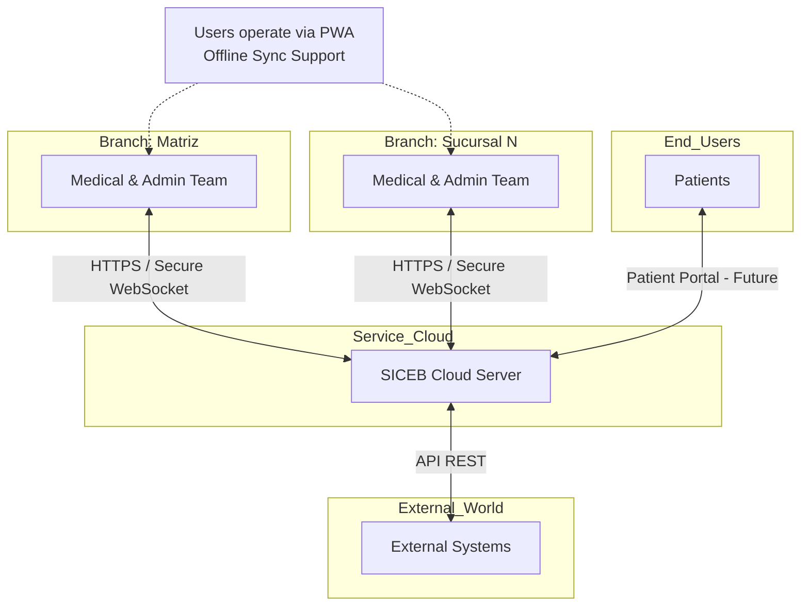
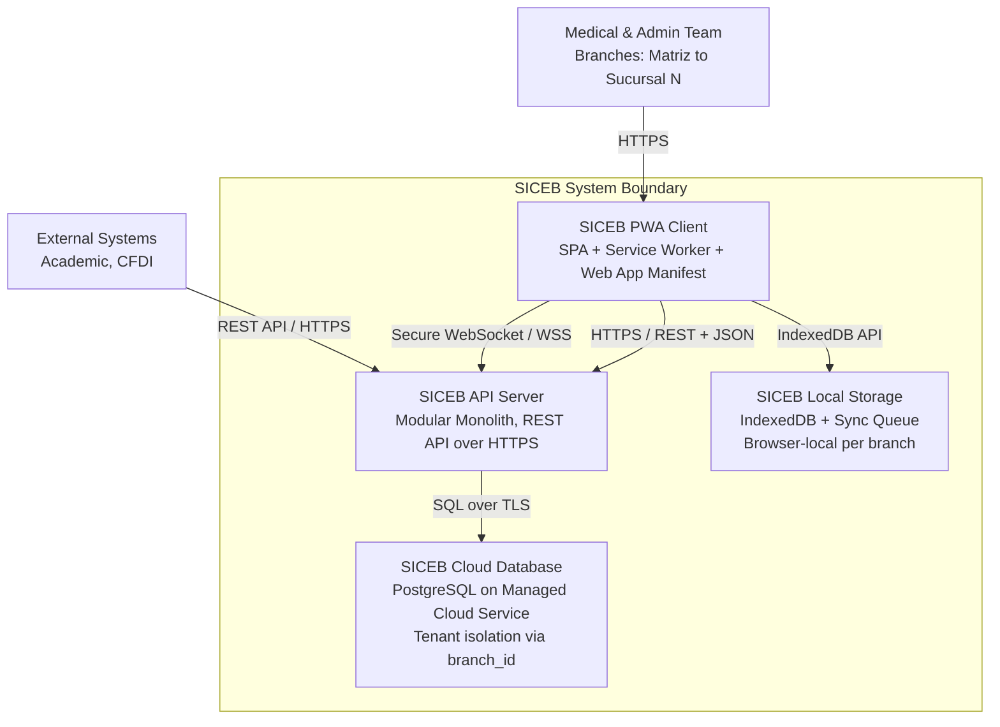
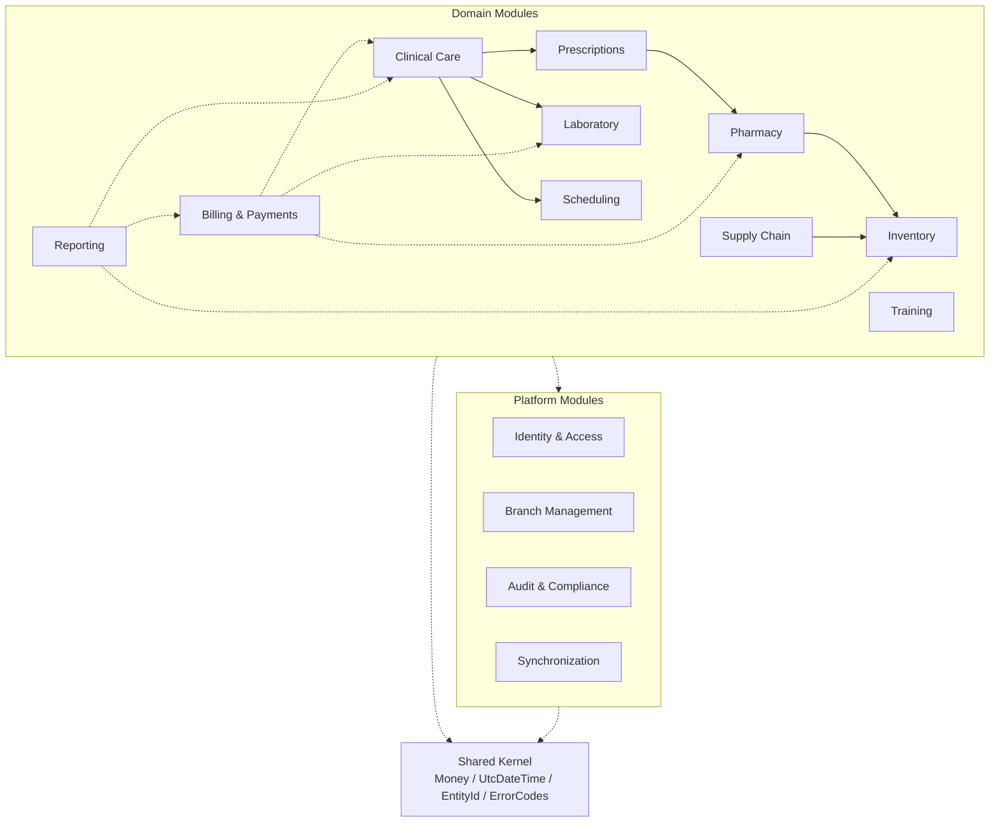
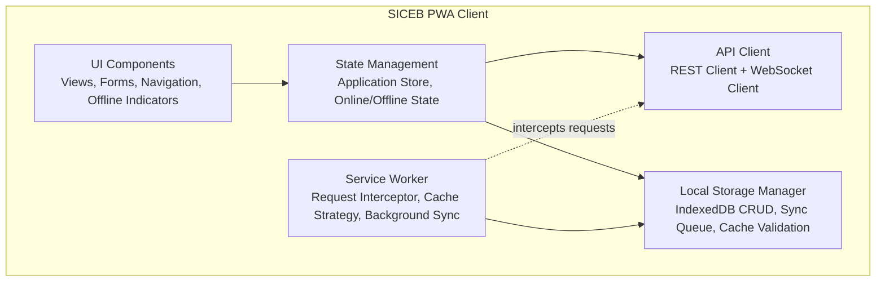
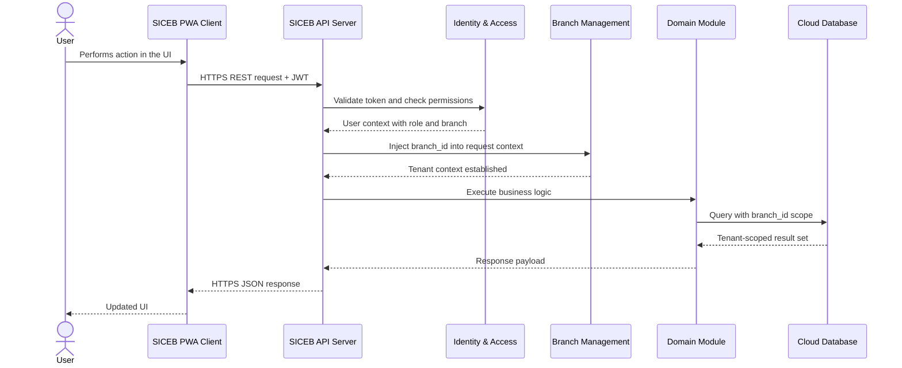
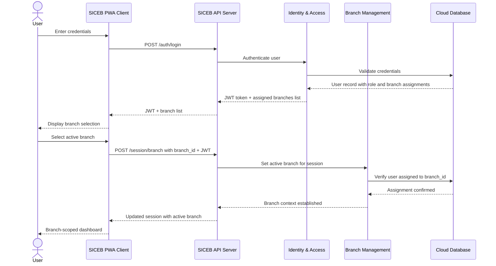
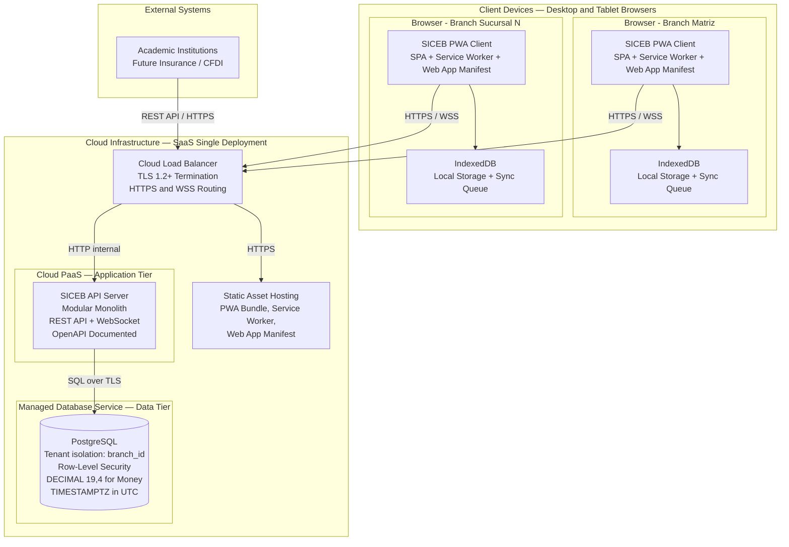
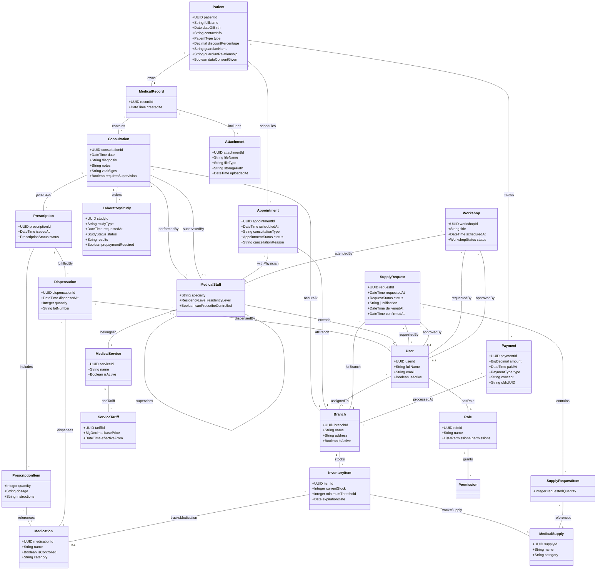

# Iteration 1 — Establish Overall System Structure

## 1. Introduction

This document captures the architectural specification for SICEB Iteration 1, which establishes the high-level decomposition of the system into containers and modules, technology choices, interaction patterns, the multi-branch tenant model, and offline-aware design conventions. All subsequent iterations inherit and refine the structural foundation defined here.

SICEB (Sistema Integral de Control y Expedientes de Bienestar) is a greenfield system. This iteration addresses the five technical constraints and seven architectural concerns that shape the entire technology stack, module organization, and cross-cutting conventions — including mandatory offline-aware design rules that ensure modules built in Iterations 2–5 are inherently compatible with offline synchronization.

---

## 2. Context Diagram

The following context diagram shows SICEB as a single system interacting with its external actors. Medical and administrative teams at each branch access the system through a Progressive Web App over HTTPS and Secure WebSocket. External systems — academic institutions and future insurance integrations — communicate via a REST API. A future patient portal is planned but out of scope for the current design.

---

## 3. Architectural Drivers

### Architectural Concerns

| Driver | Description | Why this iteration |
|---|---|---|
| **CRN-25** | Overall system structure | Defines the top-level containers: PWA, REST API, cloud DB, local storage |
| **CRN-26** | Functionality-to-module allocation | Allocates the 18 epics into cohesive, loosely coupled modules |
| **CRN-27** | Dependency management | Establishes dependency rules to prevent circular dependencies between modules |
| **CRN-29** | Multi-branch architecture | Determines the single-deployment, tenant-isolated multi-branch model |
| **CRN-41** | UTC timestamps | Convention must be established before any data is persisted |
| **CRN-42** | Currency handling | Fixed-precision arithmetic must be in place before any financial entity is designed |
| **CRN-43** | Offline-aware design conventions | Must be established before any domain module is built, so that Iterations 2–5 produce sync-compatible code without requiring retrofit |

### Technical Constraints

| Driver | Description | Why this iteration |
|---|---|---|
| **CON-01** | PWA with Hybrid Cloud (SaaS) | Shapes the entire technology stack; native mobile apps are excluded |
| **CON-02** | HTTPS / Secure WebSocket | Determines communication infrastructure between all clients and server |
| **CON-03** | Browser compatibility (last 2 versions of Chrome, Edge, Safari, Firefox) | Constrains frontend framework and API choices |
| **CON-04** | REST API for external integrations | Shapes the backend's interface layer |
| **CON-05** | No DICOM/PACS; text-only lab results | Bounds the data model scope — no binary medical imaging |

---

## 4. Container Diagram

The following C4 container diagram decomposes SICEB into its four deployable containers and shows how they interact with external actors. The PWA Client communicates with the API Server over HTTPS/REST and Secure WebSocket. The API Server persists data in the Cloud Database over TLS-encrypted SQL connections. The PWA Client also writes to its own Local Storage via IndexedDB for offline operation.

### Container Responsibilities

| Container | Technology | Responsibilities |
|---|---|---|
| **SICEB PWA Client** | SPA Framework + PWA APIs + IndexedDB | Renders the user interface for all 11 roles; manages application state; intercepts network requests via Service Worker for caching; stores offline data in IndexedDB; provides installable experience on desktop and tablet; targets last 2 versions of Chrome, Edge, Safari, Firefox |
| **SICEB API Server** | Cloud PaaS, Modular Monolith | Exposes REST API over HTTPS for all client and external operations; hosts domain and platform modules; enforces authentication, authorization, and tenant context; orchestrates business logic; publishes real-time events via Secure WebSocket; documented via OpenAPI specification |
| **SICEB Cloud Database** | PostgreSQL, Managed Cloud Service | Stores all persistent data with tenant isolation via `branch_id` discriminator column; enforces referential integrity and data types at the schema level; uses `DECIMAL(19,4)` for monetary values and `TIMESTAMPTZ` in UTC for all timestamps; supports row-level security for multi-tenant queries |
| **SICEB Local Storage** | IndexedDB, Browser Storage | Caches a subset of cloud data relevant to the user's active branch for offline operation; maintains a sync queue for operations performed while offline; supports cache validation and corruption detection; enforces branch-scoped cache isolation upon branch context switch |

---

## 5. Component Diagrams

### 5.1 — SICEB API Server Components

The API Server is internally organized as a modular monolith following domain-driven decomposition. Modules are grouped into three layers: **Domain Modules** encapsulate business logic for specific bounded contexts, **Platform Modules** provide cross-cutting infrastructure services consumed by all domain modules, and the **Shared Kernel** defines common value types used across the entire codebase.

#### API Server Module Responsibilities

| Module | Type | Responsibilities |
|---|---|---|
| **Clinical Care** | Domain | Patient registration and demographics; medical record creation and append-only enforcement; consultation recording with vital signs and diagnosis; file attachment management; system-wide unique patient identifier |
| **Prescriptions** | Domain | Prescription creation within consultation context; prescription item management; prescriber permission validation based on residency level; prescription status lifecycle |
| **Pharmacy** | Domain | Medication catalog management; dispensation event recording with traceability for controlled substances; inventory deduction upon dispensation; prescription validation before dispensing |
| **Laboratory** | Domain | Laboratory study request lifecycle; prepayment verification; text-only result entry per CON-05; result availability in patient medical record |
| **Inventory** | Domain | Branch-scoped stock tracking for medications and medical supplies; all stock mutations as intent-based delta commands per CRN-43; minimum threshold configuration; low-stock alerts; expiration date tracking; no outgoing domain dependencies |
| **Supply Chain** | Domain | Supply request creation with justification; multi-step approval workflow; delivery recording; receipt confirmation; branch inventory update upon delivery |
| **Scheduling** | Domain | Appointment creation and management; physician agenda views; cancellation and rescheduling with documented reasons |
| **Billing & Payments** | Domain | Payment registration for consultations, pharmacy, and laboratory; service tariff configuration with `DECIMAL(19,4)` precision; receipt generation; future CFDI integration point |
| **Reporting** | Domain | Consolidated financial reports across branches; operational dashboards; read-only access to Billing, Inventory, and Clinical Care data |
| **Training** | Domain | Workshop request and approval workflow; attendance tracking; future exposure to external academic systems via REST API |
| **Identity & Access** | Platform | Authentication, authorization, RBAC, user and role management. All domain modules depend on this |
| **Branch Management** | Platform | Branch CRUD, active branch selection, `branch_id` injection into request context for tenant-scoped queries |
| **Audit & Compliance** | Platform | Centralized append-only audit log. Write-only sink — domain modules push events, Audit never calls back |
| **Synchronization** | Platform | Offline sync queue, conflict detection, data reconciliation. Detailed design deferred to Iteration 6 |
| **Shared Kernel** | Shared | `Money(DECIMAL(19,4), MXN)`, `UtcDateTime` (always UTC), `EntityId` (UUID — no auto-increment), `IdempotencyKey`, standardized error codes |

### 5.2 — SICEB PWA Client Components

The PWA Client is organized into five internal components that separate UI rendering, state management, network communication, offline caching, and local persistence.

#### PWA Client Component Responsibilities

| Component | Responsibilities |
|---|---|
| **UI Components** | Renders views, forms, and navigation for all user roles; displays offline/online status indicators and sync progress; responsive layout for desktop and 10-inch tablets; follows progressive enhancement for browser compatibility |
| **State Management** | Maintains application state including user session, active branch context, and online/offline mode; coordinates between API Client and Local Storage Manager; triggers UI updates on state changes |
| **API Client** | Sends REST requests to the API Server over HTTPS; manages WebSocket connection for real-time events; handles authentication token lifecycle; serializes requests and deserializes responses |
| **Service Worker** | Intercepts outgoing network requests; applies caching strategies for static assets and API responses; triggers background sync when connectivity is restored; manages PWA installation and update lifecycle |
| **Local Storage Manager** | Performs CRUD operations on IndexedDB; manages the offline sync queue; validates cache integrity via checksums; stores branch-scoped data subset for offline operation; enforces cache isolation per `branch_id` |

---

## 6. Sequence Diagrams

### SD-01: Authenticated API Request Flow

This sequence diagram illustrates the standard lifecycle of any authenticated request in SICEB. Every request passes through token validation, permission checks, tenant context injection, and query scoping before reaching any domain module.

### SD-02: Branch Context Selection

This sequence diagram shows how a user authenticates, selects an active branch, and how the tenant context is established for all subsequent operations.

---

## 7. Deployment Diagram

The following deployment diagram shows the physical infrastructure layout for SICEB's cloud-native SaaS deployment. TLS is terminated at the cloud load balancer. The API Server runs as a single deployable artifact on a managed PaaS. PostgreSQL runs on a managed database service with automated backups and high availability. PWA clients run in browsers on clinic desktops and tablets, with IndexedDB providing local storage for offline operation.

### Deployment Node Responsibilities

| Node | Technology | Responsibilities |
|---|---|---|
| **Cloud Load Balancer** | Cloud-managed LB | TLS 1.2+ termination; HTTPS and WSS routing to API Server; static asset routing; SSL certificate management; health checks |
| **SICEB API Server** | Cloud PaaS instance | Hosts the modular monolith; processes REST and WebSocket requests; enforces security middleware pipeline; auto-scalable based on load |
| **PostgreSQL Database** | Managed cloud DB service | Persistent storage with automated backups; high availability configuration; row-level security enforcement; connection pooling |
| **Static Asset Hosting** | Cloud storage / CDN | Serves the PWA bundle, Service Worker script, and Web App Manifest; cache headers for versioned assets |
| **Client Browser** | Chrome, Edge, Safari, Firefox | Runs the PWA with Service Worker for offline caching; IndexedDB for local data persistence; sync queue for offline operations |

---

## 8. Interfaces and Events

Iteration 1 establishes the structural foundation and cross-cutting conventions. No concrete API endpoints are defined at this stage — those are introduced in Iterations 2–3 as domain modules are refined. However, the following conventions govern all future interfaces:

### Interface Conventions

| Convention | Description | Driver |
|---|---|---|
| **REST + JSON over HTTPS** | All client-server and external communication uses REST API with JSON payloads, documented via OpenAPI | CON-04 |
| **JWT Authentication** | Every request carries a JWT token; unauthenticated requests are rejected | CON-02 |
| **Branch-scoped queries** | Every tenant-scoped query includes `branch_id` filtering from the session context | CRN-29 |
| **IdempotencyKey on writes** | Every write command includes a client-generated `IdempotencyKey` for safe offline replay | CRN-43 |
| **UUID identifiers** | All entity IDs are UUID via `EntityId` — no auto-increment sequences | CRN-43 |
| **UTC timestamps** | All timestamps use `UtcDateTime` stored in UTC; presentation-layer converts to `America/Mexico_City` | CRN-41 |
| **DECIMAL(19,4) for money** | All monetary values use `Money` value type with banker's rounding | CRN-42 |

### Events and Conventions Established

| Convention | Description | Driver |
|---|---|---|
| **Domain modules emit audit events** | All domain modules must push events to the Audit & Compliance sink | CRN-17 |
| **Delta-based inventory mutations** | Stock changes are recorded as intent-based delta commands, not absolute state | CRN-43, CRN-44 |
| **Local-first business validations** | Business rules validate against JWT claims and cached data, not live DB queries | CRN-43 |
| **Idempotent write operations** | Every command handler must be idempotent — retrying produces the same result | CRN-43 |

---

## 9. Domain Model

The following domain model captures the core business entities and their relationships. The model reflects the clinical, pharmacy, inventory, financial, scheduling, and administrative domains of a multi-branch medical clinic network.

---

## 10. Design Decisions

| Driver | Decision | Rationale | Discarded Alternatives |
|---|---|---|---|
| **CRN-25** | Decompose SICEB into four containers: PWA Client, API Server, Cloud Database, Local Storage | Three-tier architecture provides clear separation of concerns; each tier can evolve independently; Local Storage container enables offline operation | Two-tier with direct DB access — exposes database credentials to client; Serverless-first — vendor lock-in and cold-start latency |
| **CRN-26** | Organize the API Server into 10 domain modules, 4 platform modules, and a Shared Kernel following domain-driven decomposition | High cohesion within modules aligned with business domains; clear ownership boundaries; modules can be independently tested and maintained | Technical-layer decomposition — low cohesion, a single feature change touches every layer; Unstructured monolith — no module boundaries, prevents future decomposition |
| **CRN-27** | Enforce an acyclic directed dependency graph: domain modules depend on platform modules and Shared Kernel; cross-domain dependencies follow Clinical Care → Prescriptions → Pharmacy → Inventory | Prevents circular dependencies; dependency direction mirrors business process flow; enforceable at build time through module visibility rules | Unrestricted module access — leads to spaghetti coupling; Event-only coupling between all modules — premature complexity for the initial architecture |
| **CRN-29** | Shared database with `branch_id` tenant discriminator column; single deployment serving all branches; row-level filtering enforced at the repository layer | Low operational cost with a single database to manage; simplified schema migrations; enables cross-branch reporting; aligns with small-team operational capacity | Database-per-tenant — N databases to patch, migrate, and back up; Schema-per-tenant — complex migrations across N schemas |
| **CRN-41** | Store all timestamps in UTC using `UtcDateTime` value type in Shared Kernel; convert to `America/Mexico_City` only at the UI presentation layer | Eliminates timezone ambiguity during offline synchronization; consistent chronological ordering in audit logs; simplifies cross-branch data correlation | Local timezone storage — causes sync conflicts during DST transitions; Dual storage of UTC + local — data redundancy and drift risk |
| **CRN-42** | Use `DECIMAL(19,4)` for all monetary database columns and `Money` value type in Shared Kernel with banker's rounding | Zero floating-point rounding errors in financial calculations; matches tax authority precision requirements for IVA proration; auditable results | IEEE 754 float/double — accumulates rounding errors in sums; Integer cents — insufficient precision for tax proration at 16% IVA |
| **CON-01** | Build the frontend as a Progressive Web App with Service Worker, Web App Manifest, and IndexedDB | Installable on desktop and tablet without app store; offline-capable through Service Worker caching; single codebase for all platforms | Native mobile apps — explicitly excluded by the constraint; Server-rendered MPA — poor offline support, full page reloads degrade clinical workflow UX |
| **CON-02** | TLS 1.2+ termination at cloud load balancer; all API endpoints require HTTPS; WebSocket channel secured with WSS protocol | Industry-standard transport security; centralized certificate management at infrastructure level; meets the constraint for all client-server communication | Application-level encryption only — incomplete protection, no certificate trust chain; Self-signed certificates — browser trust warnings in clinical setting |
| **CON-03** | Target last 2 versions of Chrome, Edge, Safari, and Firefox; use standard Web APIs with progressive enhancement | Meets the constraint; ensures consistent experience on clinic desktops and tablets; avoids polyfill overhead for obsolete browsers | Support all browser versions — excessive testing burden; Single-browser target — limits deployment flexibility across clinic devices |
| **CON-04** | Expose REST API with JSON payloads documented via OpenAPI specification; versioned endpoints for external consumers | Standard integration interface; stateless and cacheable; excellent tooling ecosystem; meets the constraint for academic and future insurance integrations | GraphQL — steeper learning curve, less standard HTTP caching; gRPC — no native browser support, requires proxy |
| **CON-05** | Laboratory results stored as text fields only; no binary medical imaging pipeline | Simplifies data model and storage requirements; avoids PACS integration complexity and associated infrastructure costs; meets the constraint scope | DICOM/PACS support — explicitly excluded by the constraint; File-based image storage — exceeds defined scope and adds storage costs |
| **CRN-43** | Establish four mandatory offline-aware design conventions for all modules: (1) UUID-only identifiers via `EntityId`; (2) idempotent write operations with client-generated idempotency keys; (3) business validations executable against locally cached data; (4) inventory mutations modeled as intent-based delta commands. Enforced via automated architecture tests in CI | Ensures all modules built in Iterations 2–5 are inherently compatible with offline synchronization; eliminates costly data-layer retrofit in Iteration 6; delta commands enable deterministic conflict resolution; CI enforcement prevents convention erosion over 4 iterations | No conventions — defer all offline concerns to Iteration 6 with high retrofit risk; Full offline implementation in Iteration 1 — premature without domain models; Manual code review only — insufficient for sustained discipline |

---

## 11. Implementation Constraints

This section captures critical implementation constraints that must be observed during Iteration 1 development. These originate from the architectural risk analysis and are binding for the development team.

### IC-01: Domain Module Scope Limitation

| Attribute | Value |
|---|---|
| **Risk** | Attempting to implement business logic or physical data models (DDL) for domain modules during Iteration 1 will cause premature coupling, loss of focus, and significant delays — violating the iterative ADD approach |
| **Drivers** | CRN-25, CRN-26, CRN-27, CRN-43 |
| **Constraint** | Domain modules (Clinical Care, Prescriptions, Pharmacy, Laboratory, Inventory, Supply Chain, Scheduling, Billing & Payments, Reporting, Training) must be created as **empty stubs only** — namespace/package placeholders with declared external dependencies. No business logic, no database tables, no API endpoints. All implementation effort in this iteration is directed exclusively to the Shared Kernel and the four Platform Modules (Identity & Access, Branch Management, Audit & Compliance, Synchronization) |
| **Enforcement mechanism** | Automated architecture tests in CI (per CRN-43 decision) must verify that domain module packages contain only stub declarations. Code reviews must reject any pull request that introduces domain logic ahead of its scheduled iteration |
| **Alternatives considered** | (1) Implement all domain modules from Iteration 1 — rejected: premature coupling, contradicts iterative design; (2) No stubs at all — rejected: namespace structure and dependency graph must be established early to validate CRN-27 acyclic dependency rules |
| **Domain module schedule** | Iteration 2: Clinical Care, Prescriptions, Laboratory; Iteration 4: Inventory, Supply Chain; Iteration 5: Pharmacy; remaining modules per IterationPlan.md |
