# Iteration 2 — Core Clinical Workflow and Medical Records

## 1. Introduction

This document captures the architectural specification for SICEB Iteration 2, which designs the clinical care modules representing the primary business value stream: patient management, medical consultations, prescribing, laboratory study tracking, and the immutable clinical record. This iteration enforces medical record immutability, NOM-004-SSA3-2012 compliance, and a system-wide unique patient identifier.

The clinic's core revenue comes from patient consultations. The clinical record is the most regulated artifact (NOM-004-SSA3-2012) and the most architecturally constrained (append-only, permanent retention). Addressing this early ensures the data model is correct before downstream modules (pharmacy, laboratory, payments) depend on it.

**Business objective:** Gestión de Clientes — Maintain centralized digital records with complete care history.

**Drivers addressed:** US-024, US-025, US-026, US-031, US-019, US-020, US-023, US-027, US-038, US-040, US-041, US-042, PER-03, USA-02, AUD-03, CRN-02, CRN-01, CRN-31, CRN-37.

---

## 2. Context Diagram

The following context diagram shows SICEB as a single system interacting with its external actors. Medical and administrative teams at each branch access the system through a Progressive Web App over HTTPS and Secure WebSocket. External systems — academic institutions and future insurance integrations — communicate via a REST API.

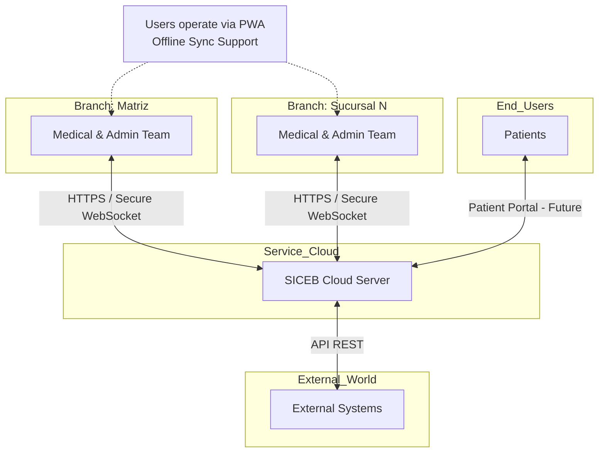

---

## 3. Architectural Drivers

### Primary User Stories

| Driver | Rank | Description | Why this iteration |
|---|---|---|---|
| **US-024** | 8 | Create clinical record | Entry point for all patient care |
| **US-025** | 6 | Add consultation to record | The daily core clinical operation; supports REL-01, USA-01 |
| **US-026** | 5 | Record immutability | Must be enforced from the data model layer; supports REL-02 |
| **US-031** | 9 | Prescribe medications | Consultations generate prescriptions; supports USA-01 |

### Supporting User Stories

| Driver | Description | Why this iteration |
|---|---|---|
| **US-019** | Register new patients with demographic information | Foundational for creating medical records |
| **US-020** | Classify patients by type with automatic discount calculation | Patient type determines financial treatment |
| **US-023** | Validate guardian presence for minor patients | Regulatory requirement for patients under 17 |
| **US-027** | View comprehensive medical history across services | Core clinical read use case |
| **US-038** | Request laboratory studies during consultation | Lab orders originate from consultations |
| **US-040** | View pending laboratory study requests | Lab technician work queue |
| **US-041** | Enter laboratory study results in text format | Text-only per CON-05 |
| **US-042** | View laboratory results in the patient's medical record | Results become part of the immutable record |

### Quality Attribute Scenarios

| Driver | Description | Why this iteration |
|---|---|---|
| **PER-03** | Patient search under 1 second over 50,000+ records | Requires indexing strategy on clinical read models |
| **USA-02** | New resident onboarding — guided consultation flow | Supports daily clinical operations for R1–R4 residents |
| **AUD-03** | Medical record immutability — 100% of modification attempts blocked and logged | Core architectural constraint for clinical data |

### Architectural Concerns

| Driver | Description | Why this iteration |
|---|---|---|
| **CRN-02** | Immutable data model for clinical records | Insert-only clinical event schema must be designed with the initial data model |
| **CRN-01** | Data retention policies | Permanent retention for clinical records influences storage design |
| **CRN-31** | NOM-004-SSA3-2012 compliance | Mandates specific record structure and mandatory sections |
| **CRN-37** | System-wide unique patient identifier | Foundational to the clinical workflow across branches |

---

## 4. Container Diagram

The following C4 container diagram decomposes SICEB into its four deployable containers. The clinical workflows in this iteration flow through the PWA Client to the API Server (Clinical Care, Prescriptions, and Laboratory modules) and persist as immutable events in the Cloud Database.

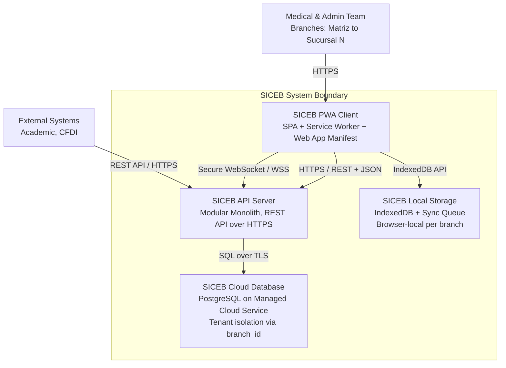

### Container Responsibilities

| Container | Technology | Responsibilities |
|---|---|---|
| **SICEB PWA Client** | SPA Framework + PWA APIs + IndexedDB | Renders the user interface for all 11 roles; manages application state; intercepts network requests via Service Worker for caching; stores offline data in IndexedDB; provides installable experience on desktop and tablet |
| **SICEB API Server** | Cloud PaaS, Modular Monolith | Exposes REST API over HTTPS; hosts domain and platform modules; enforces authentication, authorization, and tenant context; orchestrates business logic; publishes real-time events via Secure WebSocket |
| **SICEB Cloud Database** | PostgreSQL, Managed Cloud Service | Stores all persistent data with tenant isolation via `branch_id`; enforces referential integrity; uses `DECIMAL(19,4)` for monetary values and `TIMESTAMPTZ` in UTC; supports row-level security |
| **SICEB Local Storage** | IndexedDB, Browser Storage | Caches branch-scoped data for offline operation; maintains sync queue; validates cache integrity; enforces cache isolation per `branch_id` |

---

## 5. Component Diagrams

### 5.1 — API Server Components

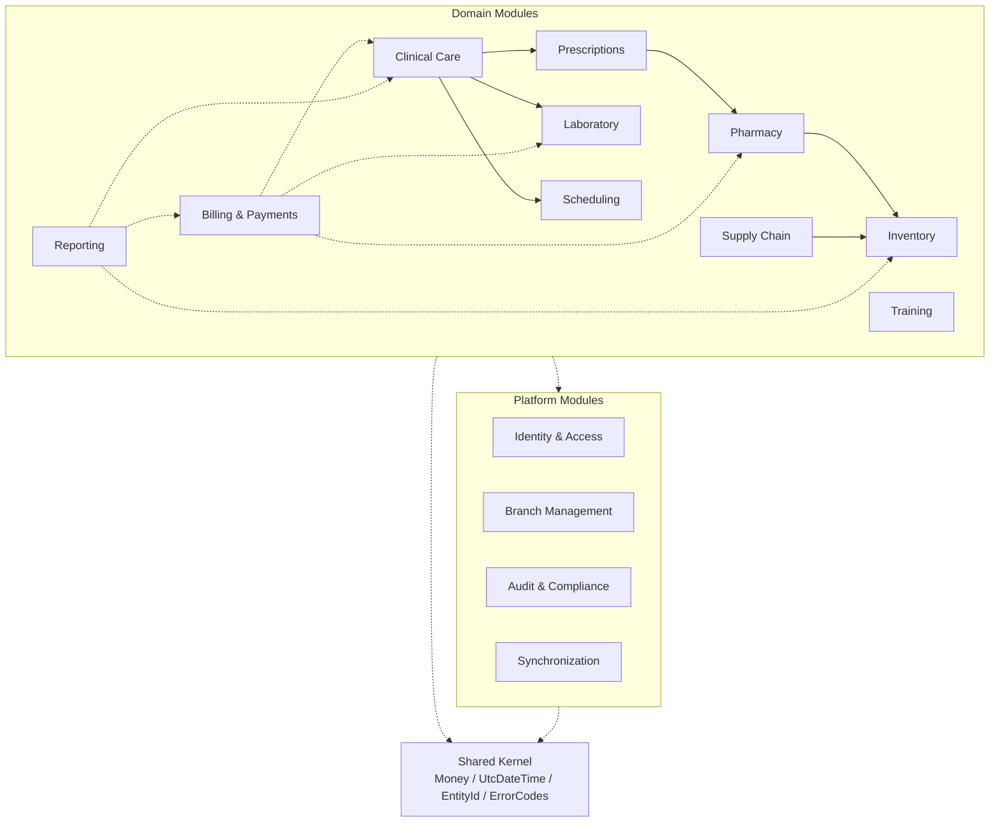

### 5.2 — Clinical Care Module Internals (Iteration 2 Refinement)

This component diagram zooms into the **Clinical Care**, **Prescriptions**, and **Laboratory** modules, showing the CQRS structure. The **command side** receives clinical commands and appends immutable `ClinicalEvent`s to the event store. The **read side** maintains projections optimized for patient search, clinical timeline rendering, NOM-004 structured views, and pending lab study lists.

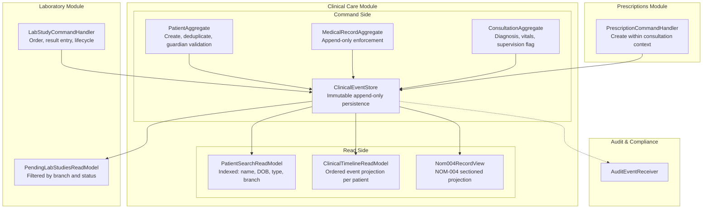

#### Clinical Care Module — Internal Component Responsibilities

| Component | Side | Responsibilities | Key Drivers |
|---|---|---|---|
| **PatientAggregate** | Command | Handles `CreatePatient` commands; enforces global uniqueness of `patientId` across branches; validates guardian presence for minors; applies patient type classification and discount rules | CRN-37, US-019, US-020, US-023 |
| **MedicalRecordAggregate** | Command | Handles `CreateMedicalRecord` commands; enforces the invariant that exactly one record exists per patient; rejects any update or delete operation — append-only | US-026, CRN-02, AUD-03 |
| **ConsultationAggregate** | Command | Handles `AddConsultation` commands; captures diagnosis, notes, vital signs; flags `requiresSupervision` for R1/R2 residents; serves as the transactional context for prescriptions and lab orders | US-025, USA-02, CRN-16 |
| **ClinicalEventStore** | Command | Immutable, append-only persistence layer; assigns sequential ordering per `MedicalRecord`; validates `IdempotencyKey` to prevent duplicate writes during offline sync; publishes notifications to read-side projections and Audit & Compliance | CRN-02, CRN-43, AUD-03 |
| **PrescriptionCommandHandler** | Command | Handles `CreatePrescriptionFromConsultation`; creates Prescription and PrescriptionItem events within consultation context. Prescriber-level restrictions enforced upstream by AuthorizationMiddleware (Iteration 3) | US-031, US-031, US-050, US-051 |
| **LabStudyCommandHandler** | Command | Handles `CreateLabStudiesFromConsultation` and `RecordLabResult`; manages lab study lifecycle; appends `LaboratoryStudy` and `LaboratoryResult` as separate events; text-only per CON-05 | US-038, US-040, US-041, US-042, CON-05 |
| **PatientSearchReadModel** | Read | Denormalized, indexed projection for fast patient lookup; indexes on `fullName`, `dateOfBirth`, `patientType`, `branch_id`, `lastVisitDate`; targets sub-1-second over 50,000+ records | PER-03, US-027 |
| **ClinicalTimelineReadModel** | Read | Chronologically ordered projection of all clinical events per patient; enables rendering of complete medical history without expensive runtime joins | US-027, US-025 |
| **Nom004RecordView** | Read | Structured projection organizing events into NOM-004-SSA3-2012 mandatory sections: identification, clinical notes, diagnostics, lab summaries, prescriptions, attachments | CRN-31, AUD-03 |
| **PendingLabStudiesReadModel** | Read | Branch-scoped list of lab studies in pending or in-progress status; enables lab technicians to view their work queue | US-040 |

### 5.3 — PWA Client Components

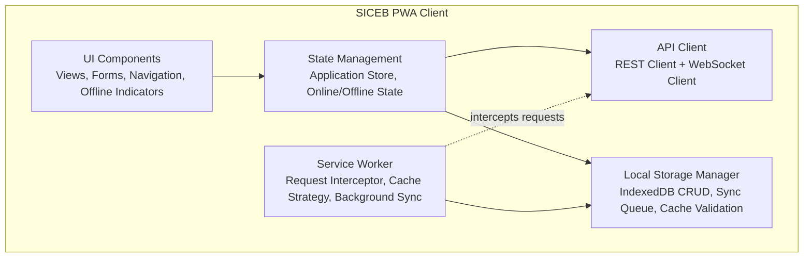

### 5.4 — PWA Clinical Workflow Components (Iteration 2 Refinement)

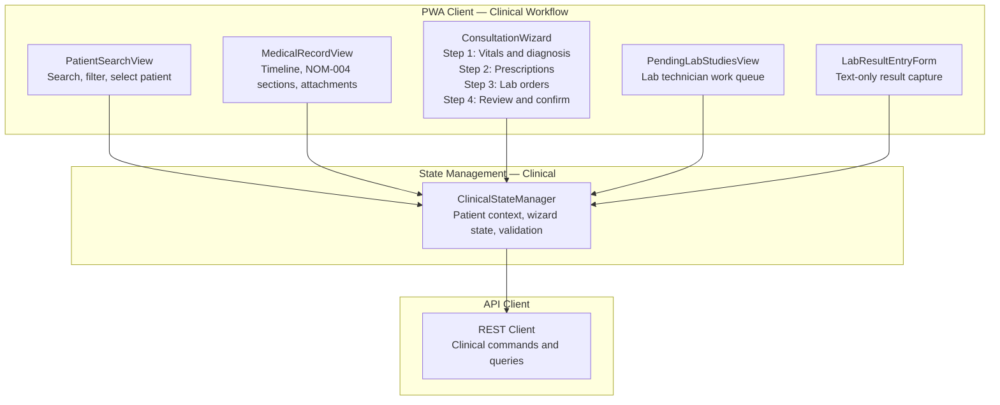

#### PWA Clinical Workflow — Component Responsibilities

| Component | Responsibilities | Key Drivers |
|---|---|---|
| **PatientSearchView** | Renders patient search interface with filters for name, date of birth, and patient type; displays results from `PatientSearchReadModel`; allows selecting a patient to navigate to their medical record | PER-03, US-019 |
| **MedicalRecordView** | Displays the patient's complete clinical timeline and NOM-004 structured sections; renders consultations, prescriptions, lab results, and attachments in chronological order | US-027, CRN-31 |
| **ConsultationWizard** | Guides the clinician through a structured multi-step flow: vital signs/diagnosis, prescriptions, lab orders, review and confirmation. Each step validates completeness before advancing. Reduces errors for new residents | US-024, US-025, US-031, US-038, USA-02 |
| **PendingLabStudiesView** | Shows branch-scoped list of pending lab studies for lab technicians; allows selection to enter results | US-040 |
| **LabResultEntryForm** | Captures text-only lab results for a selected pending study; validates required fields before submission | US-041, US-042, CON-05 |
| **ClinicalStateManager** | Maintains active patient context, wizard state, and validation rules; coordinates command dispatch and refreshes read-model data after successful writes | USA-02, US-025 |

---

## 6. Sequence Diagrams

### SD-03: Create Patient and Medical Record

This sequence diagram shows the creation of a new patient and their medical record, enforcing global patient uniqueness across branches (CRN-37), guardian validation for minors (US-023), and the creation of the append-only medical record as the first clinical event.

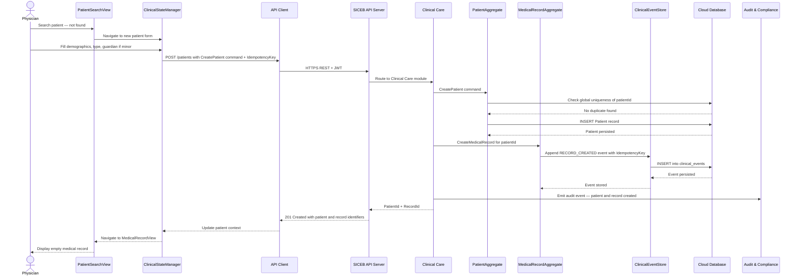

### SD-04: Add Consultation with Prescriptions and Lab Orders

This sequence diagram illustrates the core daily clinical workflow: a physician adds a consultation, and within the same encounter context, creates prescriptions and laboratory orders. All artifacts are appended as immutable clinical events.

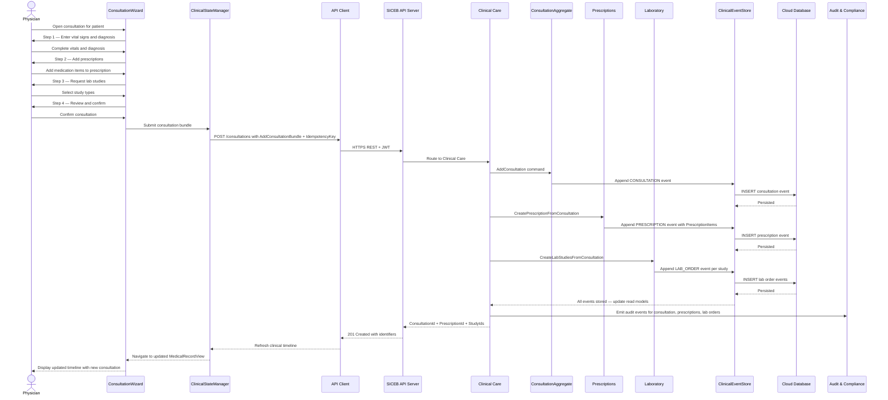

### SD-05: Enter Lab Results and Project into Medical Record

This sequence diagram shows how laboratory staff enter text-based results for a pending study and how those results become part of the patient's immutable medical record through a separate `LaboratoryResult` clinical event.

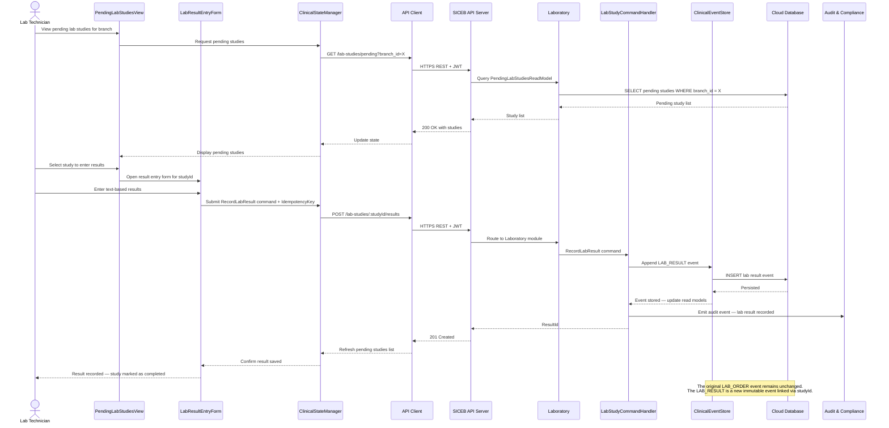

### SD-06: Search Patient and Load Clinical Timeline

This sequence diagram shows the read-side flow for searching patients and loading their complete clinical history. Both queries hit dedicated read models optimized for performance (PER-03).

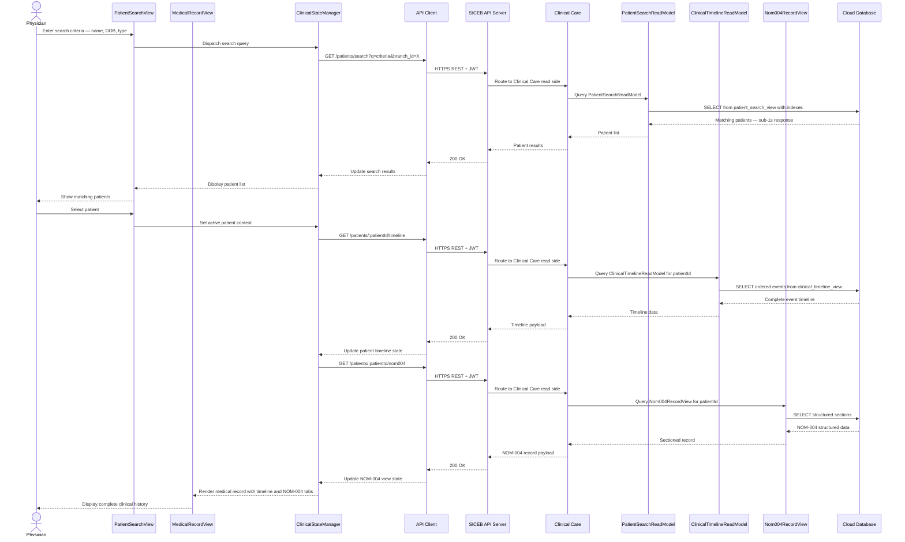

---

## 7. Deployment Diagram

The following deployment diagram shows the physical infrastructure layout for SICEB's cloud-native SaaS deployment. The clinical workflows from this iteration flow through browser-based PWA clients, through the cloud load balancer and API Server, to the managed PostgreSQL database where clinical events are persisted as immutable records.

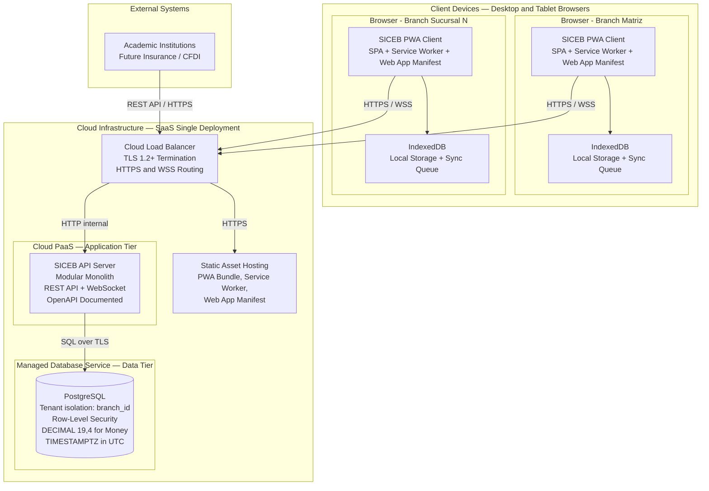

### Deployment Node Responsibilities

| Node | Technology | Responsibilities |
|---|---|---|
| **Cloud Load Balancer** | Cloud-managed LB | TLS 1.2+ termination; HTTPS and WSS routing to API Server; static asset routing; SSL certificate management; health checks |
| **SICEB API Server** | Cloud PaaS instance | Hosts the modular monolith; processes REST and WebSocket requests; enforces security middleware pipeline; auto-scalable |
| **PostgreSQL Database** | Managed cloud DB service | Persistent storage with automated backups; high availability; row-level security; connection pooling |
| **Static Asset Hosting** | Cloud storage / CDN | Serves PWA bundle, Service Worker, and Web App Manifest; cache headers for versioned assets |
| **Client Browser** | Chrome, Edge, Safari, Firefox | Runs the PWA with Service Worker; IndexedDB for local data; sync queue for offline operations |

---

## 8. Interfaces and Events

### 8.1 — Clinical Care Command Interfaces

Each command appends one or more immutable `ClinicalEvent`s to the event store. All commands require a valid JWT token, an active `branch_id` in session context, and a client-generated `IdempotencyKey` for safe offline replay.

| Command | Module | HTTP Verb / Endpoint | Input Invariants | Events Produced | Key Drivers |
|---|---|---|---|---|---|
| **CreatePatient** | Clinical Care | `POST /patients` | `patientId` is UUID; `fullName`, `dateOfBirth`, `type` required; if age < 17 guardian is mandatory; `dataConsentGiven` must be set; no duplicate `patientId` globally | `RECORD_CREATED` via linked `CreateMedicalRecord` | CRN-37, US-019, US-020, US-023 |
| **CreateMedicalRecord** | Clinical Care | Invoked internally after `CreatePatient` | Exactly one record per `patientId`; `recordId` is UUID | `RECORD_CREATED` | US-026, CRN-02, CRN-01 |
| **AddConsultation** | Clinical Care | `POST /consultations` | Must reference an existing `recordId`; `diagnosis`, `vitalSigns` required; `requiresSupervision` flag set based on residency level; `consultationId` is UUID | `CONSULTATION` | US-025, USA-02 |
| **CreatePrescriptionFromConsultation** | Prescriptions | `POST /consultations/:consultationId/prescriptions` | Must reference an open consultation; at least one `PrescriptionItem` with valid `medicationId`, `quantity`, `dosage`; `prescriptionId` is UUID | `PRESCRIPTION` | US-031, US-031 |
| **CreateLabStudiesFromConsultation** | Laboratory | `POST /consultations/:consultationId/lab-studies` | Must reference an open consultation; at least one study with valid `studyType`; `studyId` is UUID per study | `LAB_ORDER` per study | US-038 |
| **RecordLabResult** | Laboratory | `POST /lab-studies/:studyId/results` | Study must exist and be in `PENDING` or `IN_PROGRESS` status; `resultText` required and non-empty; `resultId` is UUID | `LAB_RESULT` | US-041, US-042, CON-05 |

### 8.2 — Clinical Care Query Interfaces

Each query is served by a dedicated read model optimized for its access pattern. Queries do not modify the event store.

| Query | Read Model | HTTP Verb / Endpoint | Parameters | Performance Target | Key Drivers |
|---|---|---|---|---|---|
| **SearchPatients** | `PatientSearchReadModel` | `GET /patients/search` | `q` (name substring), `dateOfBirth`, `type`, `branch_id` (from session) | Sub-1s over 50,000+ records | PER-03, US-027 |
| **GetPatientClinicalTimeline** | `ClinicalTimelineReadModel` | `GET /patients/:patientId/timeline` | `patientId`; optional date range filters | Pre-computed, paginated | US-027, US-025 |
| **GetNom004Record** | `Nom004RecordView` | `GET /patients/:patientId/nom004` | `patientId` | Structured projection with completeness validation | CRN-31, AUD-03 |
| **ListPendingLabStudies** | `PendingLabStudiesReadModel` | `GET /lab-studies/pending` | `branch_id` (from session); optional `status` filter | Branch-scoped, sorted by requestedAt ascending | US-040 |

### 8.3 — Events Produced

| Event Type | Source Module | Description | Consumers |
|---|---|---|---|
| `RECORD_CREATED` | Clinical Care | Patient and medical record creation | PatientSearchReadModel, ClinicalTimelineReadModel, Audit & Compliance |
| `CONSULTATION` | Clinical Care | Consultation with diagnosis, vitals, supervision flag | ClinicalTimelineReadModel, Nom004RecordView, Audit & Compliance |
| `PRESCRIPTION` | Prescriptions | Prescription with items, created within consultation context | ClinicalTimelineReadModel, Nom004RecordView, Audit & Compliance |
| `LAB_ORDER` | Laboratory | Laboratory study request per study type | PendingLabStudiesReadModel, ClinicalTimelineReadModel, Audit & Compliance |
| `LAB_RESULT` | Laboratory | Text-only result for a pending study | PendingLabStudiesReadModel, ClinicalTimelineReadModel, Nom004RecordView, Audit & Compliance |

---

## 9. Domain Model

### Clinical Care Domain Model — Iteration 2 Refinement

The following diagram zooms into the clinical care bounded context, making explicit the **append-only event stream** that enforces medical record immutability. Every clinical action is persisted as an immutable `ClinicalEvent` linked to the patient's `MedicalRecord`. The write model stores the event stream; the read models are projections built from these events.

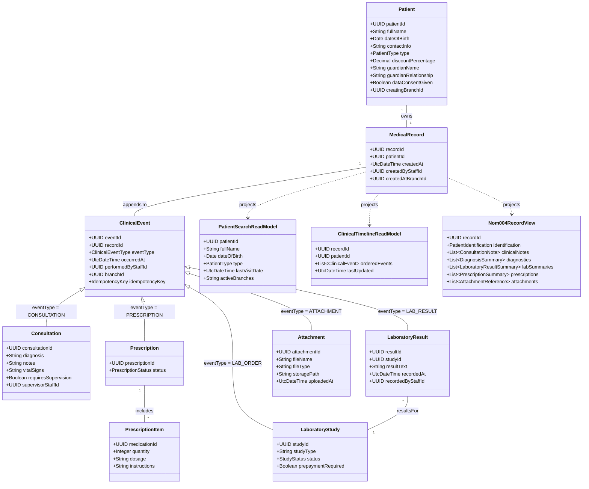

#### Clinical Care Domain — Element Descriptions

| Element | Type | Description | Key Drivers |
|---|---|---|---|
| **Patient** | Aggregate Root | Identity anchor for all clinical data. Globally unique `patientId` as UUID. Guardian fields mandatory for minors under 17. `creatingBranchId` records provenance for audit and sync | CRN-37, US-019, US-020, US-023, PER-03 |
| **MedicalRecord** | Aggregate Root | Append-only container for all clinical events. Once created, no event can be updated or deleted. Retention is permanent per NOM-004-SSA3-2012 | US-026, CRN-02, CRN-01, CRN-31, AUD-03 |
| **ClinicalEvent** | Entity / Event | Base type for every immutable clinical entry. Carries `idempotencyKey` for offline replay and `branchId` for tenant context. Specialized into Consultation, Prescription, LaboratoryStudy, LaboratoryResult, Attachment | US-025, US-026, CRN-02, CRN-43 |
| **Consultation** | Event Specialization | Clinical encounter with diagnosis, notes, vital signs, optional supervisor for R1/R2 residents. Origin context for prescriptions and lab orders | US-025, US-025, USA-02, CRN-16 |
| **Prescription** | Event Specialization | Medication order within consultation context. Prescriber permission validation fully enforced by AuthorizationMiddleware and ResidencyLevelPolicy (Iteration 3) | US-031, US-031, US-033 |
| **PrescriptionItem** | Value Object | Single medication line: medication reference, quantity, dosage, instructions. Immutable once appended | US-031 |
| **LaboratoryStudy** | Event Specialization | Lab test order within consultation. Results stored as separate `LaboratoryResult` event. Text-only per CON-05 | US-038, US-040, CON-05 |
| **LaboratoryResult** | Event Specialization | Text-based result for a previously ordered study. Appended as new event — original order never modified | US-041, US-042, CRN-02 |
| **Attachment** | Event Specialization | File reference appended to medical record. Supports PDFs, images, scanned documents | US-029, US-056, CRN-31 |
| **PatientSearchReadModel** | Projection | Denormalized, indexed projection for fast patient lookup. Sub-1s over 50,000+ records | PER-03, US-027 |
| **ClinicalTimelineReadModel** | Projection | Chronologically ordered projection of all clinical events per patient | US-027, US-025 |
| **Nom004RecordView** | Projection | Structured projection with NOM-004-SSA3-2012 mandatory sections. Enables automated completeness validation | CRN-31, AUD-03 |

---

## 10. Design Decisions

| Driver | Decision | Rationale | Discarded Alternatives |
|---|---|---|---|
| **US-026, CRN-02, AUD-03** | Adopt an append-only clinical event stream (`ClinicalEvent`) as the authoritative write model for medical records. No updates or deletes are permitted on clinical events | Enforces immutability at the deepest layer; satisfies NOM-004 permanent retention (CRN-01) and 100% modification blocking (AUD-03); aligns with offline-aware conventions (CRN-43) | Update-in-place CRUD — weaker guarantee, bypassed by direct DB access; Soft-delete — still allows logical mutation |
| **PER-03, US-027** | Introduce CQRS with dedicated read models (`PatientSearchReadModel`, `ClinicalTimelineReadModel`, `Nom004RecordView`, `PendingLabStudiesReadModel`) backed by indexed views | Sub-1s patient search over 50,000+ records without compromising append-only integrity; read models evolve independently | Single unified model — trade-off between write simplicity and read performance; Full event sourcing with runtime projection — higher complexity |
| **CRN-31** | Represent NOM-004 sections as structured projection (`Nom004RecordView`) generated from clinical events | First-class regulatory compliance; automated completeness validation; regenerable without altering events | Free-form text — impossible to automate verification; Hard-coded screen layouts — brittle, not auditable |
| **CRN-37** | Global `PatientId` (UUID) enforced by `PatientAggregate` with cross-branch uniqueness validation | Exactly one record per patient across all branches; compatible with offline ID generation | Auto-increment per branch — collisions on sync; Composite natural keys — brittle; Centralized sequence server — incompatible with offline |
| **CRN-01** | Permanent retention for all clinical events; no deletion or archival; retention policy encoded in `MedicalRecord` aggregate | Satisfies NOM-004 permanent retention; combined with append-only store prevents data loss | Time-based archival — violates NOM-004; Soft-delete — implies eventual deletion |
| **USA-02** | Guided `ConsultationWizard` in PWA with four steps: vitals/diagnosis, prescriptions, lab orders, review | Reduces cognitive load for residents; enforces structured NOM-004-aligned data capture; mirrors domain aggregates | Unstructured forms — higher error rate; Single long form — overwhelming |
| **US-024, US-025, US-031, US-038** | DDD aggregates with clear transactional boundaries; prescriptions and lab orders created within consultation context as atomic event bundles | Enforces clinical invariants at domain level; prevents partial consultation data; enables independent module testing | Anemic domain model — scattered rules; Entity-per-table — weak invariant enforcement |
| **AUD-03, CRN-17** | Wire clinical writes to emit audit events to Audit & Compliance via `ClinicalEventStore` before full audit infra (Iteration 3) | No auditability gap from day one; no retrofit needed when Iteration 3 completes audit design | Defer to Iteration 3 — unaudited gap for early clinical transactions |
| **PER-03** | Composite B-tree indexes + `pg_trgm` trigram indexes on `PatientSearchReadModel`; partial indexes per branch | Sub-1s search over 50,000+ records; trigram indexes support partial name matching; partial indexes improve multi-tenant cache hits | No indexes — unacceptable performance; Elasticsearch — disproportionate overhead; `tsvector` — overkill for name search |

---

## 11. Implementation Constraints

This section captures critical implementation constraints that must be observed during Iteration 2 development. These originate from the architectural risk analysis and are binding for the development team.

### IC-02: Hybrid JSONB Schema for Clinical Event Persistence

| Attribute | Value |
|---|---|
| **Risk** | Implementing the `ClinicalEventStore` using multiple heavily normalized relational tables will degrade read performance (requiring massive JOINs to reconstruct a patient record) and create severe bottlenecks for offline synchronization in Iteration 6 |
| **Drivers** | CRN-02, CRN-43, PER-03, US-026, AUD-03 |
| **Constraint** | The `ClinicalEventStore` must be persisted using a **single `clinical_events` table** with a hybrid design in PostgreSQL: fixed relational columns for metadata used in filtering, ordering, and concurrency control, plus a structured `JSONB` column for the dynamic event payload |
| **Impact on future iterations** | Iteration 6 (Offline-First) depends on fast bulk data downloads for synchronization. A normalized multi-table design would require complex JOIN operations that throttle sync throughput. The single-table JSONB approach enables streaming serialization of events to clients |

#### Required fixed columns (aligned with ClinicalEvent domain model)

| Column | Type | Source | Purpose |
|---|---|---|---|
| `event_id` | `UUID` PRIMARY KEY | `ClinicalEvent.eventId` | Unique event identifier, generated client-side for offline compatibility |
| `record_id` | `UUID` FOREIGN KEY | `ClinicalEvent.recordId` | Links event to the patient's MedicalRecord aggregate |
| `event_type` | `VARCHAR` NOT NULL | `ClinicalEvent.eventType` | Discriminator: `RECORD_CREATED`, `CONSULTATION`, `PRESCRIPTION`, `LAB_ORDER`, `LAB_RESULT`, `ATTACHMENT` |
| `occurred_at` | `TIMESTAMPTZ` NOT NULL | `ClinicalEvent.occurredAt` | UTC timestamp per CRN-41 convention |
| `branch_id` | `UUID` NOT NULL | `ClinicalEvent.branchId` | Tenant discriminator for RLS and sync scoping |
| `performed_by_staff_id` | `UUID` NOT NULL | `ClinicalEvent.performedByStaffId` | Audit trail: who performed the clinical action |
| `idempotency_key` | `UUID` UNIQUE NOT NULL | `ClinicalEvent.idempotencyKey` | Prevents duplicate event insertion during offline replay (CRN-43 rule 2) |
| `payload` | `JSONB` NOT NULL | Dynamic event content | Contains event-specific data: diagnosis, vitals, prescription items, lab results, etc. |

#### Required indexes

| Index | Type | Purpose | Driver |
|---|---|---|---|
| `ix_clinical_events_record_id_occurred_at` | B-tree on `record_id, occurred_at` | Fast chronological timeline reconstruction per patient | PER-03, US-027 |
| `ix_clinical_events_branch_id_event_type` | B-tree on `branch_id, event_type` | Tenant-scoped queries by event type (e.g., pending lab studies) | US-040, SEC-02 |
| `ix_clinical_events_idempotency_key` | Unique on `idempotency_key` | Idempotent write enforcement | CRN-43 |
| `ix_clinical_events_payload_gin` | GIN on `payload` | Advanced queries on JSONB attributes for read model projections | PER-03 |

#### Consequences

- **Positive:** Atomic append-only inserts at high throughput. GIN and `pg_trgm` indexes on JSONB attributes feed the CQRS read models efficiently. Simplified serialization for offline sync clients
- **Negative:** Complex analytical queries against the raw event store are impractical at scale — all query optimization is delegated to the dedicated read models (PatientSearchReadModel, ClinicalTimelineReadModel, Nom004RecordView, PendingLabStudiesReadModel). The JSONB payload has no database-level schema validation; payload structure must be enforced in the application layer via the domain aggregates
- **Alternatives considered:** (1) Fully normalized relational tables per event type — rejected: excessive JOINs, poor sync performance; (2) Pure document store (MongoDB) — rejected: loses transactional guarantees with relational data, adds operational complexity; (3) Separate event store product (EventStoreDB) — rejected: disproportionate infrastructure for current scale |
