# Iteration 3 — Security, Access Control, and Audit Infrastructure

## 1. Introduction

This document captures the architectural specification for SICEB Iteration 3, which implements the security architecture: authentication, role-based access control with branch-scoped and residency-level permissions, API protection, personal data handling (LFPDPPP), and the centralized immutable audit trail.

Security is cross-cutting and must be layered on top of the structural foundation (Iteration 1) and the clinical data model (Iteration 2) before more modules are built. The audit trail is required by virtually every subsequent feature (pharmacy traceability, supply approval logs, regulatory reports). Residency-level restrictions (R1–R4) are critical for controlled substance enforcement in Iteration 5. Iteration 2 left prescriber-level restrictions structurally supported but not fully enforced — this iteration completes that enforcement.

**Business objective:** Gestión de Personal — Control over physicians, residents, and staff with role-appropriate access.

**Drivers addressed:** US-003, US-001, US-002, US-050, US-051, US-066, SEC-01, SEC-02, SEC-04, MNT-03, CRN-15, CRN-13, CRN-17, CRN-18, CRN-32.

---

## 2. Context Diagram

The following context diagram shows SICEB as a single system interacting with its external actors. Medical and administrative teams at each branch access the system through a Progressive Web App over HTTPS and Secure WebSocket. External systems — academic institutions and future insurance integrations — communicate via a REST API.

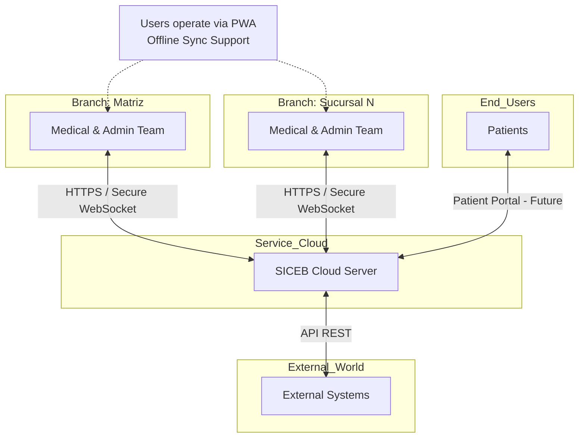

---

## 3. Architectural Drivers

### Primary User Story

| Driver | Type | Description | Why this iteration |
|---|---|---|---|
| **US-003** | Primary US (rank 4) | Role-based permissions — foundational to every user-facing module; supports SEC-02 | Rank 4 primary user story; every module built in Iterations 4–7 depends on RBAC being in place |

### Supporting User Stories

| Driver | Type | Description | Why this iteration |
|---|---|---|---|
| **US-001** | US (HIGH) | Create user accounts with role-based permissions | Foundational — users must exist before any access control is meaningful |
| **US-002** | US (HIGH) | Secure login with credentials | Authentication is the entry point for all system interactions |
| **US-050** | US (HIGH) | Validate residents can only perform actions allowed for their level (R1–R4) | Residency-level enforcement is required before pharmacy (Iteration 5) adds controlled substance dispensation |
| **US-051** | US (HIGH) | Block R1, R2, R3 residents from prescribing controlled medications | Critical regulatory constraint; Iteration 2 left this structurally supported but unenforced |
| **US-066** | US (HIGH) | Register audit log entries for record access (LFPDPPP traceability) | Legal compliance; audit infrastructure must exist before more modules generate auditable events |

### Quality Attribute Scenarios

| Driver | Type | Description | Why this iteration |
|---|---|---|---|
| **SEC-01** | QA Scenario | Role-based access control — 100% of restricted actions blocked and logged | Defines the measurable security guarantee for RBAC |
| **SEC-02** | QA Scenario (High/High) | Branch-level data segmentation — zero unauthorized cross-branch access | One of the 6 high/high scenarios; depends on RBAC + branch context + tenant isolation |
| **SEC-04** | QA Scenario | REST API protection — 100% of unauthenticated requests rejected | Hardens the API before it is exposed to more consumers |
| **MNT-03** | QA Scenario | Admin-configurable roles — new roles operational in <30 min, zero code changes | Requires the role/permission model to be data-driven |

### Architectural Concerns

| Driver | Type | Description | Why this iteration |
|---|---|---|---|
| **CRN-15** | Concern | RBAC for 11 roles with branch-scoped permissions | Core security concern — defines the entire permission model |
| **CRN-13** | Concern | API hardening: HTTPS enforcement, error sanitization | Must be done before the API surface grows |
| **CRN-17** | Concern | Centralized audit log consumed by Iterations 4–7; must exist first | Pharmacy, supply chain, and offline compensation all depend on audit infrastructure |
| **CRN-18** | Concern | Audit log immutability — tamper-proof even for DBAs | Regulatory requirement; must be architecturally enforced |
| **CRN-32** | Concern | LFPDPPP personal data protection (consent, access rights) | Patient data is already stored from Iteration 2; legal compliance must be layered on now |

---

## 4. Container Diagram

The following C4 container diagram decomposes SICEB into its four deployable containers. In this iteration, the security middleware pipeline is applied to every request flowing from the PWA Client to the API Server, and PostgreSQL Row-Level Security provides defense-in-depth tenant isolation at the database level.

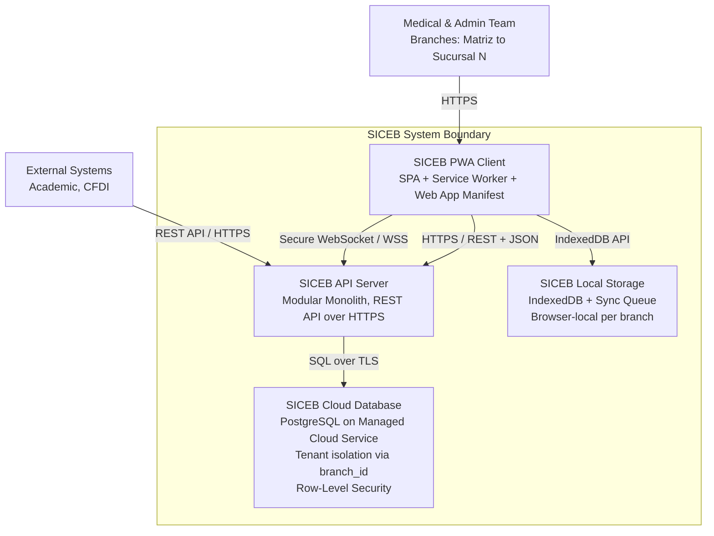

### Container Responsibilities

| Container | Technology | Responsibilities |
|---|---|---|
| **SICEB PWA Client** | SPA Framework + PWA APIs + IndexedDB | Renders the user interface for all 11 roles; manages application state; stores JWT in memory (not localStorage); intercepts requests via Service Worker; provides role-aware UI rendering |
| **SICEB API Server** | Cloud PaaS, Modular Monolith | Exposes REST API over HTTPS; applies six-filter security middleware pipeline; enforces three-dimensional RBAC; orchestrates business logic; publishes real-time events via Secure WebSocket |
| **SICEB Cloud Database** | PostgreSQL, Managed Cloud Service | Stores all persistent data with tenant isolation via `branch_id`; enforces Row-Level Security at DB level; stores security schema (users, roles, permissions); stores hash-chained audit log with INSERT-only privileges |
| **SICEB Local Storage** | IndexedDB, Browser Storage | Caches branch-scoped data for offline operation; maintains sync queue; validates cache integrity; enforces cache isolation per `branch_id` |

---

## 5. Component Diagrams

### 5.1 — API Server Components

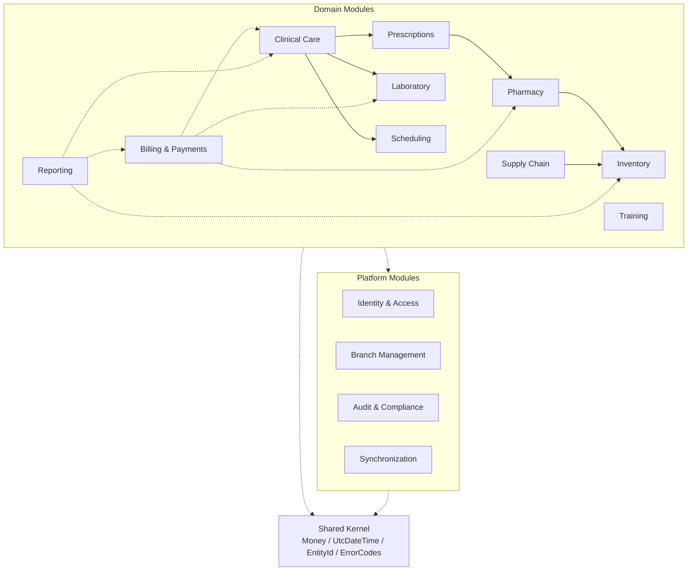

### 5.2 — Identity & Access Module Internals (Iteration 3)

This component diagram decomposes the **Identity & Access** platform module. The `AuthenticationService` handles credential validation and JWT lifecycle. The `AuthorizationMiddleware` evaluates three-dimensional permission checks on every request. The `ResidencyLevelPolicy` encodes hierarchical R1–R4 action restrictions.

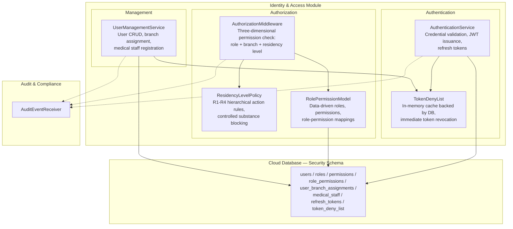

#### Identity & Access Module — Internal Component Responsibilities

| Component | Responsibilities | Key Drivers |
|---|---|---|
| **AuthenticationService** | Validates credentials against bcrypt hashes. Issues JWT access token (15-min TTL) with claims: userId, role, residencyLevel, branchAssignments, activeBranchId, permissions, consentScopes. Issues refresh token (7-day TTL, server-side, revocable). Checks TokenDenyList. Emits audit events for login success/failure/refresh | US-002, SEC-04, CRN-43 |
| **TokenDenyList** | In-memory cache backed by DB table. Stores JTI of revoked tokens. Populated on user deactivation, explicit revocation, or suspicious activity. Auto-purges after original TTL | US-001, SEC-04 |
| **AuthorizationMiddleware** | Intercepts every request. Evaluates three dimensions: (1) role permission, (2) branch assignment, (3) residency level via ResidencyLevelPolicy. Rejects with 403 + audit event on failure | SEC-01, SEC-02, CRN-15, US-003 |
| **ResidencyLevelPolicy** | Encodes R1–R4 hierarchical rules from DB, cached in memory. R1/R2/R3 blocked from `controlled_med:prescribe`; R1/R2 require mandatory supervision. Evaluated for permissions with `requiresResidencyCheck` | US-050, US-051, SEC-01 |
| **RolePermissionModel** | Data-driven storage of roles, permissions, and mappings. 11 system roles seeded and protected. Admin can create new roles. Validates regulatory constraints | MNT-03, US-003, CRN-15 |
| **UserManagementService** | User CRUD with role/branch assignment. Deactivation triggers TokenDenyList revocation. Medical staff: residencyLevel, supervisorStaffId (mandatory R1/R2) | US-001, CRN-15 |

### 5.3 — Audit & Compliance Module Internals (Iteration 3)

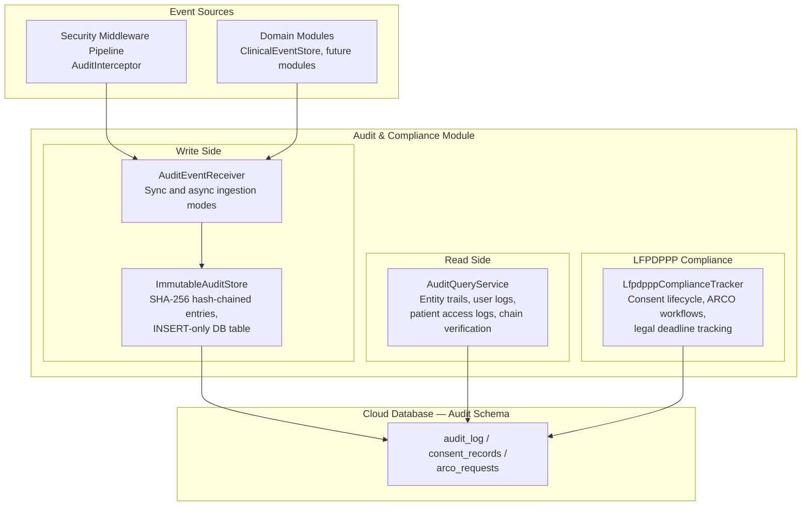

#### Audit & Compliance Module — Internal Component Responsibilities

| Component | Side | Responsibilities | Key Drivers |
|---|---|---|---|
| **AuditEventReceiver** | Write | Ingests events from security middleware and domain modules. Each event enriched with `previous_hash`, hashed (SHA-256), forwarded to ImmutableAuditStore. Synchronous for security-critical events, asynchronous for high-volume access logs | CRN-17, US-066 |
| **ImmutableAuditStore** | Write | Append-only persistence. Each entry includes `entry_hash` (SHA-256 of `previous_hash` + payload). Application DB role has INSERT-only privileges — UPDATE, DELETE, TRUNCATE revoked. Periodic integrity verification job | CRN-17, CRN-18, AUD-03 |
| **AuditQueryService** | Read | Four operations: GetAuditTrailForEntity, GetAuditTrailForUser, GetAccessLogForPatient, VerifyChainIntegrity. Paginated. Branch-scoped except Director General | CRN-17, US-066, CRN-32 |
| **LfpdpppComplianceTracker** | Compliance | Consent lifecycle via `consent_records`. ARCO workflows via `arco_requests` with legal deadlines (20 business days). Rectification via corrective addendum events on immutable records | CRN-32, US-062, US-063, US-066 |

### 5.4 — Security Middleware Pipeline (Iteration 3)

This diagram shows the ordered filter chain applied to every API request. Each filter has a single responsibility and can short-circuit the chain.

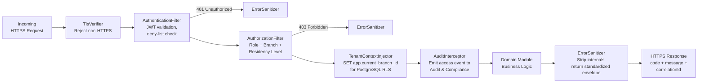

#### Security Middleware Pipeline — Filter Responsibilities

| Filter | Order | Responsibilities | Short-Circuit | Key Drivers |
|---|---|---|---|---|
| **TlsVerifier** | 1 | Defense-in-depth verification that request arrived over HTTPS. Safeguard behind cloud load balancer's TLS termination | 421 Misdirected Request | CON-02, CRN-13 |
| **AuthenticationFilter** | 2 | Validates JWT signature, expiry, issuer. Checks JTI against TokenDenyList. Extracts full user context from JWT claims | 401 Unauthorized | SEC-04, US-002 |
| **AuthorizationFilter** | 3 | Reads required permission from route metadata. Evaluates three dimensions: role permission, branch assignment, residency level. Emits audit event for every denial | 403 Forbidden | SEC-01, SEC-02, CRN-15, US-050, US-051 |
| **TenantContextInjector** | 4 | Sets PostgreSQL session variable `app.current_branch_id` activating RLS policies. For cross-branch reporting: bypass flag via `admin_reporting` role | None — always passes | SEC-02 |
| **AuditInterceptor** | 5 | Captures access audit event for every authenticated request. Records userId, action, targetEntity, targetId, branchId, timestamp, ipAddress. Synchronous for security-sensitive, async for standard | None — always passes | US-066, CRN-17 |
| **ErrorSanitizer** | 6 | Strips stack traces, internal entity names, DB details. Returns `{ code, message, correlationId }`. Validation errors passed through with user-facing messages | N/A — wraps response | CRN-13, SEC-04 |

### 5.5 — PWA Client Components

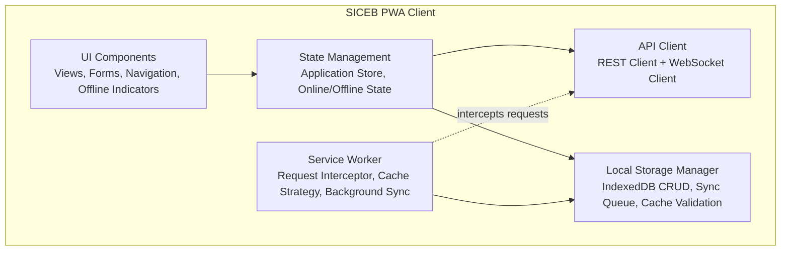

### 5.6 — PWA Security and Admin Components (Iteration 3)

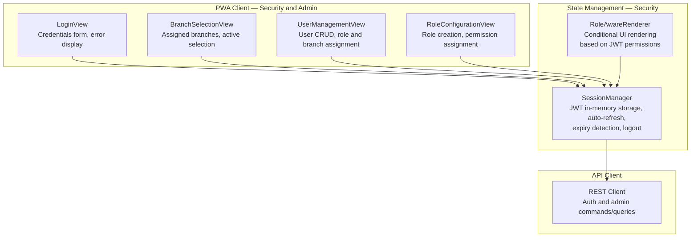

#### PWA Security and Admin — Component Responsibilities

| Component | Responsibilities | Key Drivers |
|---|---|---|
| **LoginView** | Renders login form. Displays authentication errors without revealing which field is incorrect. On success, stores JWT via SessionManager and navigates to BranchSelectionView | US-002, SEC-04 |
| **BranchSelectionView** | Displays branches from JWT `branchAssignments` claim. Triggers `POST /session/branch`. For single-branch users, auto-selects and skips | US-003, SEC-02 |
| **SessionManager** | Stores JWT in memory (not localStorage) — XSS mitigation. Monitors TTL and auto-refreshes. Detects expired/revoked tokens. Exposes user context to all components. Handles logout | US-002, SEC-04, CRN-43 |
| **RoleAwareRenderer** | Wraps UI elements and conditionally renders based on `permissions[]` from JWT. Elements without permission not rendered (not merely hidden). All checks mirrored server-side | US-003, SEC-01, CRN-15 |
| **UserManagementView** | Admin interface for user CRUD, role assignment, branch assignment, medical staff attributes. Only rendered for `user:manage` permission | US-001, CRN-15 |
| **RoleConfigurationView** | Admin interface for role creation and permission assignment. Validates regulatory constraints. Enables MNT-03: new roles in <30 min, zero code changes | MNT-03, US-003, CRN-15 |

---

## 6. Sequence Diagrams

### SD-01: Authenticated API Request Flow (Updated — Iteration 3)

This sequence diagram illustrates the standard lifecycle of any authenticated request, now showing the concrete six-filter security middleware pipeline.

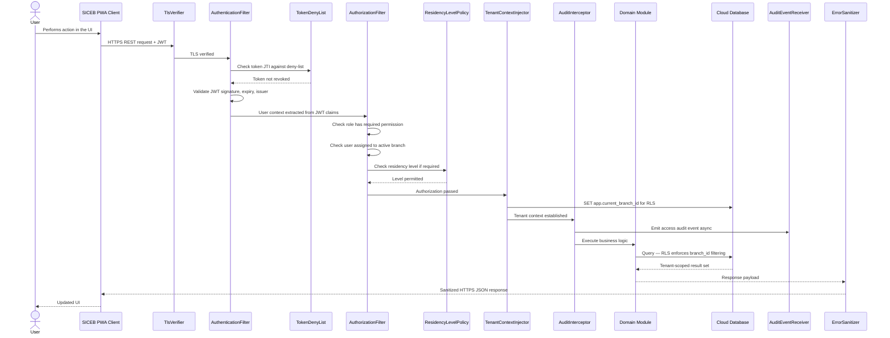

### SD-02: Branch Context Selection and Tenant Isolation (Updated — Iteration 3)

This sequence diagram shows authentication, branch selection, and tenant context establishment with JWT claim embedding, refresh token issuance, deny-list verification, and PostgreSQL RLS activation.

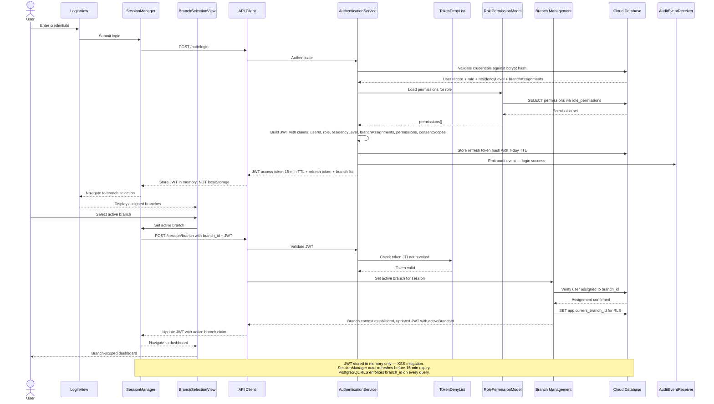

### SD-07: Controlled Medication Prescription Blocked by Residency Policy

This sequence diagram shows the security enforcement when an R2 resident attempts to prescribe a controlled medication. The `AuthorizationFilter` delegates to `ResidencyLevelPolicy` and blocks the action.

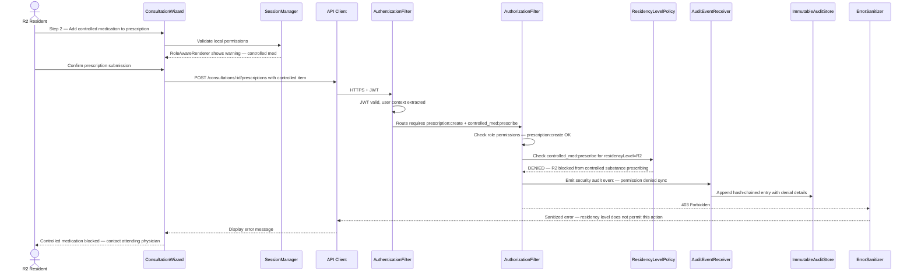

### SD-08: Admin Creates New Role

This sequence diagram shows an Administrator creating a new role through the `RoleConfigurationView`, demonstrating MNT-03 — new roles operational in under 30 minutes with zero code changes.

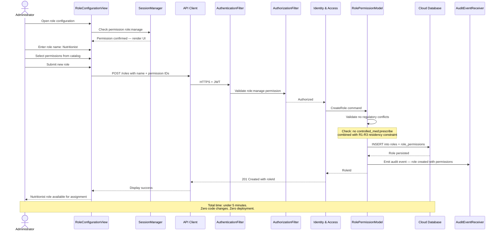

### SD-09: Patient Record Access with LFPDPPP Audit Logging

This sequence diagram shows a physician accessing a patient's clinical timeline, with the `AuditInterceptor` capturing the access event and routing it through the hash-chained `ImmutableAuditStore` for LFPDPPP compliance.

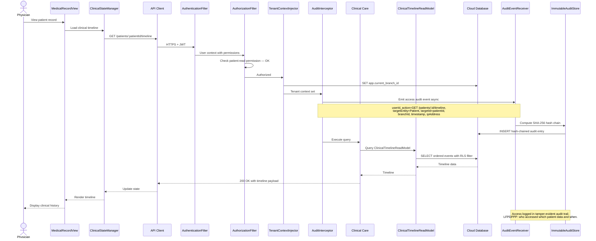

---

## 7. Deployment Diagram

The following deployment diagram shows the physical infrastructure layout for SICEB's cloud-native SaaS deployment. The security middleware pipeline runs within the API Server on cloud PaaS. PostgreSQL Row-Level Security provides defense-in-depth at the database level. The hash-chained audit log is stored with INSERT-only DB privileges.

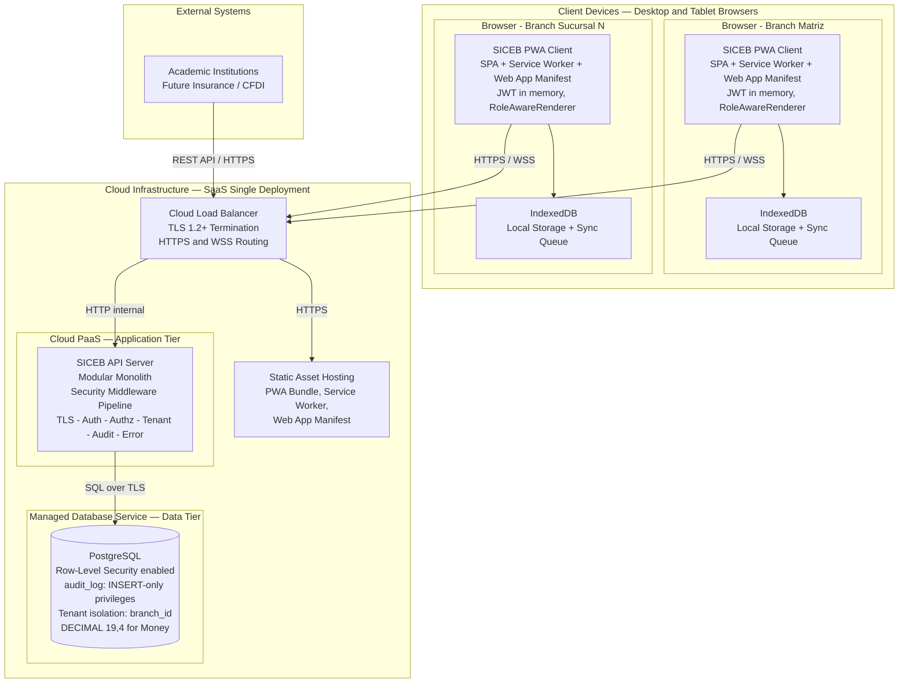

### Deployment Node Responsibilities

| Node | Technology | Responsibilities |
|---|---|---|
| **Cloud Load Balancer** | Cloud-managed LB | TLS 1.2+ termination; HTTPS and WSS routing; SSL certificate management; health checks |
| **SICEB API Server** | Cloud PaaS instance | Hosts modular monolith with six-filter security middleware; processes all REST and WebSocket requests; enforces RBAC and audit |
| **PostgreSQL Database** | Managed cloud DB service | Persistent storage; Row-Level Security enforcement; INSERT-only audit_log privileges; automated backups; high availability |
| **Static Asset Hosting** | Cloud storage / CDN | Serves PWA bundle, Service Worker, Web App Manifest; versioned cache headers |
| **Client Browser** | Chrome, Edge, Safari, Firefox | Runs PWA with JWT in memory; Service Worker for offline caching; IndexedDB for local persistence |

---

## 8. Interfaces and Events

### 8.1 — Identity & Access Command Interfaces

All commands emit audit events to the `ImmutableAuditStore`. User management requires `user:manage` permission; role management requires `role:manage` permission.

| Command | HTTP Verb / Endpoint | Input Invariants | Key Drivers |
|---|---|---|---|
| **Login** | `POST /auth/login` | `email` and `password` required; returns JWT (15-min TTL) with embedded claims + refresh token (7-day TTL) + branch list. Audit event for success and failure | US-002, SEC-04 |
| **RefreshToken** | `POST /auth/refresh` | Valid refresh token; checks TokenDenyList; returns new JWT with updated claims | US-002, SEC-04 |
| **Logout** | `POST /auth/logout` | Valid JWT; revokes refresh token; adds access token JTI to TokenDenyList | US-002 |
| **CreateUser** | `POST /users` | `fullName`, `email`, `roleId`, `branchAssignments[]` required; `email` unique; medical staff: `specialty`, `residencyLevel`, `supervisorStaffId` (mandatory R1/R2) | US-001, CRN-15 |
| **UpdateUser** | `PUT /users/:userId` | Supports role change, branch assignment update, medical staff changes. Role change triggers JWT invalidation via TokenDenyList | US-001, CRN-15 |
| **DeactivateUser** | `POST /users/:userId/deactivate` | Sets `isActive = false`; adds all active tokens to TokenDenyList; emits security audit event | US-001, SEC-04 |
| **CreateRole** | `POST /roles` | `name` and `permissionIds[]` required; validates regulatory conflicts; `is_system_role = false` for custom roles | MNT-03, US-003, CRN-15 |
| **UpdateRolePermissions** | `PUT /roles/:roleId/permissions` | `permissionIds[]` required; system roles protected; re-validates constraints; triggers JWT invalidation for affected users | MNT-03, CRN-15 |

### 8.2 — Identity & Access Query Interfaces

| Query | HTTP Verb / Endpoint | Parameters | Key Drivers |
|---|---|---|---|
| **ListUsers** | `GET /users` | Optional: `roleId`, `branchId`, `isActive`; paginated; branch-scoped for non-admin | US-001, CRN-15 |
| **GetUser** | `GET /users/:userId` | Returns user profile with role, branches, medical staff details | US-001 |
| **ListRoles** | `GET /roles` | All roles with permission sets; includes `is_system_role` flag | MNT-03, US-003 |
| **ListPermissions** | `GET /permissions` | System permission catalog grouped by category; includes `requiresResidencyCheck` | MNT-03, CRN-15 |

### 8.3 — Audit & Compliance Query Interfaces

All queries branch-scoped except Director General. Results paginated.

| Query | HTTP Verb / Endpoint | Parameters | Key Drivers |
|---|---|---|---|
| **GetAuditTrailForEntity** | `GET /audit/entity/:entityType/:entityId` | `entityType`, `entityId`, optional `dateRange` | CRN-17 |
| **GetAuditTrailForUser** | `GET /audit/user/:userId` | `userId`, optional `dateRange` | CRN-17, US-066 |
| **GetAccessLogForPatient** | `GET /audit/patient/:patientId/access` | `patientId`, optional `dateRange` — LFPDPPP compliance | CRN-32, US-066 |
| **VerifyChainIntegrity** | `GET /audit/verify` | `fromEntryId`, `toEntryId`; walks SHA-256 hash chain | CRN-18 |

### 8.4 — Events Produced

| Event Type | Source | Description | Storage |
|---|---|---|---|
| Login Success / Failure | AuthenticationService | Credential validation outcome with IP, timestamp | ImmutableAuditStore (sync) |
| Permission Denied | AuthorizationFilter | Blocked action with user, permission, dimension that failed | ImmutableAuditStore (sync) |
| Access Event | AuditInterceptor | Every authenticated API request: who, what, when, where | ImmutableAuditStore (async) |
| User Lifecycle | UserManagementService | Create, update, deactivate with details | ImmutableAuditStore (sync) |
| Role Change | RolePermissionModel | Role creation, permission update | ImmutableAuditStore (sync) |
| Controlled Substance Denial | ResidencyLevelPolicy via AuthorizationFilter | R1/R2/R3 blocked from controlled_med:prescribe | ImmutableAuditStore (sync) |

### 8.5 — Interface-to-Driver Traceability

| Interface | Drivers Addressed |
|---|---|
| Login | US-002, SEC-04, CRN-17 |
| RefreshToken | US-002, SEC-04 |
| Logout | US-002 |
| CreateUser | US-001, CRN-15 |
| UpdateUser | US-001, CRN-15 |
| DeactivateUser | US-001, SEC-04, CRN-17 |
| CreateRole | MNT-03, US-003, CRN-15 |
| UpdateRolePermissions | MNT-03, CRN-15 |
| GetAuditTrailForEntity | CRN-17 |
| GetAuditTrailForUser | CRN-17, US-066 |
| GetAccessLogForPatient | CRN-32, US-066 |
| VerifyChainIntegrity | CRN-18 |

---

## 9. Domain Model

### Security and Audit Domain Entities (Iteration 3)

This iteration introduces the security and compliance entities that support RBAC, audit, and LFPDPPP. These entities complement the clinical domain model from Iteration 2.

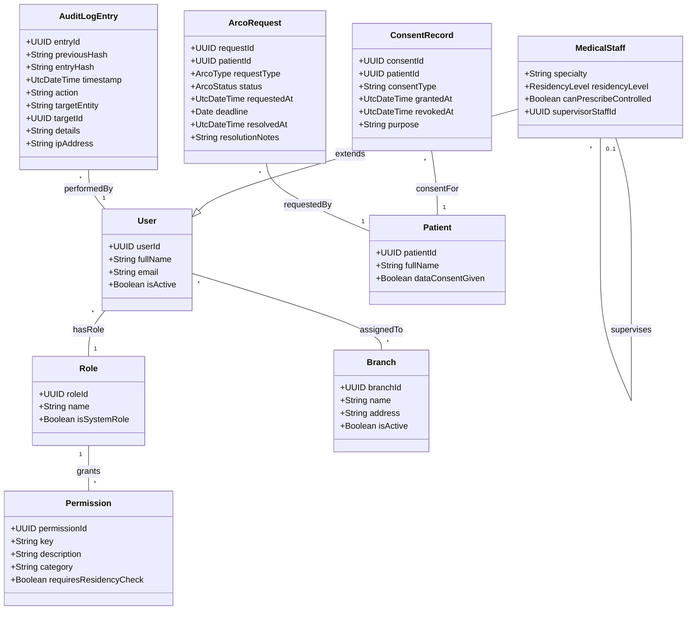

#### Security Domain — Element Descriptions

| Element | Type | Description | Key Drivers |
|---|---|---|---|
| **User** | Entity | Authenticated person in the system. Assigned to branches, granted permissions through a configurable role | US-001, US-002, CRN-15 |
| **Role** | Entity | Configurable permission set. New roles created by administrators without code changes. `isSystemRole` protects the 11 seeded roles | US-003, MNT-03, CRN-15 |
| **Permission** | Entity | Granular authorization unit with stable string key. `requiresResidencyCheck` triggers ResidencyLevelPolicy delegation | US-003, US-050, SEC-01, MNT-03 |
| **MedicalStaff** | Entity | User specialization for clinical personnel. Carries residencyLevel and controlled substance authorization. R1/R2 require mandatory supervisor | US-049, US-050, US-051, SEC-01 |
| **ConsentRecord** | Entity | Tracks patient data consent lifecycle under LFPDPPP. Consent status embedded in JWT for offline verification | CRN-32, US-066 |
| **ArcoRequest** | Entity | Formal ARCO rights request under LFPDPPP. Legal deadline tracking (20 business days). Rectification via corrective addendum on immutable records | CRN-32, US-062, US-063 |
| **AuditLogEntry** | Entity | Immutable, hash-chained audit record. SHA-256 hash of previous entry + payload. INSERT-only DB privileges. Tamper-evident chain | CRN-17, CRN-18, AUD-03 |

---

## 10. Design Decisions

| Driver | Decision | Rationale | Discarded Alternatives |
|---|---|---|---|
| **CRN-15, US-003** | Three-dimensional RBAC: role permissions + branch scoping + residency-level restrictions. 11 initial roles seeded; custom roles via admin UI | Captures all access control requirements in a single coherent model; branch scoping enforces SEC-02; residency dimension is explicit and centrally maintained | ABAC — higher complexity, unjustified; ACL per resource — impractical at 50,000+ records |
| **US-002, SEC-04** | Stateless JWT with embedded claims (15-min TTL) + refresh tokens (7-day TTL) + TokenDenyList for immediate revocation | Embedded claims enable offline authorization (CRN-43 rule 3); short TTL limits exposure; deny-list closes revocation gap | Server-side sessions — incompatible with offline; OAuth2 with external IdP — external dependency, no offline introspection |
| **SEC-01, SEC-04, CRN-13, US-066** | Six-filter security middleware pipeline: TlsVerifier → AuthenticationFilter → AuthorizationFilter → TenantContextInjector → AuditInterceptor → ErrorSanitizer | Single enforcement point; ordering guarantees unauthenticated requests rejected first; all access audited; no internal details leak | Per-endpoint annotations — scattered; Dedicated API gateway — excessive for monolith |
| **SEC-02** | PostgreSQL RLS as defense-in-depth below application-level filtering. `admin_reporting` role with BYPASSRLS for cross-branch reports | Two-layer enforcement for High/High scenario; RLS prevents data leakage even with application bugs | Application-level WHERE only — single layer, insufficient for SEC-02 |
| **CRN-17, CRN-18, AUD-03** | SHA-256 hash-chained append-only audit log. INSERT-only DB privileges. Periodic integrity verification job | Tamper-evidence detectable by any verifier; DB-level restriction satisfies CRN-18; active detection via verification job | Simple append-only without chaining — DBA tampering undetectable; Blockchain — extreme overhead |
| **MNT-03** | Data-driven role/permission model in DB tables. Admin UI for role creation and permission assignment. Regulatory conflict validation | <30 min for new roles, zero code changes; decoupled from releases; auditable | Hard-coded roles — violates MNT-03; Config-file roles — requires deployment |
| **US-050, US-051, SEC-01** | `ResidencyLevelPolicy` as first-class component with hierarchical R1–R4 rules. R1/R2/R3 blocked from controlled substance prescribing. Rules in DB, cached, evaluated by middleware | Explicit, centrally maintained; testable in isolation; travels in JWT for offline | Generic RBAC per action per level — permission explosion; Hard-coded checks — scattered |
| **CRN-32** | LFPDPPP compliance as cross-cutting concern: consent lifecycle, ARCO workflows with legal deadlines, corrective addendum for Rectification on immutable records | Architecturally explicit; enforceable at middleware; reconciles LFPDPPP with NOM-004 immutability | Consent as UI checkbox — no enforcement; Post-hoc retrofit — expensive |
| **CRN-13, SEC-04** | Error sanitization as terminal middleware filter returning `{ code, message, correlationId }` | Prevents leakage in all error paths; standardized format; correlation ID for debugging | Verbose errors — information leakage; Per-handler formatting — inconsistent |

---

## 11. Implementation Constraints

This section captures critical implementation constraints that must be observed during Iteration 3 development. These originate from the architectural risk analysis and are binding for the development team.

### IC-03: Transactional Serialization of the Audit Hash Chain

| Attribute | Value |
|---|---|
| **Risk** | The `ImmutableAuditStore` relies on SHA-256 hash chaining where each entry's `entry_hash` depends on the `previous_hash` of the preceding entry. Concurrent asynchronous insertions from multiple modules within the modular monolith will cause chain bifurcations — silently corrupting the integrity verification (`VerifyChainIntegrity`) without detection until a formal audit |
| **Drivers** | CRN-17, CRN-18, AUD-03, US-066 |
| **Impact on future iterations** | Iteration 5 (Pharmacy with COFEPRIS reporting and LFPDPPP traceability) depends on a verifiable, unbroken audit chain. A corrupted chain discovered at that stage would require rebuilding the entire audit history |
| **Constraint** | The hash chain computation must be **atomically serialized within PostgreSQL** using a `TRIGGER` or stored function on the `audit_log` table. The function must acquire an exclusive transactional lock on the last row before computing the new hash. The application layer (`AuditEventReceiver`) must **not** compute `previous_hash` — this responsibility belongs exclusively to the database engine |

#### Required PostgreSQL implementation

```sql
CREATE OR REPLACE FUNCTION audit_hash_chain()
RETURNS TRIGGER AS $$
DECLARE
    v_previous_hash TEXT;
BEGIN
    SELECT entry_hash INTO v_previous_hash
    FROM audit_log
    ORDER BY entry_id DESC
    LIMIT 1
    FOR UPDATE;

    NEW.previous_hash := COALESCE(v_previous_hash, 'GENESIS');
    NEW.entry_hash := encode(
        sha256(
            convert_to(NEW.previous_hash || '|' || NEW.payload::text, 'UTF8')
        ),
        'hex'
    );
    RETURN NEW;
END;
$$ LANGUAGE plpgsql;

CREATE TRIGGER trg_audit_hash_chain
    BEFORE INSERT ON audit_log
    FOR EACH ROW
    EXECUTE FUNCTION audit_hash_chain();
```

#### Throughput assessment

The `FOR UPDATE` lock serializes access to the last inserted row only — not the entire table. Given SICEB's expected volume (tens of insertions per minute across all modules, not thousands per second), this serialization does not constitute a performance bottleneck. The `AuditEventReceiver` already separates synchronous (security-critical) from asynchronous (access logs) ingestion modes, which naturally distributes insertion load.

If volume increases significantly in the future, the chain can be **partitioned by `branch_id`** — each branch maintains its own independent hash chain, enabling parallel inserts across branches while preserving per-branch integrity verification.

#### Consequences

- **Positive:** Guarantees perfect sequential immutability regardless of application-level concurrency. The database engine is the single source of truth for chain integrity. Eliminates an entire class of race-condition bugs from the application layer
- **Negative:** All audit insertions are serialized through a single lock point per chain. Acceptable at current scale; partitioning strategy documented above if scale changes
- **Alternatives considered:** (1) Application-level locking with distributed mutex — rejected: fragile, adds external dependency, doesn't protect against direct DB inserts; (2) Eventual consistency with post-hoc chain repair — rejected: defeats the purpose of tamper-evidence; (3) No hash chaining, simple append-only — rejected: DBA tampering would be undetectable (violates CRN-18) |

---

### IC-04: Silent Refresh via HttpOnly Cookie for JWT Persistence

| Attribute | Value |
|---|---|
| **Risk** | The `SessionManager` stores the JWT access token exclusively in JavaScript memory to mitigate XSS attacks. However, any browser refresh (F5), tab close, or temporary browser shutdown destroys this state, forcing immediate session termination. This creates constant logouts for physicians during clinical workflows and will completely break Offline-First functionality in Iteration 6 — if the PWA reloads without network, the access token disappears, the frontend assumes no session exists, and all offline functions are blocked |
| **Drivers** | US-002, SEC-04, CRN-43 |
| **Impact on future iterations** | Critical for Iteration 6 (Offline-First) and Iteration 4 (Branch Context Switch). Without a persistent refresh mechanism, the PWA cannot survive reloads or maintain sessions across connectivity gaps |
| **Constraint** | The authentication system must implement the **Silent Refresh** pattern. The access token (JWT, 15-min TTL) remains in memory only. The refresh token (7-day TTL) must be transported and persisted via a cookie with the following mandatory attributes |

#### Refresh token cookie specification

| Attribute | Value | Rationale |
|---|---|---|
| `HttpOnly` | `true` | Prevents JavaScript access — mitigates XSS token theft |
| `Secure` | `true` | Cookie only sent over HTTPS — aligns with CON-02 |
| `SameSite` | `Strict` | Prevents CSRF by blocking cross-site cookie transmission |
| `Path` | `/auth/refresh` | Restricts cookie transmission to the refresh endpoint only — reduces attack surface by preventing the cookie from being sent with every API request |
| `Max-Age` | `604800` (7 days) | Matches the server-side refresh token TTL |

#### Silent refresh flow

1. The PWA's API Client intercepts any HTTP `401 Unauthorized` response
2. The interceptor sends `POST /auth/refresh` — the browser automatically attaches the HttpOnly cookie
3. The `AuthenticationService` validates the refresh token hash against the database, checks `TokenDenyList`, and issues a new JWT access token with current claims
4. The interceptor stores the new JWT in memory via `SessionManager` and **retries the original failed request**
5. If the refresh also fails (expired, revoked), the user is redirected to `LoginView`

#### Offline initialization behavior

When the PWA loads without network (Service Worker serves cached shell), the `SessionManager` checks for a valid refresh token cookie by attempting `POST /auth/refresh`. If the network is unavailable, the Service Worker can serve a cached JWT payload from the last successful refresh (stored in an encrypted IndexedDB entry, not localStorage). This enables the PWA to initialize in offline mode with the user's last-known claims — permissions, role, residencyLevel, and activeBranchId remain available for local authorization decisions.

#### Consequences

- **Positive:** Seamless UX — browser refreshes, tab switches, and temporary closures do not terminate the session. Combines the best of both approaches: JWT invisible to JavaScript (XSS protection) with persistent cookie-based renewal (session continuity). Enables Iteration 6 Offline-First without architectural changes
- **Negative:** The backend must configure CORS with `credentials: true` if the API and static assets are served from different origins. In SICEB's current single-deployment model (same origin), this is not required. The `/auth/refresh` endpoint becomes a critical path — it must be monitored for availability and response time
- **Alternatives considered:** (1) Store JWT in localStorage — rejected: vulnerable to XSS, any injected script can steal the token; (2) Store JWT in sessionStorage — rejected: survives tab refresh but not tab close, no cross-tab session; (3) Server-side sessions with session cookie — rejected: incompatible with offline authorization (CRN-43 rule 3 requires claims-based local validation) |
