# Iteration 4 — Multi-Branch Operations and Inventory Management

## Index

- [1. Introduction](#sec-01)
- [2. Context Diagram](#sec-02)
- [3. Architectural Drivers](#sec-03)
- [4. Container Diagram](#sec-04)
- [5. Component Diagrams](#sec-05)
- [6. Sequence Diagrams](#sec-06)
- [7. Deployment Diagram](#sec-07)
- [8. Interfaces and Events](#sec-08)
- [9. Design Decisions](#sec-09)

---

## 1. Introduction

This document consolidates the architectural views, interfaces, and design decisions produced during **Iteration 4** of the SICEB (Sistema Integral de Control y Expedientes de Bienestar) project, following the Attribute-Driven Design (ADD) method.

### Iteration Goal

Enable multi-branch operations: branch registration, active branch selection with context switching, branch-scoped inventory views, and real-time inventory updates across branches. Validate the multi-tenant scalability model for network growth from 3 to 15 branches. Adopt command/delta-based inventory mutations as the foundation for deterministic offline conflict resolution.

### Business Objective

**Gestión de Inventario** — Rigorous control of medical supplies, materials, and medications across all branches.

### Context Within the ADD Process

With clinical workflows (Iteration 2) and security infrastructure (Iteration 3) in place, this iteration activates the multi-branch dimension. Branch selection (US-074, rank 2) and branch registration (US-071, rank 3) are the second and third highest-ranked primary user stories. Inventory management (US-004, rank 7) directly supports daily clinical operations and is a prerequisite for pharmacy dispensation in Iteration 5. Inventory mutations are designed from the start as delta commands (CRN-44) following the offline-aware conventions from Iteration 1 (CRN-43), ensuring that when Iteration 6 introduces offline sync, inventory conflict resolution is deterministic and requires no data-layer rework.

### User Stories Addressed

| ID | Description | Priority |
|---|---|---|
| **US-074** | Select active branch — context switch for multi-branch users | PRIMARY (rank 2) |
| **US-071** | Register new branch — enables network expansion | PRIMARY (rank 3) |
| **US-004** | Complete inventory view for admin — total visibility of clinical resources | PRIMARY (rank 7) |
| **US-005** | Service Manager sees ONLY the inventory of their service | HIGH |
| **US-064** | Configure tariffs by medical service with base price | HIGH |

---

## 2. Context Diagram

The following C4 context diagram shows SICEB as a single system interacting with its external actors. Medical and administrative teams at each branch access the system through a Progressive Web App over HTTPS and Secure WebSocket. External systems — academic institutions and future insurance integrations — communicate via a REST API. A future patient portal is planned but out of scope for the current design.

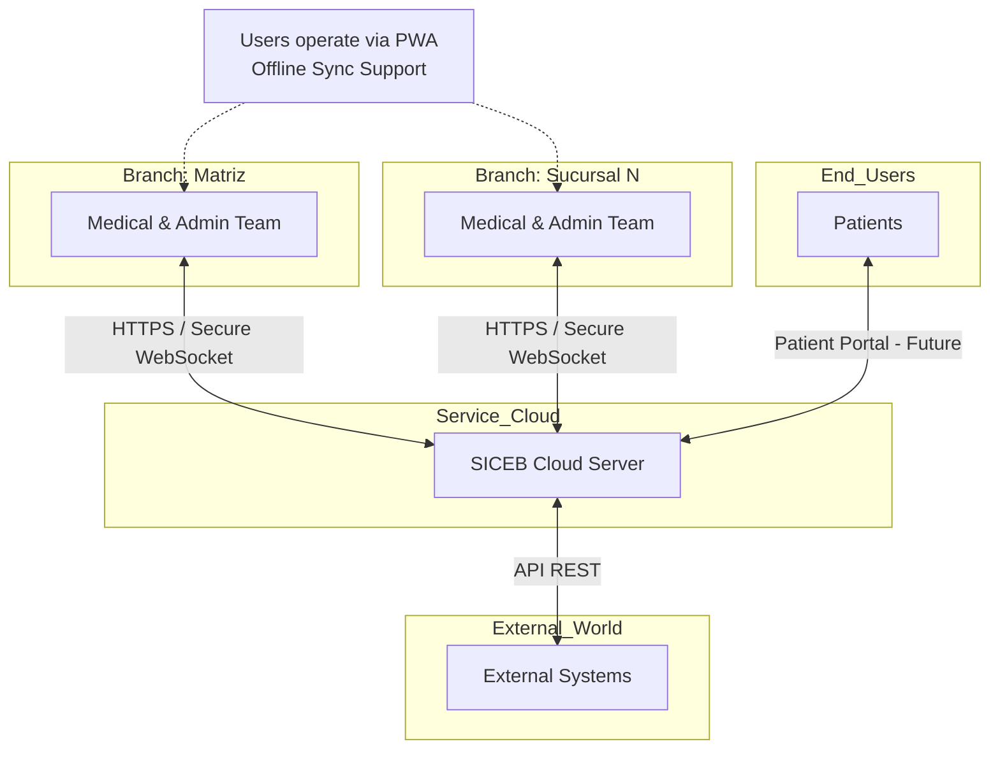

### Iteration 4 Relevance

This iteration activates the multi-branch dimension shown in the context diagram. The `Branch: Sucursal N` node represents the scalability from 3 to 15 branches that Iteration 4 validates. The Secure WebSocket channel, previously mentioned but not designed, is now fully specified for real-time inventory propagation (PER-01).

---

## 3. Architectural Drivers

### 3.1 Primary User Stories

| Driver | Type | Description | Why this iteration |
|---|---|---|---|
| **US-074** | Primary US (rank 2) | Select active branch — context switch for multi-branch users; supports SEC-02, ESC-02 | Rank 2 primary US; enables branch-scoped data views required by inventory, clinical care, and pharmacy modules |
| **US-071** | Primary US (rank 3) | Register new branch — enables network expansion; supports SEC-02, ESC-02 | Rank 3 primary US; prerequisite for multi-branch scalability validation |
| **US-004** | Primary US (rank 7) | Complete inventory view for admin — total visibility of clinical resources; supports PER-01 | Rank 7 primary US; core inventory visibility requirement, prerequisite for pharmacy (Iteration 5) |

### 3.2 Supporting User Stories

| Driver | Type | Description | Why this iteration |
|---|---|---|---|
| **US-005** | US (HIGH) | Service Manager sees ONLY the inventory of their service | Branch + service scoping; validates RBAC and tenant isolation against inventory data |
| **US-064** | US (HIGH) | Configure tariffs by medical service with base price | Tariff configuration is branch-scoped and must be in place before payment registration (Iteration 5) |

### 3.3 Quality Attribute Scenarios

| Driver | Type | Description | Why this iteration |
|---|---|---|---|
| **PER-01** | QA Scenario (High/High) | Inventory updates reflected across all views in less than 2 seconds | One of the 6 High/High scenarios; requires real-time propagation infrastructure via WebSocket |
| **ESC-01** | QA Scenario | New branch fully operational in less than 1 hour | Defines measurable scalability guarantee for branch onboarding |
| **ESC-02** | QA Scenario (High/High) | Growth from 3 to 15 branches with <10% performance degradation | One of the 6 High/High scenarios; validates multi-tenant model under load |
| **ESC-03** | QA Scenario | Staff branch-context switch in less than 3 seconds without logout | Defines UX performance for multi-branch users switching context |

### 3.4 Architectural Concerns

| Driver | Type | Description | Why this iteration |
|---|---|---|---|
| **CRN-24** | Concern | Multi-tenant model must sustain network growth without performance degradation | Core scalability concern; tenant isolation validated at inventory and branch management level |
| **CRN-35** | Concern | Inventory consistency under concurrent edits from multiple branches | Concurrent modifications to the same supply need a conflict resolution policy |
| **CRN-44** | Concern | Inventory mutations must be modeled as delta commands for deterministic offline conflict resolution | Following CRN-43 conventions; delta commands enable Iteration 6 to apply changes deterministically |

### 3.5 Technical Constraints (inherited)

| ID | Constraint |
|---|---|
| **CON-01** | PWA with Hybrid Cloud / SaaS; no native mobile apps |
| **CON-02** | HTTPS / Secure WebSocket for all client-server communication |
| **CON-03** | Last 2 versions of Chrome, Edge, Safari, Firefox on desktop and tablet |
| **CON-04** | REST API for all external integrations |
| **CON-05** | No DICOM/PACS; text-only laboratory results |

---

## 4. Container Diagram

The following C4 container diagram decomposes SICEB into its four deployable containers and shows how they interact with external actors. The PWA Client communicates with the API Server over HTTPS/REST and Secure WebSocket. The API Server persists data in the Cloud Database over TLS-encrypted SQL connections. The PWA Client also writes to its own Local Storage via IndexedDB for offline operation.

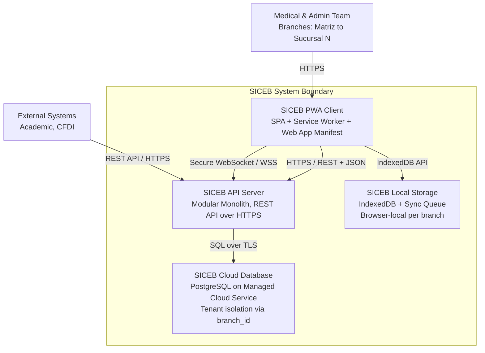

### Container Responsibilities

| Container | Technology | Responsibilities |
|---|---|---|
| **SICEB PWA Client** | SPA Framework + PWA APIs + IndexedDB | Renders the user interface for all 11 roles; manages application state; intercepts network requests via Service Worker for caching; stores offline data in IndexedDB; provides installable experience on desktop and tablet |
| **SICEB API Server** | Cloud PaaS, Modular Monolith | Exposes REST API over HTTPS for all client and external operations; hosts domain and platform modules; enforces authentication, authorization, and tenant context; orchestrates business logic; publishes real-time events via Secure WebSocket |
| **SICEB Cloud Database** | PostgreSQL, Managed Cloud Service | Stores all persistent data with tenant isolation via `branch_id` discriminator column; enforces referential integrity; uses `DECIMAL(19,4)` for monetary values and `TIMESTAMPTZ` in UTC; supports row-level security for multi-tenant queries; **Iteration 4: tables partitioned by `branch_id`** |
| **SICEB Local Storage** | IndexedDB, Browser Storage | Caches a subset of cloud data relevant to the user's active branch for offline operation; maintains a sync queue for operations performed while offline; enforces branch-scoped cache isolation upon branch context switch |

### Iteration 4 Container Refinements

- **API Server**: WebSocket infrastructure added (RealtimeEventPublisher, WebSocketSecurityInterceptor with STOMP topic routing)
- **Cloud Database**: `inventory_items` and `inventory_deltas` tables partitioned by `branch_id`; `StockMaterializationTrigger` (AFTER INSERT); `pg_notify` for real-time event bridging; RLS policies on inventory and tariff tables
- **PWA Client**: Branch management, inventory, and tariff UI components added; `InventoryRealtimeManager` for WebSocket subscription lifecycle; `BranchSelectionView` extended for mid-session switching with cache clearing

---

## 5. Component Diagrams

### 5.1 — SICEB API Server Module Overview

The API Server is internally organized as a modular monolith following domain-driven decomposition. Modules are grouped into three layers: **Domain Modules** encapsulate business logic for specific bounded contexts, **Platform Modules** provide cross-cutting infrastructure services consumed by all domain modules, and the **Shared Kernel** defines common value types used across the entire codebase.

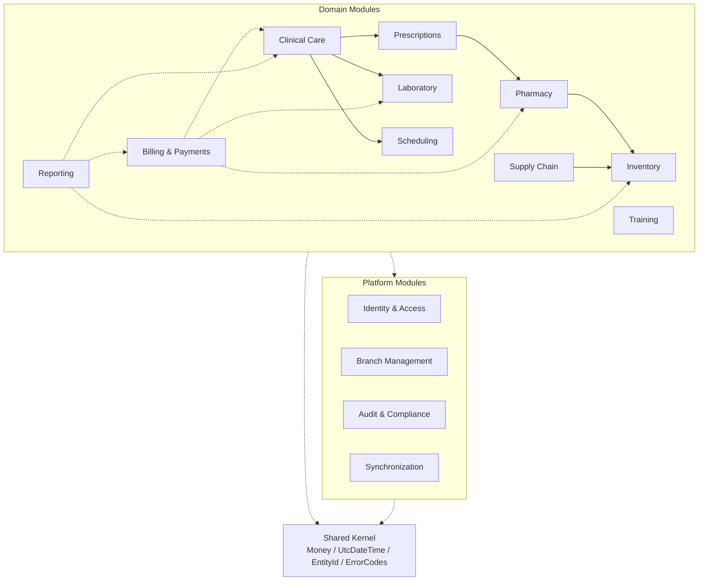

### 5.2 — Branch Management Module Internals (Iteration 4)

This component diagram decomposes the **Branch Management** platform module into its internal components. The `BranchRegistrationService` handles branch lifecycle operations. The `BranchOnboardingOrchestrator` executes the multi-step branch setup workflow. The `BranchContextService` manages active branch selection and mid-session context switching with JWT re-issuance. The `BranchConfigurationStore` persists branch-specific settings and onboarding progress.

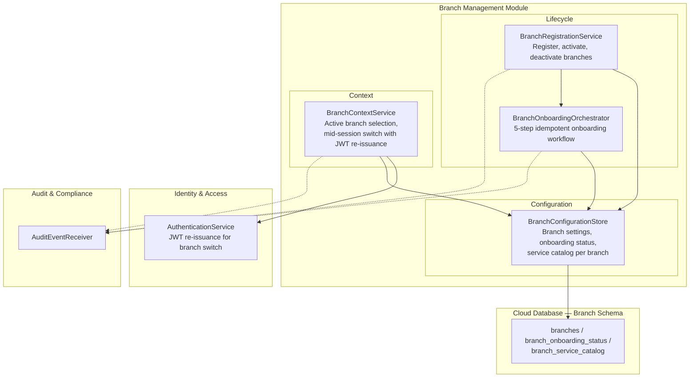

#### Branch Management Module — Internal Component Responsibilities

| Component | Responsibilities | Key Drivers |
|---|---|---|
| **BranchRegistrationService** | Handles `RegisterBranch` command: validates unique branch name and address, persists branch record with `isActive = true`, triggers `BranchOnboardingOrchestrator`. Handles `DeactivateBranch` command: sets `isActive = false`, preserves all historical data, prevents new operations. Emits audit events for both lifecycle actions. | US-071, ESC-01 |
| **BranchOnboardingOrchestrator** | Executes a deterministic 5-step idempotent sequence after branch registration: (1) create database partitions for `inventory_items` and `inventory_deltas` tables, (2) seed default service catalog entries from the organization template, (3) copy active tariff catalog to the new branch, (4) initialize empty inventory items per service, (5) mark branch as `onboarding_complete`. Each step records progress in `branch_onboarding_status` table for resumability. Designed to complete within ESC-01 target (<1 hour). | US-071, ESC-01 |
| **BranchContextService** | Handles `SwitchBranch` command for mid-session branch context switching: validates user is assigned to the target branch (from JWT `branchAssignments`), delegates to `AuthenticationService` for JWT re-issuance with updated `activeBranchId` claim, sets PostgreSQL RLS session variable `app.current_branch_id` to the new branch. Does not require re-authentication — satisfies ESC-03 (<3 seconds without logout). Also handles initial post-login branch selection. | US-074, ESC-03, SEC-02 |
| **BranchConfigurationStore** | Persistence layer for branch records, onboarding progress tracking, and branch-scoped service catalog configuration. Stores branch settings including name, address, `isActive` status, `onboardingComplete` flag. Provides queries for `ListBranches`, `GetBranch`, and `GetOnboardingStatus`. | US-071, ESC-01 |

---

### 5.3 — Inventory Module Internals (Iteration 4)

This component diagram decomposes the **Inventory** domain module into its CQRS structure. The **command side** receives inventory delta commands and persists them to the append-only `InventoryDeltaStore`. A PostgreSQL trigger atomically materializes the current stock on every delta insertion, eliminating any eventual consistency gap. The **read side** maintains projections for branch-scoped inventory views, low-stock alerts, and expiration alerts. The delta store publishes change notifications via `pg_notify` to bridge to the WebSocket real-time infrastructure.

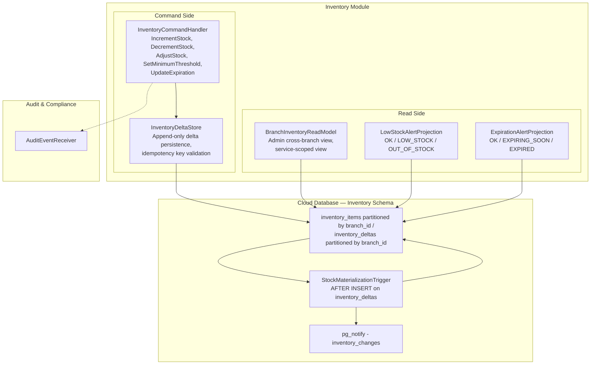

#### Inventory Module — Internal Component Responsibilities

| Component | Side | Responsibilities | Key Drivers |
|---|---|---|---|
| **InventoryCommandHandler** | Command | Processes five delta command types: `IncrementStock`, `DecrementStock`, `AdjustStock`, `SetMinimumThreshold`, `UpdateExpiration`. Validates item exists and belongs to the active branch. Uses `SELECT ... FOR UPDATE` on the `inventory_items` row for concurrency serialization within a branch. Validates `DecrementStock` will not produce negative stock. Delegates persistence to `InventoryDeltaStore`. Emits audit events for all mutations. | CRN-44, CRN-35, CRN-43 |
| **InventoryDeltaStore** | Command | Append-only persistence layer for inventory deltas. Each delta carries: `delta_id (UUID)`, `item_id`, `branch_id`, `delta_type`, `quantity_change`, `absolute_quantity`, `reason`, `source_ref`, `staff_id`, `timestamp (TIMESTAMPTZ)`, `idempotency_key (UNIQUE)`, `sequence_number`. Validates idempotency key uniqueness to prevent duplicate writes during offline sync replay. Insertion triggers `StockMaterializationTrigger`. | CRN-44, CRN-43 |
| **StockMaterializationTrigger** | Database | PostgreSQL `AFTER INSERT` trigger function on `inventory_deltas`. Applies the delta to `inventory_items.current_stock` atomically within the same transaction: INCREMENT adds, DECREMENT subtracts (raises error if result < 0), ADJUST sets absolute value. After materialization, executes `pg_notify('inventory_changes', json_payload)` to trigger real-time WebSocket propagation. | CRN-44, CRN-35, PER-01 |
| **BranchInventoryReadModel** | Read | Denormalized projection combining `inventory_items`, `medical_supplies`, `medications`, and `medical_services` into a query-optimized view. Two access patterns: (1) Admin cross-branch — aggregates all branches, grouped by service, with filters by category, status, and service; uses `admin_reporting` RLS bypass (US-004). (2) Service-scoped — filtered by `branch_id` (RLS) and `service_id` for Service Managers (US-005). Supports sorting, pagination (50 items/page), and search by name/SKU. | US-004, US-005, PER-01 |
| **LowStockAlertProjection** | Read | Flags inventory items based on stock level relative to minimum threshold: `OK` (stock >= threshold), `LOW_STOCK` (stock < threshold and stock > 0), `OUT_OF_STOCK` (stock = 0). Updated by the stock materialization trigger. Alert status included in both REST query responses and WebSocket inventory change events. | US-004, US-005 |
| **ExpirationAlertProjection** | Read | Categorizes inventory items by expiration status: `OK` (>30 days from expiry), `EXPIRING_SOON` (<=30 days), `EXPIRED` (past date). Computed daily via a scheduled job and on-demand during inventory queries. Expiration status included in inventory views as color-coded indicators. | US-004 |

---

### 5.4 — WebSocket Real-Time Event Infrastructure (Iteration 4)

This component diagram shows the real-time event infrastructure that enables PER-01 (<2-second inventory update propagation). The `RealtimeEventPublisher` listens to PostgreSQL `pg_notify` notifications and publishes structured STOMP messages to tenant-scoped WebSocket channels. The `WebSocketSecurityInterceptor` authenticates connections via JWT and authorizes subscriptions to prevent cross-branch data leakage.

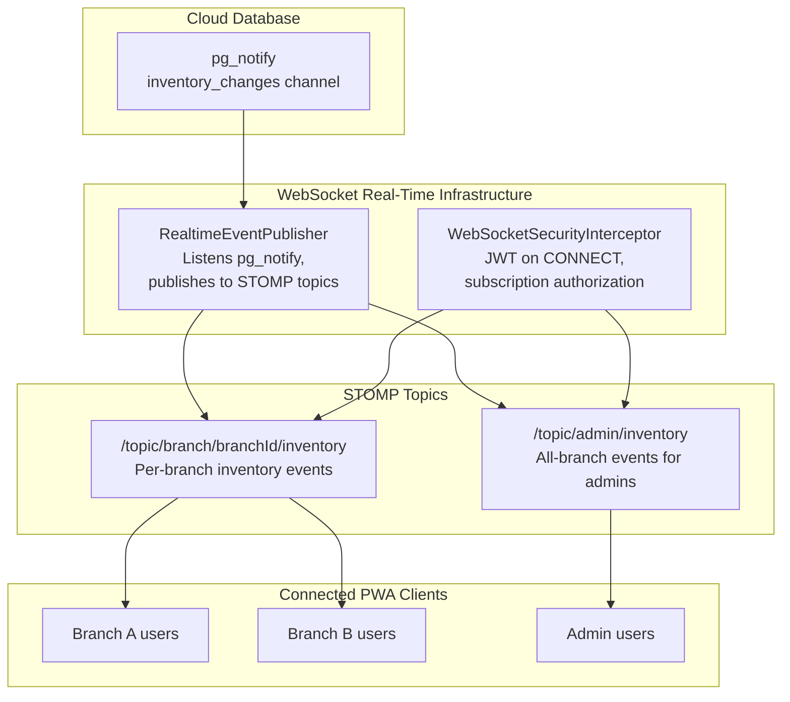

#### WebSocket Real-Time Infrastructure — Component Responsibilities

| Component | Responsibilities | Key Drivers |
|---|---|---|
| **RealtimeEventPublisher** | Listens to PostgreSQL `pg_notify('inventory_changes')` notifications via a persistent JDBC listener connection. Deserializes the JSON payload containing `branchId`, `itemId`, `deltaType`, `newStock`, `stockStatus`, and `timestamp`. Publishes a structured STOMP message to `/topic/branch/{branchId}/inventory` for the specific branch. Simultaneously publishes to `/topic/admin/inventory` for admin subscribers. Designed for sub-second processing latency to satisfy PER-01 (<2-second end-to-end). | PER-01, ESC-02 |
| **WebSocketSecurityInterceptor** | Validates JWT on STOMP CONNECT frame — extracts `activeBranchId` and `permissions` from claims. Authorizes SUBSCRIBE requests: users may only subscribe to their branch channel or `inventory:read_all` for admin wildcard. Rejects unauthorized subscriptions with STOMP ERROR frame. Periodically validates token expiry; disconnects clients with expired tokens. Handles reconnection with re-authentication. | SEC-02, PER-01, ESC-02 |

---

### 5.5 — PWA Branch and Inventory Components (Iteration 4)

This diagram refines the PWA client's `UI Components` and `State Management` for branch management, inventory visualization, tariff configuration, and real-time inventory updates introduced in Iteration 4. The `InventoryRealtimeManager` manages WebSocket subscriptions for live inventory updates. The `BranchSelectionView` is extended to support mid-session context switching without logout.

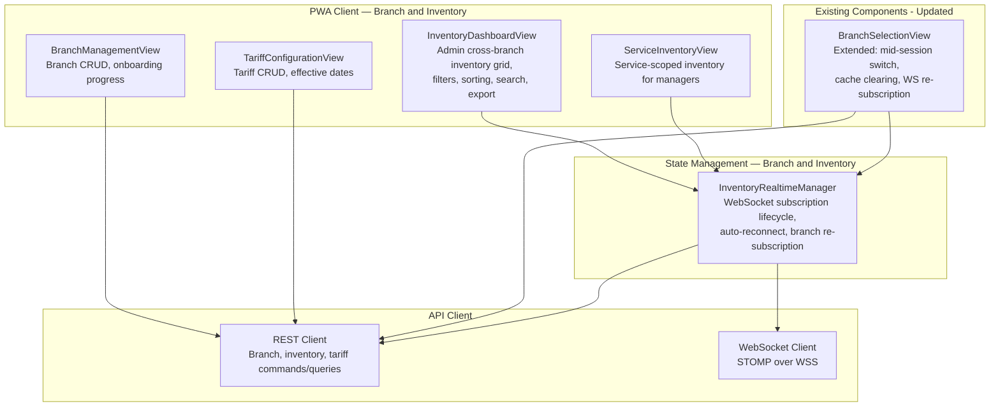

#### PWA Branch and Inventory — Component Responsibilities

| Component | Responsibilities | Key Drivers |
|---|---|---|
| **BranchManagementView** | Admin interface for registering new branches (name, address), viewing branch list with status (active/inactive/onboarding), and deactivating branches. Displays onboarding progress during registration with step-by-step completion indicators. Only rendered for users with `branch:manage` permission via `RoleAwareRenderer`. | US-071, ESC-01 |
| **InventoryDashboardView** | Renders the full inventory grid for General Administrator: grouped by service, filterable by category/status/service/branch, sortable by any column, searchable by name/SKU, paginated (50 items/page). Items display color-coded status indicators: OK = white, LOW_STOCK = yellow, EXPIRING_SOON = orange, EXPIRED = red. Detail panel on item selection showing all fields per US-004. Export to Excel. Receives real-time updates from `InventoryRealtimeManager`. | US-004, PER-01 |
| **ServiceInventoryView** | Renders the service-scoped inventory for Service Managers and physicians. Same layout as `InventoryDashboardView` but pre-filtered to the user's assigned service — items from other services are never rendered (not merely hidden). Export includes only the user's service items. Unauthorized direct URL access returns 403 and is logged. Only rendered for users with `inventory:read_service` permission. | US-005, SEC-02 |
| **TariffConfigurationView** | Admin interface for creating and updating service tariffs. Displays tariff catalog with service name, code, current price, and effective date. Supports creating new tariffs with effective-from date, updating prices for future dates. Price field validates non-negative `DECIMAL` input. Search across tariff catalog. Only rendered for users with `tariff:manage` permission. | US-064 |
| **InventoryRealtimeManager** | State management component that manages WebSocket subscription lifecycle for real-time inventory updates. Subscribes to `/topic/branch/{activeBranchId}/inventory` on inventory view load (or `/topic/admin/inventory` for admins). Processes incoming STOMP messages and triggers UI re-renders. Handles WebSocket disconnection with auto-reconnect and exponential backoff. On branch context switch: unsubscribes from old branch channel, subscribes to new. | PER-01, ESC-03 |
| **BranchSelectionView** (updated) | Extended to support mid-session branch context switching (ESC-03) in addition to the initial post-login selection. When user selects a different branch mid-session: (1) confirms if there is unsaved work, (2) calls `POST /session/branch`, (3) stores new JWT, (4) clears branch-scoped IndexedDB cache, (5) triggers `InventoryRealtimeManager` to re-subscribe to new branch WebSocket channel, (6) reloads dashboard with new branch data. Single-branch users continue to auto-select and skip. | US-074, ESC-03, SEC-02 |

---

## 6. Sequence Diagrams

### SD-10: Register New Branch with Onboarding Workflow

This sequence diagram shows an Administrator registering a new branch and the `BranchOnboardingOrchestrator` executing the 5-step idempotent onboarding sequence. Each step records progress for resumability. The complete workflow targets ESC-01 (<1 hour for full branch operability).

**Drivers:** US-071, ESC-01

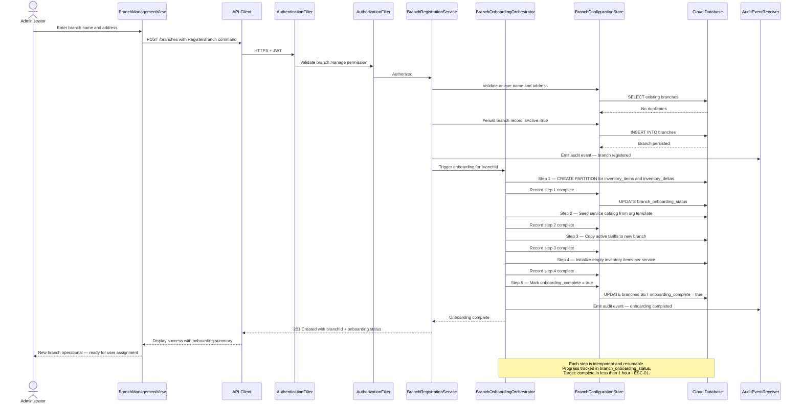

This flow satisfies US-071 (branch registration) and ESC-01 (new branch operational in <1 hour). The onboarding orchestrator executes all five steps in sequence, with each step recording its completion status. If the process is interrupted, it can be resumed from the last completed step without repeating previous steps.

---

### SD-11: Inventory Delta Command with Real-Time WebSocket Propagation

This sequence diagram illustrates the end-to-end flow of an inventory mutation: a physician uses supplies during a consultation, triggering a `DecrementStock` delta command. The delta is persisted, stock is atomically materialized via a PostgreSQL trigger, `pg_notify` fires, and the `RealtimeEventPublisher` pushes a STOMP message to all connected clients on the branch channel — all within the PER-01 target of <2 seconds.

**Drivers:** CRN-44, PER-01, CRN-35

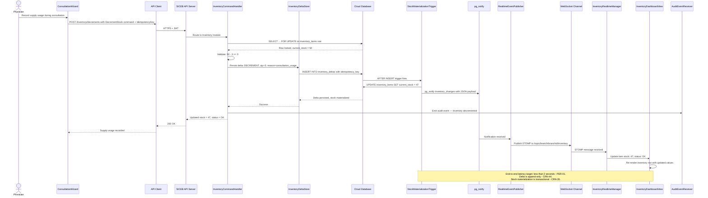

This flow demonstrates four key architectural decisions working together: (1) delta-based mutations (CRN-44) — the stock change is recorded as an intent command, not an absolute state overwrite; (2) transactional materialization (CRN-35) — the trigger updates `current_stock` atomically within the same transaction; (3) real-time propagation (PER-01) — `pg_notify` bridges the database event to the WebSocket layer without polling; (4) concurrency control — `SELECT ... FOR UPDATE` prevents lost updates.

---

### SD-12: Branch Context Switch Without Logout

This sequence diagram shows a multi-branch user switching their active branch mid-session without logging out. The flow re-issues the JWT with the new `activeBranchId`, resets the PostgreSQL RLS session variable, clears the branch-scoped IndexedDB cache, and re-subscribes to the new branch's WebSocket channel — all within the ESC-03 target of <3 seconds.

**Drivers:** US-074, ESC-03, SEC-02

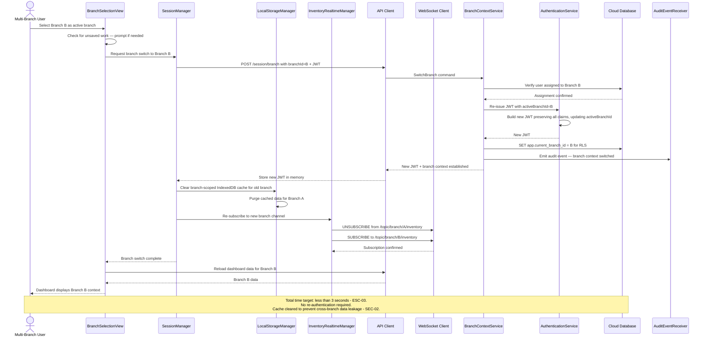

This flow satisfies US-074 (active branch selection), ESC-03 (<3 seconds without logout), and SEC-02 (no cross-branch data leakage). The key operations are: (1) JWT re-issuance without password re-entry; (2) RLS session variable reset; (3) IndexedDB cache clearing; (4) WebSocket re-subscription.

---

### SD-13: Admin Views Cross-Branch Inventory

This sequence diagram shows a General Administrator accessing the inventory dashboard with cross-branch visibility. The request activates the `admin_reporting` RLS bypass, queries across all branch partitions, and subscribes to the admin WebSocket channel for real-time updates from all branches.

**Drivers:** US-004, PER-01, ESC-02

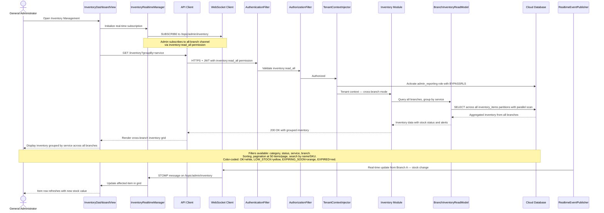

This flow satisfies US-004 (General Administrator sees complete inventory of ALL services), PER-01 (real-time updates via WebSocket), and ESC-02 (parallel partition scans ensure performance with up to 15 branches). The `admin_reporting` RLS bypass allows cross-branch queries while maintaining the SEC-02 security model.

---

## 7. Deployment Diagram

The following deployment diagram shows the physical infrastructure topology for SICEB after Iteration 4, including the WebSocket infrastructure for real-time inventory propagation and the multi-branch client distribution.

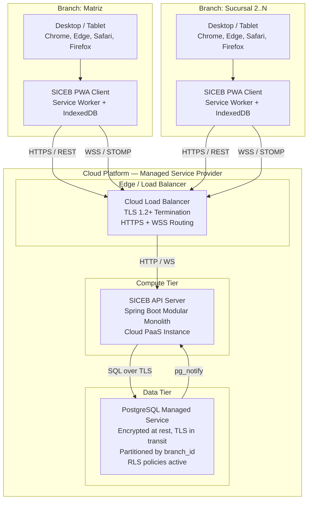

### Deployment Nodes

| Node | Technology | Responsibilities | Scaling |
|---|---|---|---|
| **Cloud Load Balancer** | Managed cloud LB service | TLS 1.2+ termination for HTTPS and WSS traffic; routes REST and WebSocket connections to API Server; health checks; sticky sessions for WebSocket | Managed by cloud provider; auto-scales |
| **SICEB API Server** | Spring Boot on Cloud PaaS | Hosts all 14 modules (10 domain + 4 platform); exposes REST API and WebSocket/STOMP endpoints; maintains `RealtimeEventPublisher` JDBC listener to `pg_notify`; serves up to ~150 concurrent WebSocket connections (15 branches x ~10 users) | Vertical scaling within PaaS tier; single instance for current load profile |
| **PostgreSQL Managed Service** | Cloud-managed PostgreSQL | Stores all persistent data; enforces RLS policies; executes `StockMaterializationTrigger` on inventory deltas; emits `pg_notify` for real-time events; tables partitioned by `branch_id` for scalability | Managed backups, failover, and patching; vertical scaling for storage/compute |
| **Branch Client Devices** | Desktop and 10-inch tablets | Runs the SICEB PWA in supported browsers (last 2 versions of Chrome, Edge, Safari, Firefox); Service Worker caches static assets and intercepts requests; IndexedDB provides branch-scoped local storage for offline operation | 3 to 15 branches; ~10 concurrent users per branch |

### Network Topology

| Path | Protocol | Security | Purpose |
|---|---|---|---|
| Client → Load Balancer | HTTPS / WSS | TLS 1.2+ with cloud-managed certificate | All user traffic — REST API and WebSocket |
| Load Balancer → API Server | HTTP / WS | Internal VPC network | Terminated TLS; internal routing |
| API Server → Database | SQL | TLS in transit, AES-256 at rest | Data persistence and queries |
| Database → API Server | pg_notify | Internal VPC | Real-time inventory change notifications |

### Scalability Characteristics (ESC-02)

The deployment supports growth from 3 to 15 branches with <10% performance degradation:

- **Database partitioning** by `branch_id` ensures per-branch query performance is independent of total branch count (partition pruning)
- **WebSocket connections** scale linearly: 15 branches x ~10 users = ~150 connections, well within Spring STOMP capacity on a single instance
- **Tenant-scoped STOMP channels** prevent unnecessary message fan-out — each branch channel only reaches its subscribers
- **Admin cross-branch queries** use PostgreSQL parallel partition scans to maintain performance across all partitions

---

## 8. Interfaces and Events

### 8.1 — Branch Management Command Interfaces

All commands emit audit events to the `ImmutableAuditStore`. Branch management commands require `branch:manage` permission.

| Command | HTTP Verb / Endpoint | Input Invariants | Key Drivers |
|---|---|---|---|
| **RegisterBranch** | `POST /branches` | `name` (unique, non-empty), `address` (non-empty) required; `branchId` is UUID. Triggers `BranchOnboardingOrchestrator` after persistence. Emits audit event. | US-071, ESC-01 |
| **DeactivateBranch** | `POST /branches/:branchId/deactivate` | Branch must exist and be active. Sets `isActive = false`. Preserves all historical data. Prevents new operations at the branch. Users assigned to only this branch are notified. Emits audit event. | US-071 |
| **SwitchBranch** | `POST /session/branch` | `branchId` required; user must be assigned to the target branch (validated against JWT `branchAssignments`). Re-issues JWT with updated `activeBranchId` claim. Sets PostgreSQL RLS session variable. Does not require re-authentication. | US-074, ESC-03, SEC-02 |

### 8.2 — Branch Management Query Interfaces

| Query | HTTP Verb / Endpoint | Parameters | Key Drivers |
|---|---|---|---|
| **ListBranches** | `GET /branches` | Optional filters: `isActive`, `onboardingComplete`; paginated. Admin users see all branches; non-admin users see only their assigned branches. | US-071, US-074 |
| **GetBranch** | `GET /branches/:branchId` | Returns branch details: name, address, isActive, onboardingComplete, creation date, assigned user count. | US-071 |
| **GetOnboardingStatus** | `GET /branches/:branchId/onboarding` | Returns step-by-step onboarding progress: step name, status (pending/complete/failed), completion timestamp. Requires `branch:manage` permission. | ESC-01 |

### 8.3 — Inventory Command Interfaces

All commands persist an immutable delta to the `InventoryDeltaStore` and require a client-generated `IdempotencyKey` for safe offline replay. Stock materialization occurs atomically via PostgreSQL trigger.

| Command | HTTP Verb / Endpoint | Input Invariants | Events Produced | Key Drivers |
|---|---|---|---|---|
| **IncrementStock** | `POST /inventory/increments` | `itemId` (UUID, must exist in active branch), `quantity` (positive integer), `reason` (non-empty), `sourceRef` (optional — links to supply delivery, purchase order), `idempotencyKey` (UUID, unique). | Delta: INCREMENT | CRN-44, CRN-43 |
| **DecrementStock** | `POST /inventory/decrements` | `itemId` (UUID, must exist in active branch), `quantity` (positive integer), `reason` (non-empty), `sourceRef` (optional — links to consultation, dispensation), `idempotencyKey` (UUID, unique). Validation: resulting stock >= 0. | Delta: DECREMENT | CRN-44, CRN-43, CRN-35 |
| **AdjustStock** | `POST /inventory/adjustments` | `itemId` (UUID, must exist in active branch), `absoluteQuantity` (non-negative integer), `reason` (mandatory — justification for override), `idempotencyKey` (UUID, unique). Requires `inventory:adjust` permission. | Delta: ADJUST | CRN-44 |
| **SetMinimumThreshold** | `PUT /inventory/:itemId/threshold` | `itemId` (UUID, must exist in active branch), `threshold` (non-negative integer). Triggers immediate re-evaluation of `LowStockAlertProjection` for this item. | Delta: THRESHOLD | US-004, US-005 |
| **UpdateExpiration** | `PUT /inventory/:itemId/expiration` | `itemId` (UUID, must exist in active branch), `expirationDate` (DATE, must be future or null). Updates `ExpirationAlertProjection`. | Delta: EXPIRATION | US-004 |

### 8.4 — Inventory Query Interfaces

| Query | Read Model | HTTP Verb / Endpoint | Parameters | Performance / Consistency | Key Drivers |
|---|---|---|---|---|---|
| **GetBranchInventory** | `BranchInventoryReadModel` | `GET /inventory` | `branch_id` (from session or query param for admin), `groupBy` (service/category), `filterStatus`, `filterCategory`, `filterService`, `sortBy`, `page`, `pageSize` (default 50). Admin users with `inventory:read_all` see all branches; others see only active branch. | Partition-pruned queries; <1s per branch; parallel scan for cross-branch admin view | US-004, US-005, PER-01, ESC-02 |
| **GetInventoryItem** | `BranchInventoryReadModel` | `GET /inventory/:itemId` | `itemId`; returns full detail: SKU, name, category, service, current stock, minimum threshold, expiration date, status, last updated timestamp. Branch-scoped via RLS. | Single-row lookup; <100ms | US-004, US-005 |
| **SearchInventory** | `BranchInventoryReadModel` | `GET /inventory/search` | `q` (name or SKU substring), `branch_id` (from session). Supports partial matching. | Indexed search; <500ms | US-004, US-005 |
| **ExportInventory** | `BranchInventoryReadModel` | `GET /inventory/export` | Same filters as `GetBranchInventory`; returns Excel file. Service Managers export only their service. Admins export all or filtered. | Streaming export; file generated server-side | US-004, US-005 |

### 8.5 — Tariff Management Interfaces

All tariff commands require `tariff:manage` permission (Director General or General Administrator). Tariffs use the temporal effective-date pattern with `DECIMAL(19,4)` precision.

| Interface | Type | HTTP Verb / Endpoint | Input / Parameters | Key Drivers |
|---|---|---|---|---|
| **CreateTariff** | Command | `POST /tariffs` | `serviceId` (UUID, must reference existing service), `branchId` (UUID), `basePrice` (DECIMAL >= 0.00), `effectiveFrom` (TIMESTAMPTZ, must be current or future). Validates no overlapping effective dates for the same service + branch. | US-064, CRN-42 |
| **UpdateTariff** | Command | `PUT /tariffs/:tariffId` | `basePrice` (DECIMAL >= 0.00), `effectiveFrom` (TIMESTAMPTZ, must be future). Creates a new effective-date entry; historical tariff records are immutable. | US-064, CRN-42 |
| **GetActiveTariff** | Query | `GET /tariffs/active?serviceId=X&branchId=Y` | Resolves the current active tariff as `MAX(effectiveFrom) WHERE effectiveFrom <= NOW()` for the given service and branch. Returns `tariffId`, `serviceId`, `branchId`, `basePrice`, `effectiveFrom`. | US-064 |
| **ListTariffs** | Query | `GET /tariffs` | Optional filters: `serviceId`, `branchId`, `includeHistorical` (default false). Paginated. Returns tariff catalog with service name, code, current price, effective date. | US-064 |
| **SearchTariffs** | Query | `GET /tariffs/search` | `q` (service name substring). Returns matching tariffs with current active price. | US-064 |

### 8.6 — WebSocket Events

| Event | STOMP Topic | Payload | Trigger | Key Drivers |
|---|---|---|---|---|
| **InventoryChanged** | `/topic/branch/{branchId}/inventory` | `{ branchId, itemId, deltaType, newStock, stockStatus, expirationStatus, timestamp }` | `pg_notify('inventory_changes')` after `StockMaterializationTrigger` fires | PER-01, ESC-02 |
| **InventoryChanged (admin)** | `/topic/admin/inventory` | Same payload as above, duplicated to admin channel | Same trigger, published in parallel by `RealtimeEventPublisher` | PER-01, US-004 |

### 8.7 — Interface-to-Driver Traceability (Iteration 4)

| Interface | Drivers Addressed |
|---|---|
| RegisterBranch | US-071, ESC-01 |
| DeactivateBranch | US-071 |
| SwitchBranch | US-074, ESC-03, SEC-02 |
| ListBranches | US-071, US-074 |
| GetBranch | US-071 |
| GetOnboardingStatus | ESC-01 |
| IncrementStock | CRN-44, CRN-43 |
| DecrementStock | CRN-44, CRN-43, CRN-35 |
| AdjustStock | CRN-44 |
| SetMinimumThreshold | US-004, US-005 |
| UpdateExpiration | US-004 |
| GetBranchInventory | US-004, US-005, PER-01, ESC-02 |
| GetInventoryItem | US-004, US-005 |
| SearchInventory | US-004, US-005 |
| ExportInventory | US-004, US-005 |
| CreateTariff | US-064, CRN-42 |
| UpdateTariff | US-064, CRN-42 |
| GetActiveTariff | US-064 |
| ListTariffs | US-064 |
| SearchTariffs | US-064 |

### 8.8 — New Permissions Introduced

| Permission Key | Description | Granted To |
|---|---|---|
| `branch:manage` | Register, edit, deactivate branches | General Administrator |
| `branch:read` | View branch list and details | All authenticated users |
| `inventory:read_all` | View inventory across all branches | General Administrator, Director General |
| `inventory:read_service` | View inventory scoped to user's service | Service Manager, Physician |
| `inventory:adjust` | Perform absolute stock adjustments | General Administrator |
| `tariff:manage` | Create and update tariffs | General Administrator, Director General |
| `tariff:read` | View tariff catalog | All authenticated users |

---

## 9. Design Decisions

| Driver | Decision | Rationale | Discarded Alternatives |
|---|---|---|---|
| **CRN-44, CRN-35** | Adopt CQRS for the Inventory bounded context with an append-only `InventoryDeltaStore` and PostgreSQL trigger-based stock materialization. Every stock change is recorded as an intent-based delta command. Current stock is atomically derived by a PostgreSQL `AFTER INSERT` trigger on the delta table, eliminating any eventual consistency gap. `pg_notify` bridges the database event to the WebSocket real-time layer | Delta commands enable deterministic offline conflict resolution — deltas can be replayed in any order and produce the same final state when combined with timestamp ordering. Trigger-based materialization guarantees stock consistency within the same transaction as the delta insertion. Consistent with the CQRS pattern adopted for Clinical Care in Iteration 2 and the offline-aware conventions from Iteration 1 (CRN-43) | CRUD with direct stock updates — absolute state overwrites prevent deterministic offline merge and lose mutation history. Application-level materialization job — introduces delay between delta write and stock update, risks stale reads. Full event sourcing with runtime projection — excessive for inventory volumes; runtime replay latency unacceptable for PER-01 |
| **PER-01, ESC-02** | Implement real-time inventory update propagation via WebSocket publish-subscribe using Spring STOMP with tenant-scoped channels. `RealtimeEventPublisher` listens to PostgreSQL `pg_notify('inventory_changes')` and publishes structured STOMP messages to `/topic/branch/{branchId}/inventory`. Admin users subscribe to `/topic/admin/inventory` for cross-branch events | Sub-2-second end-to-end propagation achievable with push model (database trigger → pg_notify → WebSocket → UI). Eliminates polling overhead that would scale poorly with branch count. Tenant-scoped channels enforce data segmentation at the transport layer. Linear connection scaling — 15 branches x ~10 users = ~150 connections, well within STOMP capacity | Short polling — unacceptable latency vs. resource trade-off at 2-second target with 15 branches. Server-Sent Events — unidirectional only, no standard reconnection ID across browsers. Raw WebSocket without STOMP — requires custom topic routing. External message broker — operational overhead disproportionate for ~150 connections |
| **US-071, ESC-01** | Implement branch registration with a choreographed 5-step idempotent onboarding workflow via `BranchOnboardingOrchestrator`: (1) create database partitions, (2) seed service catalog, (3) copy active tariffs, (4) initialize inventory, (5) mark complete. Each step records progress in `branch_onboarding_status` for resumability | Each step independently testable and idempotent — safe to retry on failure. Measurable progress toward ESC-01 (<1 hour target). Progress tracking enables admin monitoring. No external orchestrator infrastructure needed | Manual step-by-step admin configuration — error-prone, unmeasurable against ESC-01 time target. Event-driven choreography across modules — harder to track overall progress and ensure step ordering |
| **US-074, ESC-03** | Implement mid-session branch context switching via JWT re-issuance without re-authentication. `BranchContextService` validates user assignment, delegates to `AuthenticationService` for JWT re-issuance with updated `activeBranchId`, resets PostgreSQL RLS session variable. PWA clears IndexedDB cache and re-subscribes WebSocket to new branch channel | <3 seconds achievable without password re-entry. RLS immediately enforces new branch scope on all queries. Cache clearing prevents cross-branch data leakage (SEC-02). WebSocket re-subscription ensures correct real-time event feed | Logout and re-login — violates ESC-03 requirement. Client-side branch context only — no server-side RLS enforcement, security gap for SEC-02 |
| **ESC-02, CRN-24** | Partition `inventory_items` and `inventory_deltas` tables by `branch_id` using PostgreSQL declarative partitioning (`PARTITION BY LIST`). `BranchOnboardingOrchestrator` creates new partitions during branch registration. Cross-branch admin queries use parallel partition scans | Partition pruning ensures per-branch query performance is independent of total branch count — adding branches from 3 to 15 has near-zero impact on individual branch queries. Smaller per-partition indexes improve cache hit rates. Cross-branch admin queries benefit from PostgreSQL parallel scan capability | No partitioning (single table with branch_id index) — acceptable at 3 branches but index growth degrades performance beyond target with 15 branches. Database sharding — excessive operational complexity |
| **CRN-35** | Enforce optimistic concurrency within a branch via `SELECT ... FOR UPDATE` on the `inventory_items` row before processing delta commands. Cross-branch conflicts on shared supply catalogs resolved by applying deltas in timestamp order (last-writer-wins). UTC timestamps from CRN-41 ensure consistent ordering | Deterministic serialization within a branch prevents lost updates. Timestamp ordering is compatible with future offline delta replay in Iteration 6. No distributed lock manager needed | Pessimistic distributed locks — high latency, incompatible with offline operation. CRDT-based counters — adds significant complexity prematurely. Application-level optimistic locking — weaker than DB-level serialization |
| **US-064** | Implement temporal effective-date tariff pattern via `TariffManagementService`. Each `ServiceTariff` carries `effectiveFrom` timestamp. Active tariff resolved as `MAX(effectiveFrom) WHERE effectiveFrom <= NOW()`. Historical tariffs immutable. All prices stored as `DECIMAL(19,4)` per CRN-42 | Historical price integrity preserved — past charges unaffected by price changes and remain auditable. Simple temporal query pattern. Supports $0.00 pricing for free services | Overwrite-in-place pricing — loses price history. Separate price history table — data duplication, synchronization risk |
| **SEC-02** | Extend RLS policies to `inventory_items`, `inventory_deltas`, and `service_tariffs` tables, filtering by `app.current_branch_id`. `admin_reporting` role with `BYPASSRLS` enables cross-branch inventory views for authorized admin users. WebSocket subscriptions also enforce tenant scoping via `WebSocketSecurityInterceptor` | Defense-in-depth consistent with the Iteration 3 SEC-02 model — three enforcement layers: middleware authorization, RLS at database, and WebSocket subscription authorization | Application-level WHERE clause only — single enforcement layer; insufficient for High/High scenario |
